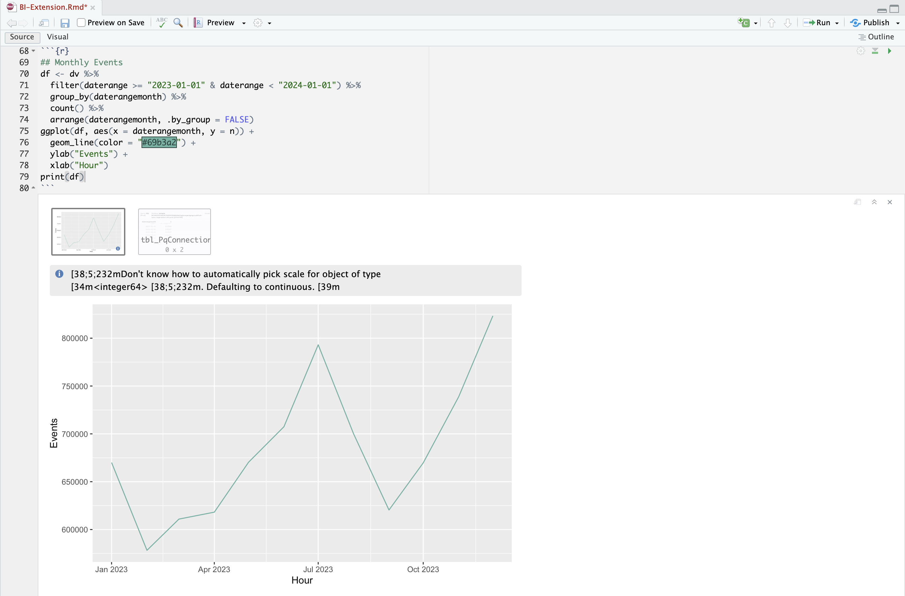

# Monatlicher Trend


In diesem Anwendungsbeispiel möchten Sie eine Tabelle und eine einfache Linienvisualisierung anzeigen, die einen monatlichen Trend des Vorkommens (Ereignisse) für 2023 zeigt.

+++ Customer Journey Analytics

Ein Beispiel **[!UICONTROL Bedienfeld &quot;]** Trend“ für den Anwendungsfall:

Visualisierung des monatlichen Customer Journey Analytics-Trends 

+++

+++ BI-Tools

>[!PREREQUISITES]
>
>Stellen Sie sicher, [&#x200B; Sie für das BI-Tool, für das Sie diesen Anwendungsfall ausprobieren möchten, (eine erfolgreiche Verbindung, Datenansichten auflisten &#x200B;](connect-and-validate.md) eine Datenansicht verwenden) validiert haben.
>

>[!BEGINTABS]

>[!TAB Power BI Desktop]

1. Im Bereich **[!UICONTROL Daten]**:
   1. Wählen Sie **[!UICONTROL daterangemonth]** aus.
   1. Wählen Sie **[!UICONTROL Summenvorfälle]** aus.

   Es wird eine Tabelle mit den Vorkommen für den aktuellen Monat angezeigt. Zur besseren Sichtbarkeit vergrößern Sie die Visualisierung.

1. Im Bereich **[!UICONTROL Filter]**:

   1. Wählen Sie **[!UICONTROL daterangemonth is (All)]** unter **[!UICONTROL Filter auf diesem Bild]** aus.
   1. Wählen Sie **[!UICONTROL Erweiterte]**) als **[!UICONTROL Filtertyp]**.
   1. Filter definieren, um **[!UICONTROL Elemente anzuzeigen, wenn der Wert]** **[!UICONTROL auf oder nach]** `1/1/2023` **[!UICONTROL Und]**&#x200B;**&#x200B;** liegt, `1/1/2024.` Sie können das Kalendersymbol verwenden, um ein Datum auszuwählen.
   1. Wählen Sie **[!UICONTROL Filter anwenden]** aus.

   Die Tabelle wird mit dem angewendeten Filter **[!UICONTROL daterangemonth“]**.

1. Im Bereich **[!UICONTROL Visualisierungen]**:

   1. Wählen Sie die Visualisierung **[!UICONTROL Liniendiagramm]** aus.

   Eine Liniendiagramm-Visualisierung ersetzt die Tabelle, wobei dieselben Daten wie die Tabelle verwendet werden. Ihr Power BI-Desktop sollte wie folgt aussehen.

   

1. Visualisierung im Liniendiagramm:

   1. Wählen Sie  aus.
   1. Wählen Sie im Kontextmenü die Option **[!UICONTROL Als Tabelle anzeigen]** aus.

   Die Hauptansicht wird aktualisiert, um sowohl eine Linienvisualisierung als auch eine Tabelle anzuzeigen. Ihr Power BI-Desktop sollte wie folgt aussehen.

   

>[!TAB Tableau Desktop]

1. Wählen Sie unten **[!UICONTROL Registerkarte Blatt 1]** aus, um aus **[!UICONTROL Datenquelle]** zu wechseln. In der Ansicht **[!UICONTROL Blatt 1]**:
   1. Ziehen Sie den **[!UICONTROL Daterange]** aus der Liste **[!UICONTROL Tabellen]** im Bereich **[!UICONTROL Daten]** und legen Sie den Eintrag auf dem Regal **[!UICONTROL Filter]** ab.
   1. Wählen Sie im Dialogfeld **[!UICONTROL Filterfeld \[Datumsbereich\]]** die Option **[!UICONTROL Datumsbereich]** und wählen Sie **[!UICONTROL Weiter >]**.
   1. Wählen Sie im Dialogfeld **[!UICONTROL Filter \[Daterange\]]** die Option **[!UICONTROL Datumsbereich]** und geben Sie einen Zeitraum von `01/01/2023` bis `01/01/2024` an.

      

   1. Ziehen Sie **[!UICONTROL daterangeday]** per Drag-and-Drop aus der Liste **[!UICONTROL Tabellen]** in den Bereich **[!UICONTROL Daten]** und legen Sie den Eintrag im Feld neben **[!UICONTROL Spalten]** ab.
      * Wählen Sie **[!UICONTROL MONTH]** aus dem Dropdown **[!UICONTROL Menü daterangeday]**, sodass der Wert auf &quot;**[!UICONTROL (daterangeday)]** aktualisiert wird.
   1. Ziehen Sie **[!UICONTROL Vorfälle]** per Drag-and-Drop aus der Liste **[!UICONTROL Tabellen (*Kennzahlennamen*)]** in den Bereich **[!UICONTROL Daten]** und legen Sie den Eintrag im Feld neben **[!UICONTROL Zeilen]** ab. Der Wert wird automatisch in **[!UICONTROL SUM(Occurrences)]** umgewandelt.
   1. Ändern Sie **[!UICONTROL Standard]** über das Dropdown **[!UICONTROL Menü]** Anpassen **[!UICONTROL in der Symbolleiste auf Gesamte Ansicht]**.

      Ihr Tableau-Desktop sollte wie folgt aussehen.

      

1. Wählen Sie **[!UICONTROL Duplizieren]** aus dem **[!UICONTROL Blatt 1]** Kontextmenü, um ein zweites Blatt zu erstellen.
1. Wählen Sie **[!UICONTROL Umbenennen]** aus dem Kontextmenü der Registerkarte **[!UICONTROL Blatt 1]**, um das Blatt in `Graph` umzubenennen.
1. Wählen Sie **[!UICONTROL Umbenennen]** aus dem Kontextmenü der Registerkarte **[!UICONTROL Blatt 1 (2)]** aus, um das Blatt in `Data` umzubenennen.
1. Stellen Sie sicher, dass **[!UICONTROL Daten]**-Blatt ausgewählt ist. In der Datenansicht
   1. Wählen Sie **[!UICONTROL oben]** die Option „Anzeigen“ aus und wählen Sie **[!UICONTROL Texttabelle]** (Visualisierung oben links) aus, um den Inhalt der Datenansicht in eine Tabelle zu ändern.
   1. Ziehen Sie **[!UICONTROL MONTH(daterangeday)]** von **[!UICONTROL Columns]** nach **[!UICONTROL Rows]**.
   1. Ändern Sie **[!UICONTROL Standard]** über das Dropdown **[!UICONTROL Menü]** Anpassen **[!UICONTROL in der Symbolleiste auf Gesamte Ansicht]**.

      Ihr Tableau-Desktop sollte wie folgt aussehen.

      

1. Wählen Sie **[!UICONTROL Schaltfläche]** Neues Dashboard) unten aus, um eine neue Ansicht **[!UICONTROL Dashboard 1]** zu erstellen. In der Ansicht **[!UICONTROL Dashboard 1]**:
   1. Ziehen Sie das Blatt **[!UICONTROL Graph]** aus dem **[!UICONTROL Blätter]**-Regal auf die Ansicht **[!UICONTROL Dashboard 1]** mit dem Titel *Blätter hier ablegen*.
   1. Ziehen Sie das **[!UICONTROL Daten]**-Blatt aus dem **[!UICONTROL Blätter]**-Regal unter das **[!UICONTROL Diagramm]**-Blatt auf die Ansicht **[!UICONTROL Dashboard 1]**.
   1. Wählen Sie das **[!UICONTROL Daten]**-Blatt in der Ansicht aus und ändern Sie **[!UICONTROL Gesamte Ansicht]** so **[!UICONTROL Breite festlegen]**.

      Ihr Tableau-Desktop sollte wie folgt aussehen.

      


>[!TAB Looker]

1. Achten Sie in der **[!UICONTROL Explore]**-Oberfläche von Looker darauf, dass Sie über ein sauberes Setup verfügen. Wenn nicht, wählen Sie  **[!UICONTROL Felder und Filter entfernen]**.
1. Wählen Sie **[!UICONTROL + Filter]** unter **[!UICONTROL Filter]** aus.
1. Im Dialogfeld **[!UICONTROL Filter hinzufügen]**:
   1. Wählen Sie **[!UICONTROL ‣ CC-Datenansicht]**
   1. Wählen Sie aus der Liste der Felder **[!UICONTROL ‣ DateRange]** und **[!UICONTROL DateRange]** aus.
      
1. Geben Sie den Filter **[!UICONTROL CC Datenansicht Datumsbereich]** als **[!UICONTROL liegt im Bereich]** **[!UICONTROL 2023/01/01]**&#x200B;**[!UICONTROL bis (davor)]** **[!UICONTROL 2024/01/01]** an.
1. In der linken **[!UICONTROL CC-Datenansicht]**-Leiste
   1. Wählen Sie **[!UICONTROL ‣ DatumMonat]** und dann **[!UICONTROL Monat]** aus der Liste von **[!UICONTROL DIMENSIONEN]**.
   1. Wählen Sie **[!UICONTROL Count]** unter **[!UICONTROL MEASURES]** in der linken Leiste (unten) aus.
1. Wählen Sie **[!UICONTROL Ausführen]** aus.
1. Wählen Sie **[!UICONTROL ‣ Visualisierung]** aus, um die Linienvisualisierung anzuzeigen.

Es sollte eine Visualisierung und eine Tabelle ähnlich wie unten dargestellt angezeigt werden.


>[!TAB Jupyter-Notebook]

1. Geben Sie die folgenden Anweisungen in eine neue Zelle ein.

   ```python
   import seaborn as sns
   import matplotlib.pyplot as plt
   data = %sql SELECT daterangemonth AS Month, COUNT(*) AS Events \
               FROM cc_data_view \
               WHERE daterange BETWEEN '2023-01-01' AND '2024-01-01' \
               GROUP BY 1 \
               ORDER BY Month ASC
   df = data.DataFrame()
   df = df.groupby('Month', as_index=False).sum()
   plt.figure(figsize=(15, 3))
   sns.lineplot(x='Month', y='Events', data=df)
   plt.show()
   display(data)
   ```

1. Ausführen der Zelle. Es sollte eine ähnliche Ausgabe wie im folgenden Screenshot angezeigt werden.

   


>[!TAB RStudio]

1. Geben Sie die folgenden Anweisungen zwischen ` ` ``{r} ` und ` `` ` ` in einen neuen Block ein.

   ```R
   ## Hourly Events
   df <- dv %>%
      filter(daterange >= "2023-01-01" & daterange < "2023-01-02") %>%
      group_by(daterangehour) %>%
      count() %>%
      arrange(daterangehour, .by_group = FALSE)
   ggplot(df, aes(x = daterangehour, y = n)) +
      geom_line(color = "#69b3a2") +
      ylab("Events") +
      xlab("Hour")
   print(df)
   ```

1. Führt den Block aus. Es sollte eine ähnliche Ausgabe wie im folgenden Screenshot angezeigt werden.

   

>[!ENDTABS]

+++
