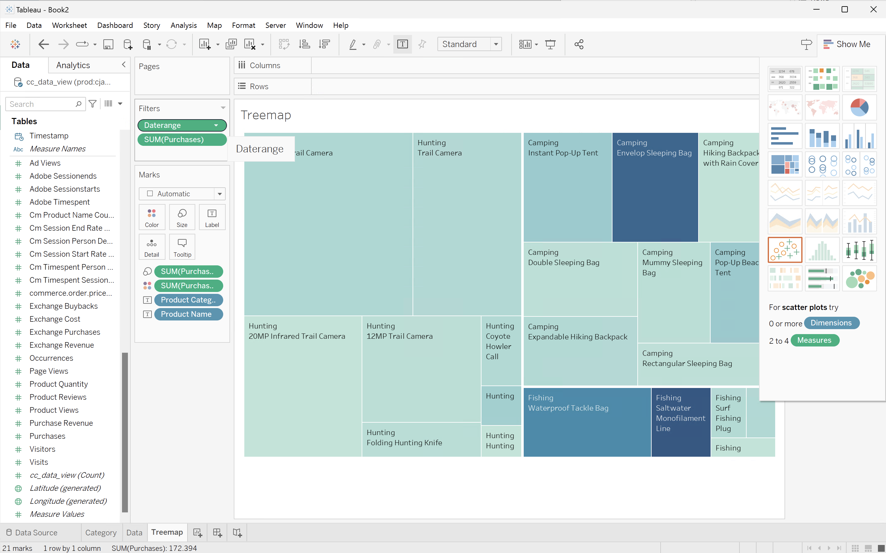

# Rangfolge mehrerer Dimensionen


In diesem Anwendungsbeispiel möchten Sie eine Tabelle anzeigen, in der die Kaufumsätze und -käufe für Produktnamen innerhalb von Produktkategorien für das Jahr 2023 aufgeschlüsselt sind. Darüber hinaus möchten Sie einige Visualisierungen verwenden, um sowohl die Produktkategorieverteilung als auch die Beiträge zu Produktnamen innerhalb jeder Produktkategorie zu veranschaulichen.

+++ Customer Journey Analytics

Ein Beispiel **[!UICONTROL Bedienfeld „Mehrere Dimension]** Rang“ für den Anwendungsfall:


+++

+++ BI-Tools

>[!PREREQUISITES]
>
>Stellen Sie sicher, [ Sie für das BI-Tool, für das Sie diesen Anwendungsfall ausprobieren möchten, (eine erfolgreiche Verbindung, Datenansichten auflisten ](connect-and-validate.md) eine Datenansicht verwenden) validiert haben.
>

>[!BEGINTABS]

>[!TAB Power BI Desktop]

1. Um sicherzustellen, dass der Datumsbereich für alle Visualisierungen gilt, ziehen Sie **[!UICONTROL daterangeday]** aus dem Bereich **[!UICONTROL Daten]** auf **[!UICONTROL Filter auf dieser Seite]**.
   1. Wählen Sie **[!UICONTROL daterangeday is (All)]** unter **[!UICONTROL Filter auf dieser Seite]** aus.
   1. Wählen Sie **[!UICONTROL Relatives Datum]** als **[!UICONTROL Filtertyp]** aus.
   1. Definieren Sie den Filter für **[!UICONTROL Elemente anzeigen, wenn der Wert]****[!UICONTROL in den letzten]**`1` **[!UICONTROL Kalenderjahren)]**.
   1. Wählen Sie **[!UICONTROL Filter anwenden]** aus.

1. Im Bereich **[!UICONTROL Daten]**:
   1. Wählen Sie **[!UICONTROL datarangeday]** aus.
   1. Wählen Sie **[!UICONTROL product_category]** aus.
   1. Wählen Sie **[!UICONTROL product_name]** aus.
   1. Wählen Sie **[!UICONTROL sum_purchase_venue]**
   1. Wählen Sie **[!UICONTROL Summenkäufe]**

1. Um das vertikale Balkendiagramm in eine Tabelle zu ändern, stellen Sie sicher, dass Sie die Tabelle ausgewählt haben, und wählen Sie **[!UICONTROL Matrix]** aus dem Bereich **[!UICONTROL Visualisierungen]** aus.
   * Ziehen Sie **[!UICONTROL product_name]** aus **[!UICONTROL Spalten]** und legen Sie das Feld unter **[!UICONTROL product_category]**y in **[!UICONTROL Zeilen]** im Bereich **[!UICONTROL Visualisierung]** ab.

1. Um die Anzahl der in der Tabelle angezeigten Produkte zu begrenzen, wählen Sie **[!UICONTROL product_name is (All)]** im Bereich **[!UICONTROL Filter]** aus.

   1. Wählen Sie **[!UICONTROL Erweiterte Filterung]** aus.
   1. Wählen Sie **[!UICONTROL Filtertyp]** **[!UICONTROL Oben N]** **[!UICONTROL Elemente anzeigen]** **[!UICONTROL Oben]** `15` **[!UICONTROL Nach Wert]**.
   1. Ziehen Sie **[!UICONTROL Bestellungen]** aus dem Bereich **[!UICONTROL Daten]** auf die **[!UICONTROL Datenfelder hier hinzufügen]**.
   1. Wählen Sie **[!UICONTROL Filter anwenden]** aus.

1. Um die Lesbarkeit zu verbessern, wählen **[!UICONTROL im oberen Menü]** Ansicht“ aus und wählen Sie **[!UICONTROL Seitenansicht]** > **[!UICONTROL Tatsächliche Größe]** und ändern Sie die Größe der Tabellenvisualisierung.

1. Um die einzelnen Kategorien in der Tabelle aufzuschlüsseln, wählen Sie **[!UICONTROL +]** auf der Ebene der Produktkategorie aus. Ihr Power BI-Desktop sollte wie folgt aussehen.

   

1. Wählen Sie **[!UICONTROL Startseite]** aus dem oberen Menü aus und wählen Sie **[!UICONTROL Neues visuelles]**. Ihrem Bericht wird eine neue visuelle Darstellung hinzugefügt.

1. Im Bereich **[!UICONTROL Daten]**:
   1. Wählen Sie **[!UICONTROL product_category]** aus.
   1. Wählen Sie **[!UICONTROL product_name]** aus.
   1. Wählen Sie **[!UICONTROL purchase_venue]** aus.

1. Um das visuelle Element zu ändern, wählen Sie das Balkendiagramm und **[!UICONTROL Treemap]** aus dem Bereich **[!UICONTROL Visualisierungen]** aus.
1. Stellen Sie sicher **[!UICONTROL dass]** product_category) unter **[!UICONTROL category]** und **[!UICONTROL product_name]** unter **[!UICONTROL details]** im Bereich **[!UICONTROL Visualisierungen]** aufgeführt ist.

   Ihr Power BI-Desktop sollte wie folgt aussehen.

   

1. Wählen Sie **[!UICONTROL Startseite]** aus dem oberen Menü aus und wählen Sie **[!UICONTROL Neues visuelles]**. Ihrem Bericht wird eine neue visuelle Darstellung hinzugefügt.

1. Im Bereich **[!UICONTROL Daten]**:
   1. Wählen Sie **[!UICONTROL product_category]** aus.
   1. Wählen Sie **[!UICONTROL purchase_venue]** aus.
   1. Wählen Sie **[!UICONTROL Kauf]** aus.

1. Im Bereich **[!UICONTROL Visualisierungen]**:
   1. Um die Visualisierung zu ändern, wählen Sie **[!UICONTROL Linien- und gestapeltes Säulendiagramm]** aus.
   1. Ziehen Sie **[!UICONTROL sum_of_purchases]** von **[!UICONTROL Spalte y-Achse]** auf **[!UICONTROL Linie y-Achse]**.

1. Im Bericht die einzelnen Visualisierungen neu mischen.

   Ihr Power BI-Desktop sollte wie folgt aussehen.

   


>[!TAB Tableau Desktop]

1. Wählen Sie unten **[!UICONTROL Registerkarte Blatt 1]** aus, um aus **[!UICONTROL Datenquelle]** zu wechseln. In der Ansicht **[!UICONTROL Blatt 1]**:
   1. Ziehen Sie den **[!UICONTROL Daterange]** aus der Liste **[!UICONTROL Tabellen]** im Bereich **[!UICONTROL Daten]** und legen Sie den Eintrag auf dem Regal **[!UICONTROL Filter]** ab.
   1. Wählen Sie im Dialogfeld **[!UICONTROL Filterfeld \[Datumsbereich\]]** die Option **[!UICONTROL Datumsbereich]** und wählen Sie **[!UICONTROL Weiter >]**.
   1. Wählen Sie im Dialogfeld **[!UICONTROL Filter \[Daterange\]]** die Option **[!UICONTROL Relative Datumsangaben]**, wählen Sie **[!UICONTROL Jahre]** aus und geben Sie **[!UICONTROL Vorheriges Jahr]** an. Wählen Sie **[!UICONTROL Übernehmen]** und **[!UICONTROL OK]** aus.

      Ihr Tableau-Desktop sollte wie folgt aussehen.

      

   1. Ziehen Sie **[!UICONTROL Produktkategorie]** und legen Sie sie neben &quot;**[!UICONTROL &quot;]**.
   1. Ziehen Sie **[!UICONTROL Kaufumsatz]** und legen Sie neben **[!UICONTROL Zeilen]** ab. Der Wert ändert sich in **[!UICONTROL SUM(Purchase Revenue)]**.
   1. Bestellungen ziehen und neben „Zeilen **[!UICONTROL ablegen]**. Der Wert ändert sich in **[!UICONTROL SUM(purchases)]**.
   1. Wählen Sie **[!UICONTROL SUM(Purchases)]** und wählen Sie im Dropdown-Menü **[!UICONTROL Dual Axis]**.
   1. Wählen Sie **[!UICONTROL SUM(Purchases]** in **[!UICONTROL Marks]** und wählen Sie **[!UICONTROL Line]** aus dem Dropdown-Menü aus.
   1. Wählen Sie **[!UICONTROL SUM(Purchase Revenue)]** in **[!UICONTROL Marks]** und wählen Sie **[!UICONTROL Bar]** aus dem Dropdown-Menü aus.
   1. Wählen Sie **[!UICONTROL Gesamte Ansicht]** aus dem Menü **[!UICONTROL Anpassen]** aus.
   1. Wählen Sie den **[!UICONTROL Kaufumsatz]** im Diagramm aus und stellen Sie sicher, dass der Kaufumsatz in aufsteigender Reihenfolge angezeigt wird.

      Ihr Tableau-Desktop sollte wie folgt aussehen.

      

1. Benennen Sie das aktuelle **[!UICONTROL Blatt 1]** in `Category` um.
1. Wählen Sie **[!UICONTROL Neues Arbeitsblatt]** aus, um ein neues Arbeitsblatt zu erstellen, und benennen Sie es in `Data` um.

   1. Ziehen Sie den **[!UICONTROL Daterange]** aus der Liste **[!UICONTROL Tabellen]** im Bereich **[!UICONTROL Daten]** und legen Sie den Eintrag auf dem Regal **[!UICONTROL Filter]** ab.
   1. Wählen Sie im Dialogfeld **[!UICONTROL Filterfeld \[Datumsbereich\]]** die Option **[!UICONTROL Datumsbereich]** und wählen Sie **[!UICONTROL Weiter >]**.
   1. Wählen Sie im Dialogfeld **[!UICONTROL Filter \[Daterange\]]** die Option **[!UICONTROL Relative Datumsangaben]**, wählen Sie **[!UICONTROL Jahre]** aus und geben Sie **[!UICONTROL Vorheriges Jahr]** an. Wählen Sie **[!UICONTROL Übernehmen]** und **[!UICONTROL OK]** aus.
   1. Ziehen Sie **[!UICONTROL Kaufumsatz]** aus dem Bereich **[!UICONTROL Daten]** in **[!UICONTROL Spalten]**. Der Wert ändert sich in **[!UICONTROL SUM(Purchase Revenue)]**.
   1. Ziehen Sie **[!UICONTROL Kauf]** aus dem Bereich **[!UICONTROL Daten]** in **[!UICONTROL Spalten]** neben **[!UICONTROL Kaufumsatz]**. Der Wert ändert sich in **[!UICONTROL SUM(purchases)]**.
   1. Ziehen Sie **[!UICONTROL Produktkategorie]** aus dem Bereich **[!UICONTROL Daten]** in **[!UICONTROL Zeilen]**.
   1. Ziehen Sie **[!UICONTROL Produktname]** aus dem Bereich **[!UICONTROL Daten]** nach **[!UICONTROL Zeilen]** neben **[!UICONTROL Produktkategorie]**.
   1. Um die beiden horizontalen Balken in eine Tabelle zu ändern, wählen Sie **[!UICONTROL Texttabelle]** unter **[!UICONTROL Anzeigen]** aus.
   1. Um die Anzahl der Produkte zu begrenzen, wählen Sie **[!UICONTROL Bestellungen]** unter **[!UICONTROL Kennzahlen]** aus. Wählen Sie aus dem Dropdown-Menü **[!UICONTROL Filter]** aus.
   1. Wählen Sie im **[!UICONTROL Filter \[Bestellungen\]]** die Option **[!UICONTROL Mindestens]** aus und geben Sie `7000` ein. Wählen Sie **[!UICONTROL Übernehmen]** und **[!UICONTROL OK]** aus.
   1. Wählen **[!UICONTROL Breite anpassen]** aus **[!UICONTROL Dropdown]** Menü Anpassen aus.

      Ihr Tableau-Desktop sollte wie folgt aussehen.

      

1. Wählen Sie **[!UICONTROL Neues Arbeitsblatt]** aus, um ein neues Arbeitsblatt zu erstellen, und benennen Sie es in **[!UICONTROL Treemap]** um.
   1. Ziehen Sie den **[!UICONTROL Daterange]** aus der Liste **[!UICONTROL Tabellen]** im Bereich **[!UICONTROL Daten]** und legen Sie den Eintrag auf dem Regal **[!UICONTROL Filter]** ab.
   1. Wählen Sie im Dialogfeld **[!UICONTROL Filterfeld \[Datumsbereich\]]** die Option **[!UICONTROL Datumsbereich]** und wählen Sie **[!UICONTROL Weiter >]**.
   1. Wählen Sie im Dialogfeld **[!UICONTROL Filter \[Daterange\]]** die Option **[!UICONTROL Relative Datumsangaben]**, wählen Sie **[!UICONTROL Jahre]** aus und geben Sie **[!UICONTROL Vorheriges Jahr]** an. Wählen Sie **[!UICONTROL Übernehmen]** und **[!UICONTROL OK]** aus.
   1. Ziehen Sie **[!UICONTROL Kaufumsatz]** aus dem Bereich **[!UICONTROL Daten]** in **[!UICONTROL Zeilen]**. Die Werte ändern sich in **[!UICONTROL SUM(Purchase Revenue)]**.
   1. Ziehen Sie **[!UICONTROL Kauf]** aus dem Bereich **[!UICONTROL Daten]** nach **[!UICONTROL Zeilen]** neben **[!UICONTROL Kaufumsatz]**. Der Wert ändert sich in **[!UICONTROL SUM(purchases)]**.
   1. Ziehen Sie **[!UICONTROL Produktkategorie]** aus dem Bereich **[!UICONTROL Daten]** nach **[!UICONTROL Spalten]**.
   1. Ziehen Sie **[!UICONTROL Produktname]** aus dem Bereich **[!UICONTROL Daten]** nach **[!UICONTROL Spalten]**.
   1. Um die beiden vertikalen Balkendiagramme in eine Baumkarte zu ändern, wählen Sie **[!UICONTROL Baumkarte]** unter **[!UICONTROL Anzeigen]** aus.
   1. Um die Anzahl der Produkte zu begrenzen, wählen Sie **[!UICONTROL Bestellungen]** unter **[!UICONTROL Kennzahlen]** aus. Wählen Sie aus dem Dropdown-Menü **[!UICONTROL Filter]** aus.
   1. Wählen Sie im **[!UICONTROL Filter \[Bestellungen\]]** die Option **[!UICONTROL Mindestens]** aus und geben Sie `7000` ein. Wählen Sie **[!UICONTROL Übernehmen]** und **[!UICONTROL OK]** aus.
   1. Wählen **[!UICONTROL Breite anpassen]** aus dem Dropdown **[!UICONTROL Menü]** Anpassen“.

      Ihr Tableau-Desktop sollte wie folgt aussehen.

      

1. Wählen Sie **[!UICONTROL Schaltfläche]** Neues Dashboard) unten aus, um eine neue Ansicht **[!UICONTROL Dashboard 1]** zu erstellen. In der Ansicht **[!UICONTROL Dashboard 1]**:
   1. Ziehen Sie das Blatt **[!UICONTROL Kategorie]** aus dem **[!UICONTROL Blätter]**-Regal auf die Ansicht **[!UICONTROL Dashboard 1]**, auf der *Blätter hier ablegen* steht.
   1. Ziehen Sie das Blatt **[!UICONTROL Treemap]** aus dem **[!UICONTROL Blätter]**-Regal unter das Blatt **[!UICONTROL Kategorie]** auf der Ansicht **[!UICONTROL Dashboard 1]**.
   1. Ziehen Sie das Blatt **[!UICONTROL Daten]** aus dem **[!UICONTROL Blätter]**-Regal unter das Blatt **[!UICONTROL Treemap]** auf der Ansicht **[!UICONTROL Dashboard 1]**.
   1. Ändern Sie die Größe der einzelnen Blätter in der Ansicht.

   Ihre Ansicht **[!UICONTROL Dashboard 1]** sollte wie folgt aussehen.

   


>[!TAB Looker]

1. Achten Sie in der **[!UICONTROL Explore]**-Oberfläche von Looker darauf, dass Sie über ein sauberes Setup verfügen. Wenn nicht, wählen Sie  **[!UICONTROL Felder und Filter entfernen]**.
1. Wählen Sie **[!UICONTROL + Filter]** unter **[!UICONTROL Filter]** aus.
1. Im Dialogfeld **[!UICONTROL Filter hinzufügen]**:
   1. Wählen Sie **[!UICONTROL ‣ CC-Datenansicht]**
   1. Wählen Sie aus der Liste der Felder **[!UICONTROL ‣ DateRange]** und **[!UICONTROL DateRange]** aus.
      
1. Geben Sie den Filter **[!UICONTROL CC Datenansicht Datumsbereich]** als **[!UICONTROL liegt im Bereich]** **[!UICONTROL 2023/01/01]****[!UICONTROL bis (davor)]** **[!UICONTROL 2024/01/01]** an.
1. Im Abschnitt **[!UICONTROL ‣ CC-Datenansicht]** in der linken Leiste:
   1. Wählen Sie **[!UICONTROL Produktkategorie]** aus.
   1. Wählen Sie **[!UICONTROL Produktname]** aus.
1. Im Abschnitt **[!UICONTROL ‣ Benutzerdefinierte Felder]** in der linken Leiste:
   1. Wählen Sie **[!UICONTROL Benutzerdefinierte Kennzahl]** aus dem Dropdown-Menü **[!UICONTROL + Hinzufügen]** aus.
   1. Im Dialogfeld **[!UICONTROL Benutzerdefinierte Kennzahl erstellen]**:
      1. Wählen **[!UICONTROL im Dropdown]** Menü **[!UICONTROL Feld zur Messung]** die Option „Kaufumsatz“ aus.
      1. Wählen Sie **[!UICONTROL Summe]** aus **[!UICONTROL Dropdown-Menü Kennzahlentyp]** aus.
      1. Geben Sie einen benutzerdefinierten Feldnamen für „Name **[!UICONTROL ein]**. Beispiel: `Sum of Purchase Revenue`.
      1. Wählen Sie die **[!UICONTROL Felddetails]** aus.
      1. Wählen Sie **[!UICONTROL Dezimalstellen]** aus dem Dropdown-Menü **[!UICONTROL Format]** aus und stellen Sie sicher, dass `0` in **[!UICONTROL Dezimalstellen]** eingegeben wird.
         
      1. Wählen Sie **[!UICONTROL Speichern]** aus.
   1. Wählen Sie **[!UICONTROL Benutzerdefinierte Kennzahl]** erneut aus dem Dropdown-Menü **[!UICONTROL + Hinzufügen]** aus. Im Dialogfeld **[!UICONTROL Benutzerdefinierte Kennzahl erstellen]**:
      1. Wählen **[!UICONTROL aus]** Dropdown-Menü **[!UICONTROL Zu messendes Feld]** die Option „Bestellungen“ aus.
      1. Wählen Sie **[!UICONTROL Summe]** aus **[!UICONTROL Dropdown-Menü Kennzahlentyp]** aus.
      1. Geben Sie einen benutzerdefinierten Feldnamen für „Name **[!UICONTROL ein]**. Beispiel: `Sum of Purchases`.
      1. Wählen Sie die **[!UICONTROL Felddetails]** aus.
      1. Wählen Sie **[!UICONTROL Dezimalstellen]** aus dem Dropdown-Menü **[!UICONTROL Format]** aus und stellen Sie sicher, dass `0` in **[!UICONTROL Dezimalstellen]** eingegeben wird.
      1. Wählen Sie **[!UICONTROL Speichern]** aus.
   1. Beide Felder werden automatisch zur Datenansicht hinzugefügt.
1. Wählen Sie **[!UICONTROL Abschnitt]** die Option **[!UICONTROL + Filter]** aus. Im Dialogfeld **[!UICONTROL Filter hinzufügen]**. Wählen Sie **[!UICONTROL ‣ Benutzerdefinierte Felder]** und dann **[!UICONTROL Kaufumsatz]**.
1. Wählen Sie **[!UICONTROL is >]** aus und geben Sie `800000` ein, um die Ergebnisse zu begrenzen.
1. Wählen Sie **[!UICONTROL Ausführen]** aus.
1. Wählen Sie **[!UICONTROL ‣ Visualisierung]** aus, um die Linienvisualisierung anzuzeigen.
1. Wählen Sie **[!UICONTROL Bearbeiten]** in **[!UICONTROL Visualisierung]** aus, um die Visualisierung zu aktualisieren. Im Popup-Dialogfeld:
   1. Wählen Sie die Registerkarte **[!UICONTROL Plot]** aus.
   1. Scrollen Sie nach unten und wählen Sie **[!UICONTROL Diagrammkonfiguration bearbeiten]** aus.
   1. Ändern Sie die JSON-Datei **[!UICONTROL Diagrammkonfiguration (Überschreiben)]** wie im folgenden Screenshot, und wählen Sie dann **[!UICONTROL Vorschau]** aus.

      

   1. Wählen Sie **[!UICONTROL Anwenden]** aus.
   1. Wählen Sie  neben **[!UICONTROL Bearbeiten]** aus, um das Popup-Dialogfeld auszublenden

Es sollte eine Visualisierung und eine Tabelle ähnlich wie unten dargestellt angezeigt werden.


>[!TAB Jupyter-Notebook]

1. Geben Sie die folgenden Anweisungen in eine neue Zelle ein.

   ```
   import seaborn as sns
   import matplotlib.pyplot as plt
   data = %sql SELECT product_category AS `Product Category`, product_name AS `Product Name`, SUM(purchase_revenue) AS `Purchase Revenue`, SUM(purchases) AS `Purchases` \
               FROM cc_data_view \
               WHERE daterange BETWEEN '2023-01-01' AND '2024-01-01' \
               GROUP BY 1, 2 \
               ORDER BY `Purchase Revenue` DESC \
               LIMIT 10;
   df = data.DataFrame()
   df = df.groupby(['Product Category', 'Product Name'], as_index=False).sum()
   plt.figure(figsize=(8, 8))
   sns.scatterplot(x='Product Category', y='Product Name', size='Purchase Revenue', sizes=(10, 200), hue='Purchases', palette='husl', data=df)
   plt.show()
   display(data)
   ```

1. Ausführen der Zelle. Es sollte eine ähnliche Ausgabe wie im folgenden Screenshot angezeigt werden.

   


>[!TAB RStudio]

1. Geben Sie die folgenden Anweisungen zwischen ` ```{r} ` und ` ``` ` in einen neuen Block ein.

   ```R
   ## Multiple dimensions ranked
   df <- dv %>%
      filter(daterange >= "2023-01-01" & daterange < "2024-01-01") %>%
      group_by(product_category, product_name) %>%
      summarise(purchase_revenue = sum(purchase_revenue), purchases = sum(purchases), .groups = "keep") %>%
      arrange(desc(purchase_revenue), .by_group = FALSE)
   print(df)
   ```

1. Führt den Block aus. Es sollte eine ähnliche Ausgabe wie im folgenden Screenshot angezeigt werden.

   


>[!ENDTABS]

+++
