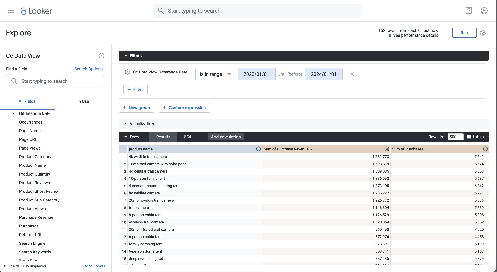

# Transformationen


Sie möchten die Transformationen von Customer Journey Analytics-Objekten wie Dimensionen, Metriken, Filtern, berechneten Metriken und Datumsbereichen durch die verschiedenen BI-Tools verstehen.

+++ Customer Journey Analytics

In Customer Journey Analytics definieren Sie in einer [Datenansicht](/help/data-views/data-views.md), welche und wie Komponenten Ihrer Datensätze als [Dimensionen](/help/components/dimensions/overview.md) und [Metriken](/help/components/apply-create-metrics.md) bereitgestellt werden. Diese Definition von Dimension und Metriken wird den BI-Tools mithilfe der BI-Erweiterung bereitgestellt.
Komponenten wie [Filter](/help/components/segments/seg-overview.md), [Berechnete Metriken](/help/components/calc-metrics/calc-metr-overview.md) und [Datumsbereiche](/help/components/date-ranges/overview.md) werden in Ihren Workspace-Projekten verwendet. Diese Komponenten werden auch den BI-Tools mithilfe der BI-Erweiterung bereitgestellt.

+++

+++ BI-Tools

>[!PREREQUISITES]
>
>Stellen Sie sicher, [ Sie für das BI-Tool, für das Sie diesen Anwendungsfall ausprobieren möchten, (eine erfolgreiche Verbindung, Datenansichten auflisten ](connect-and-validate.md) eine Datenansicht verwenden) validiert haben.
>

>[!BEGINTABS]

>[!TAB Power BI Desktop]

Die Customer Journey Analytics-Objekte sind im Bereich **[!UICONTROL Daten]** verfügbar und werden aus der von Ihnen in Power BI Desktop ausgewählten Tabelle abgerufen. Beispiel: **[!UICONTROL public.cc_data_view]**. Der Tabellenname entspricht der externen ID, die Sie für Ihre Datenansicht in Customer Journey Analytics definiert haben. Zum Beispiel eine Datenansicht mit **[!UICONTROL Titel]** `C&C - Data View` und **[!UICONTROL Externe ID]** `cc_data_view`.

**Dimensionen**
Dimensionen aus Customer Journey Analytics werden durch die [!UICONTROL Komponenten-ID] gekennzeichnet. Die [!UICONTROL Komponenten-ID] wird in Ihrer Customer Journey Analytics-Datenansicht definiert. Beispielsweise verfügt die Dimension **[!UICONTROL Produktname]** in Customer Journey Analytics über eine [!UICONTROL Komponenten-ID] **[!UICONTROL product_name]**, die der Name für die Dimension in Power BI Desktop ist.
Datumsbereichsdimensionen aus Customer Journey Analytics wie **[!UICONTROL Tag]**, **[!UICONTROL Woche]**, **[!UICONTROL Monat]** und mehr sind verfügbar als **[!UICONTROL daterangeday]**, **[!UICONTROL daterangeweek]**, **[!UICONTROL daterangemonth]** und mehr.

**Metriken**
Metriken aus Customer Journey Analytics werden durch die [!UICONTROL Komponenten-ID“ ]. Die [!UICONTROL Komponenten-ID] wird in Ihrer Customer Journey Analytics-Datenansicht definiert. Beispielsweise verfügt die Metrik **[!UICONTROL Kaufumsatz]** in Customer Journey Analytics über eine [!UICONTROL Komponenten-ID] **[!UICONTROL Kauf_Umsatz]**, die der Name für die Metrik in Power BI Desktop ist. Ein **[!UICONTROL ∑]** zeigt Metriken an. Wenn Sie eine Metrik in einer Visualisierung verwenden, wird die Metrik in „Summe **[!UICONTROL Metrik *umbenannt *]**.

**Filter**
In Customer Journey Analytics definierte Filter sind als Teil des Felds **[!UICONTROL filterName]** verfügbar. Wenn Sie ein Feld **[!UICONTROL filterName]** in Power BI Desktop verwenden, können Sie angeben, welcher Filter verwendet werden soll.

**Berechnete Metriken**
Berechnete Metriken, die Sie in Customer Journey Analytics definieren, werden durch die [!UICONTROL Externe ID] identifiziert, die Sie für die berechnete Metrik definiert haben. Beispielsweise verfügt die berechnete Metrik **[!UICONTROL Produktname (Anzahl Distinct)]** über [!UICONTROL Externe ID] **[!UICONTROL product_name_count_distinct]** und wird Power BI Desktop als **[!UICONTROL cm_product_name_count_distinct]**t angezeigt.

**Datumsbereiche**
Datumsbereiche, die Sie in Customer Journey Analytics definieren, sind als Teil des Felds **[!UICONTROL daterangeName]** verfügbar. Wenn Sie ein Feld **[!UICONTROL daterangeName]** verwenden, können Sie angeben, welcher Datumsbereich verwendet werden soll.

**Benutzerdefinierte Umwandlungen**
Power BI Desktop bietet benutzerdefinierte Umwandlungsfunktionen mithilfe von [Data Analysis Expressions (DAX)](https://learn.microsoft.com/en-us/dax/dax-overview). Als Beispiel möchten Sie den Anwendungsfall [Einzel-Dimension-Rangfolge](#single-dimension-ranked) mit Produktnamen in Kleinbuchstaben ausführen.

1. Wählen Sie in der Berichtsansicht die Balkenvisualisierung aus.
1. Wählen **[!UICONTROL product_name]** im Datenbereich aus.
1. Wählen Sie **[!UICONTROL Neue Spalte]** in der Symbolleiste aus.
1. Definieren Sie im Formeleditor eine neue Spalte mit dem Namen `product_name_lower`, z. B. `product_name_lower = LOWER('public.cc_data_view[product_name])`.
   
1. Wählen Sie die neue Spalte **[!UICONTROL product_name_lower]** im Bereich **[!UICONTROL data]** anstelle der Spalte **[!UICONTROL product_name]** aus.
1. Wählen Sie **[!UICONTROL Bericht als]**) unter  in der Tabellenvisualisierung aus.

   Ihr Power BI-Desktop sollte wie folgt aussehen.
   

Die benutzerdefinierte Transformation führt zu einer Aktualisierung der SQL-Abfragen. Siehe die Verwendung der Funktion `lower` im folgenden SQL-Beispiel:

```sql
select "_"."product_name_lower",
    "_"."a0",
    "_"."a1"
from 
(
    select "rows"."product_name_lower" as "product_name_lower",
        sum("rows"."purchases") as "a0",
        sum("rows"."purchase_revenue") as "a1"
    from 
    (
        select "_"."daterange" as "daterange",
            "_"."product_name" as "product_name",
            "_"."purchase_revenue" as "purchase_revenue",
            "_"."purchases" as "purchases",
            lower("_"."product_name") as "product_name_lower"
        from 
        (
            select "_"."daterange",
                "_"."product_name",
                "_"."purchase_revenue",
                "_"."purchases"
            from 
            (
                select "daterange",
                    "product_name",
                    "purchase_revenue",
                    "purchases"
                from "public"."cc_data_view" "$Table"
            ) "_"
            where ("_"."daterange" < date '2024-01-01' and "_"."daterange" >= date '2023-01-01') and ("_"."product_name" in ('4G Cellular Trail Camera', '4K Wildlife Trail Camera', 'Wireless Trail Camera', '8-Person Cabin Tent', '20MP No-Glow Trail Camera', 'HD Wildlife Camera', '4-Season Mountaineering Tent', 'Trail Camera', '16MP Trail Camera with Solar Panel', '10-Person Family Tent'))
        ) "_"
    ) "rows"
    group by "product_name_lower"
) "_"
where not "_"."a0" is null or not "_"."a1" is null
limit 1000001
```

>[!TAB Tableau Desktop]

Die Customer Journey Analytics-Objekte sind in der Seitenleiste **[!UICONTROL Daten]** verfügbar, wenn Sie in einem Blatt arbeiten. und werden aus der Tabelle abgerufen, die Sie als Teil der Seite **[!UICONTROL Datenquelle“]** Tableau ausgewählt haben. Beispiel: **[!UICONTROL cc_data_view]**. Der Tabellenname entspricht der externen ID, die Sie für Ihre Datenansicht in Customer Journey Analytics definiert haben. Zum Beispiel eine Datenansicht mit **[!UICONTROL Titel]** `C&C - Data View` und **[!UICONTROL Externe ID]** `cc_data_view`.

**Dimensionen**
Dimensionen aus Customer Journey Analytics werden durch den [!UICONTROL Komponentennamen] gekennzeichnet. Der [!UICONTROL Komponentenname] wird in Ihrer Customer Journey Analytics-Datenansicht definiert. Beispielsweise verfügt die Dimension **[!UICONTROL Produktname]** in Customer Journey Analytics über einen [!UICONTROL Komponentennamen] **[!UICONTROL Produktnamen]**, der der Name für die Dimension in Tableau ist. Alle Dimensionen werden durch **[!UICONTROL Abc]** gekennzeichnet.
Datumsbereichsdimensionen aus Customer Journey Analytics wie **[!UICONTROL Tag]**, **[!UICONTROL Woche]**, **[!UICONTROL Monat]** und mehr sind verfügbar als **[!UICONTROL DateRangeDay]**, **[!UICONTROL DateRangeWeek]**, **[!UICONTROL DateRangeMonth]** und mehr. Wenn Sie eine Datumsbereichsdimension verwenden, müssen Sie eine entsprechende Definition von Datum oder Uhrzeit auswählen, die auf diese Datumsbereichsdimension aus dem Dropdown-Menü angewendet werden soll. Beispiel: **[!UICONTROL Jahr]**, **[!UICONTROL Quartal]**, **[!UICONTROL Monat]**, **[!UICONTROL Tag]**.

**Metriken**
Metriken aus Customer Journey Analytics werden durch den [!UICONTROL Komponentennamen“ ]. Der [!UICONTROL Komponentenname] wird in Ihrer Customer Journey Analytics-Datenansicht definiert. Beispielsweise verfügt die Metrik **[!UICONTROL Kaufumsatz]** in Customer Journey Analytics über einen [!UICONTROL Komponentennamen] **[!UICONTROL Kaufumsatz]**, der der Name für die Metrik in Tableau ist. Alle Metriken werden durch **[!UICONTROL #]** identifiziert. Wenn Sie eine Metrik in einer beliebigen Visualisierung verwenden, wird die Metrik in **[!UICONTROL Summe(*metrik*)]**.

**Filter**
In Customer Journey Analytics definierte Filter sind als Teil des Felds **[!UICONTROL Filtername]** verfügbar. Wenn Sie ein Feld **[!UICONTROL Filtername]** in Tableau verwenden, können Sie angeben, welcher Filter verwendet werden soll.

**Berechnete Metriken**
Berechnete Metriken, die Sie in Customer Journey Analytics definieren, werden durch den [!UICONTROL Titel] identifiziert, den Sie für die berechnete Metrik definiert haben. Beispielsweise hat die berechnete Metrik **[!UICONTROL Produktname (]**) [!UICONTROL Titel] **[!UICONTROL Produktname (Anzahl Unterschiedlich)]** und wird in Tableau als **[!UICONTROL cm Produktname Anzahl Unterschiedlich]** angezeigt.

**Datumsbereiche**
Datumsbereiche, die Sie in Customer Journey Analytics definieren, sind als Teil des Felds **[!UICONTROL Datumsbereichsname]** verfügbar. Wenn Sie ein Feld **[!UICONTROL Name des Datumsbereichs]** verwenden, können Sie angeben, welcher Datumsbereich verwendet werden soll.

**Benutzerdefinierte Umwandlungen**
Tableau Desktop bietet benutzerdefinierte Umwandlungsfunktionen mithilfe von [berechneten Feldern](https://help.tableau.com/current/pro/desktop/en-us/calculations_calculatedfields_create.htm). Als Beispiel möchten Sie den Anwendungsfall [Einzel-Dimension-Rangfolge](#single-dimension-ranked) mit Produktnamen in Kleinbuchstaben ausführen.

1. Wählen **[!UICONTROL Analyse]** > **[!UICONTROL Berechnetes Feld erstellen]** aus dem Hauptmenü aus.
   1. Definieren Sie **[!UICONTROL Produktname in Kleinbuchstaben]** mithilfe der `LOWER([Product Name])`.
      
   1. Klicken Sie **[!UICONTROL OK]**.
1. Wählen Sie das **[!UICONTROL Daten]** Blatt aus.
   1. Ziehen Sie **[!UICONTROL Produktname in Kleinbuchstaben]** aus **[!UICONTROL Tabellen]** und legen Sie den Eintrag im Feld neben &quot;**[!UICONTROL &quot;]**.
   1. Entfernen Sie **[!UICONTROL Produktname]** aus **[!UICONTROL Zeilen]**.
1. Wählen Sie **[!UICONTROL Ansicht]** Dashboard 1) aus.

Ihr Tableau-Desktop sollte wie folgt aussehen.


Die benutzerdefinierte Transformation führt zu einer Aktualisierung der SQL-Abfragen. Siehe die Verwendung der Funktion `LOWER` im folgenden SQL-Beispiel:

```sql
SELECT LOWER(CAST(CAST("cc_data_view"."product_name" AS TEXT) AS TEXT)) AS "Calculation_1562467608097775616",
  SUM("cc_data_view"."purchase_revenue") AS "sum:purchase_revenue:ok",
  SUM("cc_data_view"."purchases") AS "sum:purchases:ok"
FROM "public"."cc_data_view" "cc_data_view"
WHERE (("cc_data_view"."daterange" >= (DATE '2023-01-01')) AND ("cc_data_view"."daterange" <= (DATE '2023-12-31')))
GROUP BY 1
HAVING ((SUM("cc_data_view"."purchase_revenue") >= 999999.99999998999) AND (SUM("cc_data_view"."purchase_revenue") <= 2000000.00000002))
```

>[!TAB Looker]

Die Customer Journey Analytics-Objekte sind in der Benutzeroberfläche **[!UICONTROL Erkunden]** verfügbar. und werden beim Einrichten Ihrer Verbindung, Ihres Projekts und Ihres Modells in Looker abgerufen. Beispiel: **[!UICONTROL cc_data_view]**. Der Name der Ansicht entspricht der externen ID, die Sie für Ihre Datenansicht in Customer Journey Analytics definiert haben. Zum Beispiel eine Datenansicht mit **[!UICONTROL Titel]** `C&C - Data View` und **[!UICONTROL Externe ID]** `cc_data_view`.

**Dimensionen**
Dimensionen aus Customer Journey Analytics werden in der linken Leiste in der **[!UICONTROL CC-Datenansicht]** als **** DIMENSION&quot; aufgeführt. Die Dimension wird in Ihrer Customer Journey Analytics-Datenansicht definiert. Beispielsweise verfügt die Dimension **[!UICONTROL Produktname]** in Customer Journey Analytics über einen **[!UICONTROL DIMENSION]****[!UICONTROL Produktnamen]**, der der Name für die Dimension in Looker ist.
Datumsbereichsdimensionen aus Customer Journey Analytics wie **[!UICONTROL Tag]**, **[!UICONTROL Woche]**, **[!UICONTROL Monat]** und mehr sind verfügbar als **[!UICONTROL DateRangeDay]**, **[!UICONTROL DateRangeWeek]**, **[!UICONTROL DateDateMonth]** und mehr.  Wenn Sie eine Datumsbereichsdimension verwenden, müssen Sie eine entsprechende Definition von Datum oder Uhrzeit auswählen. Beispiel: **[!UICONTROL Jahr]**, **[!UICONTROL Quartal]**, **[!UICONTROL Monat]**, **[!UICONTROL Datum]**.

**Metriken**
Metriken aus Customer Journey Analytics werden in der linken Leiste **[!UICONTROL Cc-Datenansicht]** als **** DIMENSION&quot; aufgelistet. Beispielsweise hat die Metrik **[!UICONTROL Kaufumsatz]** in Customer Journey Analytics einen **[!UICONTROL DIMENSION]****[!UICONTROL Kaufumsatz]**. Um tatsächlich als Metrik zu verwenden, erstellen Sie ein benutzerdefiniertes Kennzahlfeld, wie in den obigen Beispielen gezeigt, oder verwenden Sie den Tastaturbefehl für eine Dimension. Beispiel: **[!UICONTROL ⋮]**, wählen Sie **[!UICONTROL Aggregat]** und dann **[!UICONTROL Summe]**.

**Filter**
In Customer Journey Analytics definierte Filter sind als Teil des Felds **[!UICONTROL Filtername]** verfügbar. Wenn Sie ein Feld **[!UICONTROL Filtername]** in Looker verwenden, können Sie angeben, welcher Filter verwendet werden soll.

**Berechnete Metriken**
Berechnete Metriken, die Sie in Customer Journey Analytics definieren, werden durch den [!UICONTROL Titel] identifiziert, den Sie für die berechnete Metrik definiert haben. Beispielsweise hat die berechnete Metrik **[!UICONTROL Produktname (Anzahl Unterschiedlich)]** den [!UICONTROL Titel] **[!UICONTROL Produktnamen (Anzahl Unterschiedlich)]** und wird in Looker als **[!UICONTROL cm Produktname Anzahl Unterschiedlich]** angezeigt.

**Datumsbereiche**
Datumsbereiche, die Sie in Customer Journey Analytics definieren, sind als Teil des Felds **[!UICONTROL Datumsbereichsname]** verfügbar. Wenn Sie ein Feld **[!UICONTROL Name des Datumsbereichs]** verwenden, können Sie angeben, welcher Datumsbereich verwendet werden soll.

**Benutzerdefinierte Umwandlungen**
Looker bietet benutzerdefinierte Umwandlungsfunktionen mithilfe von benutzerdefinierten Feld-Buildern, wie oben gezeigt. Als Beispiel möchten Sie den Anwendungsfall [Einzel-Dimension-Rangfolge](#single-dimension-ranked) mit Produktnamen in Kleinbuchstaben ausführen.

1. Im Abschnitt **[!UICONTROL ‣ Benutzerdefinierte Felder]** in der linken Leiste:
   1. Wählen Sie **[!UICONTROL Benutzerdefinierte Dimension]** aus dem Dropdown-Menü **[!UICONTROL +]** aus.
   1. Geben Sie `lower(${cc_data_view.product_name})` im **[!UICONTROL Ausdruck]** ein. Sie erhalten Unterstützung bei der korrekten Syntax, wenn Sie beginnen, `Product Name` einzugeben.
      
   1. Geben Sie `product name` als **[!UICONTROL Name]** ein.
   1. Wählen Sie **[!UICONTROL Speichern]** aus.

Es sollte eine ähnliche Tabelle angezeigt werden, wie unten dargestellt.




Die benutzerdefinierte Transformation führt zu einer Aktualisierung der SQL-Abfragen. Siehe die Verwendung der Funktion `LOWER` im folgenden SQL-Beispiel:

```sql
SELECT
    LOWER((cc_data_view."product_name")) AS "product_name",
    COALESCE(SUM(CAST(( cc_data_view."purchase_revenue"  ) AS DOUBLE PRECISION)), 0) AS "sum_of_purchase_revenue",
    COALESCE(SUM(CAST(( cc_data_view."purchases"  ) AS DOUBLE PRECISION)), 0) AS "sum_of_purchases"
FROM public.cc_data_view  AS cc_data_view
WHERE ((( cc_data_view."daterange"  ) >= (DATE_TRUNC('day', DATE '2023-01-01')) AND ( cc_data_view."daterange"  ) < (DATE_TRUNC('day', DATE '2024-01-01'))))
GROUP BY
    1
ORDER BY
    2 DESC
FETCH NEXT 500 ROWS ONLY
```

>[!TAB Jupyter-Notebook]

Die Customer Journey Analytics-Objekte (Dimensionen, Metriken, Filter, berechnete Metriken und Datumsbereiche) sind als Teil der von Ihnen erstellten Embedded SQL-Abfragen verfügbar. Siehe frühere Beispiele.

**Benutzerdefinierte Umwandlungen**

1. Geben Sie die folgenden Anweisungen in eine neue Zelle ein.

   ```python
   data = %sql SELECT LOWER(product_category) AS `Product Category`, COUNT(*) AS EVENTS \
               FROM cc_data_view \
               WHERE daterange BETWEEN '2023-01-01' AND '2024-01-01' \
               GROUP BY 1 \
               ORDER BY `Events` DESC \
               LIMIT 5;
   display(data)
   ```

1. Ausführen der Zelle. Es sollte eine ähnliche Ausgabe wie im folgenden Screenshot angezeigt werden.

   

Die Abfrage wird von der BI-Erweiterung ausgeführt, wie in Jupyter Notebook definiert.

>[!TAB RStudio]

Die Customer Journey Analytics-Komponenten (Dimensionen, Metriken, Filter, berechnete Metriken und Datumsbereiche) sind als ähnliche benannte Objekte in der Sprache R verfügbar. Verweisen Sie auf die Komponenten mithilfe der Komponente Siehe frühere Beispiele.

**Benutzerdefinierte Umwandlungen**

1. Geben Sie die folgenden Anweisungen zwischen ` ```{r} ` und ` ``` ` in einen neuen Block ein.

   ```R
   df <- dv %>%
      filter(daterange >= "2023-01-01" & daterange <= "2024-01-01") %>%
      mutate(d2=lower(product_category)) %>%
      group_by(d2) %>%
      count() %>%
      arrange(d2, .by_group = FALSE)
   print(df)
   ```

1. Führt den Block aus. Es sollte eine ähnliche Ausgabe wie im folgenden Screenshot angezeigt werden.

   

Die Abfrage, die von RStudio mithilfe der BI-Erweiterung generiert wird, enthält `lower`, was bedeutet, dass die benutzerdefinierte Transformation von RStudio und der BI-Erweiterung ausgeführt wird.

```sql
SELECT "d2", COUNT(*) AS "n"
FROM (
  SELECT "cc_data_view".*, lower("product_category") AS "d2"
  FROM "cc_data_view"
  WHERE ("daterange" >= '2023-01-01' AND "daterange" <= '2024-01-01')
) AS "q01"
GROUP BY "d2"
ORDER BY "d2"
LIMIT 1000
```

>[!ENDTABS]

+++

