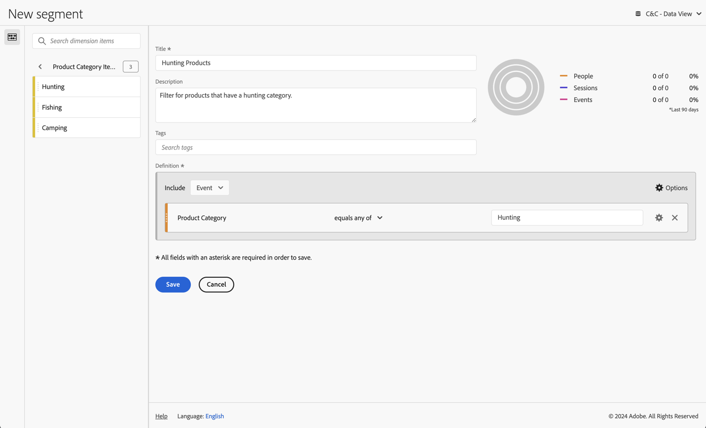

# Segmentieren von Dimensionswerten

Mit dem dynamischen Wert **[!UICONTROL Jagd]** für **[!UICONTROL Produktkategorie]** können Sie Produkte aus der Jagdkategorie segmentieren. Alternativ können Sie für die BI-Tools, die den dynamischen Abruf von Produktkategoriewerten nicht unterstützen, in Customer Journey Analytics ein neues Segment erstellen, das Produkte aus der Produktkategorie Jagd segmentiert.
Dann möchten Sie das neue Segment verwenden, um im Januar 2023 Berichte zu Produktnamen und Vorfällen (Ereignissen) für Produkte aus der Kategorie Jagd zu erstellen.

+++ Customer Journey Analytics

Erstellen Sie ein neues Segment mit **[!UICONTROL Titel]**-`Hunting Products` in Customer Journey Analytics.



Anschließend können Sie dieses Segment in einem Beispiel im Bedienfeld **[!UICONTROL Verwenden von Dimension-Werten zum Filtern]** für den Anwendungsfall verwenden:


+++

+++ BI-Tools

>[!PREREQUISITES]
>
>Stellen Sie sicher, [ Sie für das BI-Tool, für das Sie diesen Anwendungsfall ausprobieren möchten, (eine erfolgreiche Verbindung, Datenansichten auflisten ](connect-and-validate.md) eine Datenansicht verwenden) validiert haben.
>

>[!BEGINTABS]

>[!TAB Power BI Desktop]

1. Wählen Sie **[!UICONTROL Menü]** Startseite“ und dann in der Symbolleiste **[!UICONTROL Aktualisieren]** aus. Sie müssen die Verbindung aktualisieren, um den neuen Filter aufzunehmen, den Sie gerade in Customer Journey Analytics definiert haben.

1. Im Bereich **[!UICONTROL Daten]**:
   1. Wählen Sie **[!UICONTROL daterange]** aus.
   1. Wählen Sie **[!UICONTROL product_category]** aus.
   1. Wählen Sie **[!UICONTROL product_name]** aus.
   1. Wählen Sie **[!UICONTROL Summenvorfälle]** aus.

Es wird eine Visualisierung mit **[!UICONTROL Fehler beim Abrufen von Daten für dieses visuelle Element]** angezeigt.

1. Im Bereich **[!UICONTROL Filter]**:
   1. Wählen Sie **[!UICONTROL filterName is (All)]** aus **[!UICONTROL Filter für dieses visuelle Element]**.
   1. Wählen Sie **[!UICONTROL Standardfilter]** als **[!UICONTROL Filtertyp]**.
   1. Wählen Sie **[!UICONTROL daterange is (All)]** aus **[!UICONTROL Filter auf dieser visuellen]**.
   1. Wählen Sie **[!UICONTROL Erweiterte]**) als **[!UICONTROL Filtertyp]**.
   1. Definieren Sie den Filter für **[!UICONTROL Elemente anzeigen, wenn der Wert]** **[!UICONTROL auf oder nach]** `1/1/2023` **[!UICONTROL Und]****[!UICONTROL vor]** `2/1/2023` liegt.
   1. Wählen Sie **[!UICONTROL Standardfilter]** als **[!UICONTROL Filtertyp]** für **[!UICONTROL product_category]** und wählen Sie **[!UICONTROL Hunting]** aus der Liste der möglichen Werte aus.
   1. Wählen Sie  aus, um **[!UICONTROL filterName]** aus &quot;**[!UICONTROL &quot;]**.
   1. Wählen Sie  aus, um **[!UICONTROL daterange]** aus &quot;**[!UICONTROL &quot;]**.

   Die Tabelle wird mit dem angewendeten Filter **[!UICONTROL product_category]** aktualisiert. Ihr Power BI-Desktop sollte wie folgt aussehen.

   


>[!TAB Tableau Desktop]

 Tableau Desktop unterstützt nicht das Abrufen der dynamischen Liste von Produktkategorien aus Customer Journey Analytics. Stattdessen verwendet dieser Anwendungsfall den neu erstellten Filter für **[!UICONTROL Jagdprodukte]** und verwendet die Kriterien für Filternamen.

1. Wählen Sie in **[!UICONTROL Data Source]**-Ansicht unter **[!UICONTROL Data]** im Kontextmenü unter **[!UICONTROL cc_data_view(prod:cja%3FFLATTEN)]** die Option **[!UICONTROL Aktualisieren]**. Sie müssen die Verbindung aktualisieren, um den neuen Filter aufzunehmen, den Sie gerade in Customer Journey Analytics definiert haben.
1. Wählen Sie unten **[!UICONTROL Registerkarte Blatt 1]** aus, um aus **[!UICONTROL Datenquelle]** zu wechseln. In der Ansicht **[!UICONTROL Blatt 1]**:
   1. Ziehen Sie den **[!UICONTROL Filtername]** aus der Liste **[!UICONTROL Tabellen]** in die Ablage **[!UICONTROL Filter]**.
   1. Stellen Sie im **[!UICONTROL Filter \[Filtername\]]** sicher, dass **[!UICONTROL Aus Liste]** ist, und wählen Sie **[!UICONTROL Jagdprodukte]** aus der Liste. Wählen Sie **[!UICONTROL Übernehmen]** und **[!UICONTROL OK]** aus.
   1. Ziehen Sie **[!UICONTROL Daterange]**-Eintrag aus der Liste **[!UICONTROL Tabellen]** in die Ablage **[!UICONTROL Filter]**.
   1. Wählen Sie im Dialogfeld **[!UICONTROL Filterfeld \[Datumsbereich\]]** die Option **[!UICONTROL Datumsbereich]** und wählen Sie **[!UICONTROL Weiter >]**.
   1. Wählen Sie im **[!UICONTROL Filter \[Daterange\]]** die Option **[!UICONTROL Datumsbereich]** und anschließend `01/01/2023` - `1/2/2023` aus. Wählen Sie **[!UICONTROL Übernehmen]** und **[!UICONTROL OK]** aus.
   1. Ziehen Sie **[!UICONTROL Produktname]** aus der Liste **[!UICONTROL Tabellen]** in **[!UICONTROL Zeilen]**.
   1. Ziehen Sie **[!UICONTROL Eintrag]** Vorfälle“ aus der Liste **[!UICONTROL Tabellen]** und legen Sie den Eintrag im Feld neben **[!UICONTROL Spalten]** ab. Der Wert ändert sich in **[!UICONTROL SUM(Occurrences)]**.
   1. Wählen Sie **[!UICONTROL Texttabelle]** unter **[!UICONTROL Anzeigen]** aus.
   1. Wählen **[!UICONTROL Breite anpassen]** aus dem Dropdown **[!UICONTROL Menü]** Anpassen“.

      Ihr Tableau-Desktop sollte wie folgt aussehen.

      

>[!TAB Looker]

1. In der 1. Aktualisieren Sie Ihre Verbindung in der **[!UICONTROL Erkunden]**-Benutzeroberfläche von Looker. Wählen Sie  **[!UICONTROL Cache löschen und aktualisieren]** aus.
1. Achten Sie in der **[!UICONTROL Explore]**-Oberfläche von Looker darauf, dass Sie über ein sauberes Setup verfügen. Wenn nicht, wählen Sie  **[!UICONTROL Felder und Filter entfernen]**.
1. Wählen Sie **[!UICONTROL + Filter]** unter **[!UICONTROL Filter]** aus.
1. Im Dialogfeld **[!UICONTROL Filter hinzufügen]**:
   1. Wählen Sie **[!UICONTROL ‣ CC-Datenansicht]**
   1. Wählen Sie aus der Liste der Felder **[!UICONTROL ‣ DateRange]** und **[!UICONTROL DateRange]** aus.
      
1. Geben Sie den Filter **[!UICONTROL CC Datenansicht Datumsbereich]** als **[!UICONTROL liegt im Bereich]** **[!UICONTROL 2023/01/]****[!UICONTROL bis (davor)]** **[!UICONTROL 2023/02/01]** an.
1. Wählen Sie **[!UICONTROL + Filter]** unter **[!UICONTROL Filter]** aus, um einen weiteren Filter hinzuzufügen.
1. Im Dialogfeld **[!UICONTROL Filter hinzufügen]**:
   1. Wählen Sie **[!UICONTROL ‣ CC-Datenansicht]**
   1. Wählen Sie aus der Liste der Felder **[!UICONTROL ‣ Produktkategorie]** aus.
1. Stellen Sie **[!UICONTROL is]** als Auswahl für den Filter sicher.

 Lookes zeigt nicht die Liste der möglichen Werte für **[!UICONTROL Produktkategorie]**.


>[!TAB Jupyter-Notebook]

1. Geben Sie die folgenden Anweisungen in eine neue Zelle ein.

   ```python
   data = %sql SELECT DISTINCT product_category FROM cc_data_view WHERE daterange BETWEEN '2023-01-01' AND '2024-01-01';
   style = {'description_width': 'initial'}
   category_filter = widgets.Dropdown(
      options=[d for d, in data],
      description='Product Category:',
      style=style
   )
   display(category_filter)
   ```

1. Ausführen der Zelle. Es sollte eine ähnliche Ausgabe wie im folgenden Screenshot angezeigt werden.

   

1. Wählen **[!UICONTROL aus]** Dropdown-Menü „Jagd“ aus.

1. Geben Sie die folgenden Anweisungen in eine neue Zelle ein.

   ```python
   import seaborn as sns
   import matplotlib.pyplot as plt
   data = %sql SELECT product_name AS `Product Name`, COUNT(*) AS Events \
               FROM cc_data_view \
               WHERE daterange BETWEEN '2023-01-01' AND '2023-02-01' \
               AND product_category = '{category_filter.value}' \
               GROUP BY 1 \
               ORDER BY Events DESC \
               LIMIT 10;
   df = data.DataFrame()
   df = df.groupby('Product Name', as_index=False).sum()
   plt.figure(figsize=(15, 3))
   sns.barplot(x='Events', y='Product Name', data=df)
   plt.show()
   display(data)
   ```

1. Ausführen der Zelle. Es sollte eine ähnliche Ausgabe wie im folgenden Screenshot angezeigt werden.

   


>[!TAB RStudio]

1. Geben Sie die folgenden Anweisungen zwischen ` ```{r} ` und ` ``` ` in einen neuen Block ein. Stellen Sie sicher, dass Sie eine geeignete Kategorie verwenden. Beispiel: `Hunting`.

   ```R
   ## Dimension 1 Filtered by Dimension 2 value
   df <- dv %>%
      filter(daterange >= "2023-01-01" & daterange < "2023-02-01" & product_category == "Hunting") %>%
      group_by(product_name) %>%
      count() %>%
      arrange(desc(n), .by_group = FALSE)
   print(df)
   ```

1. Führt den Block aus. Es sollte eine ähnliche Ausgabe wie im folgenden Screenshot angezeigt werden.

   

>[!ENDTABS]

+++

