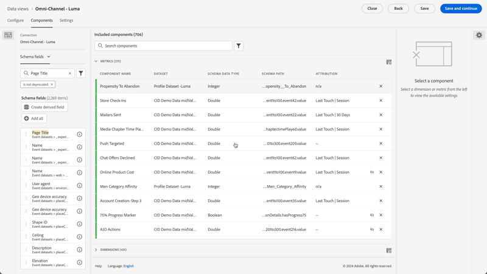
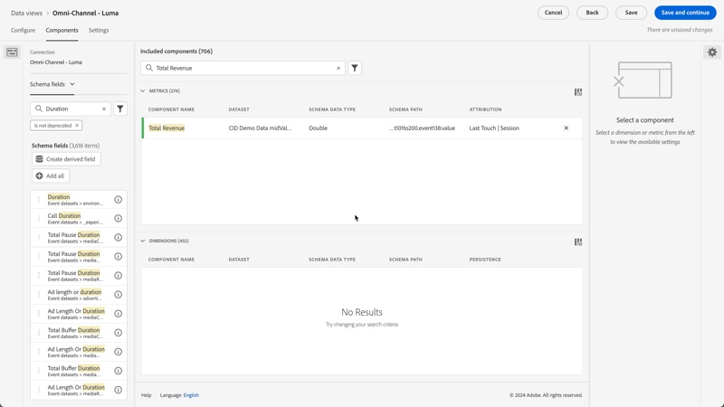

# Anwendungsfälle von Datenansichten

Diese Anwendungsfälle veranschaulichen die Flexibilität und Leistungsfähigkeit von Datenansichten in Customer Journey Analytics.

## Verwenden von Metriken für Bindungsdimensionen

Weitere Informationen finden Sie [ Anwendungsbeispiel ](binding-dimensions-metrics.md)Verwenden von Bindungsdimensionsmetriken“.

## Verwenden von Zusammenfassungsdaten

Weitere Details finden Sie [ Anwendungsbeispiel ](summary-data.md)Nutzungsübersichtsdaten“.

## Anwendungsfälle für BI-Erweiterungen

In den [BI-Erweiterungsanwendungsfällen](bi-extension-usecases.md) finden Sie Informationen zum Ausführen einer Reihe von Anwendungsfällen mit der Customer Journey Analytics BI-Erweiterung.

## Erstellen einer Metrik aus einem Zeichenfolgen-Schemafeld {#string}

Wenn Sie beispielsweise eine Datenansicht erstellen, können Sie eine Metrik [!UICONTROL Bestellungen] aus einem Schemafeld [!UICONTROL Seitentitel] erstellen, das eine Zeichenfolge ist.

1. Ziehen Sie auf **[!UICONTROL Registerkarte]** den **[!UICONTROL Seitentitel]** in den Abschnitt **[!UICONTROL Metriken]** unter [!UICONTROL Enthaltene Komponenten].
1. Markieren Sie die Metrik, die Sie gerade eingezogen haben, und benennen Sie sie in der **[!UICONTROL Komponenteneinstellungen]** in `Orders` um
1. Öffnen Sie den **[!UICONTROL Werte einschließen/ausschließen]** und geben Sie Folgendes an:
   1. Aktivieren Sie **[!UICONTROL Einschließen/ausschließen-Werte festlegen]**.
   1. Wählen Sie **[!UICONTROL Wenn alle Kriterien erfüllt sind]** unter **[!UICONTROL Übereinstimmung]** aus.
   1. `confirmation` angeben. Dieser Text für &quot;**[!UICONTROL _title]** zeigt an, dass diese Seite mit der Bestellung verbunden ist. Nach Überprüfung aller Seitentitel, die diese Kriterien erfüllen, wird für jede Instanz ein `1` gezählt. Das Ergebnis ist eine neue Metrik (keine berechnete Metrik). Eine Metrik mit eingeschlossenen/ausgeschlossenen Werten kann überall dort verwendet werden, wo auch jede andere Metrik verwendet werden kann. Es funktioniert mit Attribution IQ, Segmenten und überall dort, wo Sie Standardmetriken verwenden können.

   {width=100%}
1. Sie können darüber hinaus ein Zuordnungsmodell für diese Metrik angeben, beispielsweise [!UICONTROL Letztkontakt] mit einem [!UICONTROL Lookback-Fenster] von [!UICONTROL Sitzung].
Sie können auch eine weitere Metrik [!UICONTROL Bestellungen] aus demselben Feld erstellen und ein anderes Attributionsmodell angeben. Beispielsweise [!UICONTROL Erstkontakt] und ein anderes [!UICONTROL Lookback-Fenster] wie [!UICONTROL 30 Tage].

Ein weiteres Beispiel wäre die Verwendung der Personen-ID, einer Dimension, als Metrik zur Bestimmung der Anzahl der Personen-IDs in Ihrem Unternehmen.

## Verwenden von Ganzzahlen als Dimensionen {#integers}

Zuvor wurden in Customer Journey Analytics Ganzzahlen automatisch als Metriken behandelt. Jetzt können numerische Zeichen (einschließlich benutzerdefinierter Ereignisse aus Adobe Analytics) als Dimensionen behandelt werden. Siehe folgendes Beispiel:

1. Ziehen Sie die Ganzzahl **[!UICONTROL Dauer]** in den Abschnitt **[!UICONTROL Dimensionen]** unter [!UICONTROL Eingeschlossene Komponenten]:
1. Sie können jetzt **[!UICONTROL Wertgruppierung]** hinzufügen, um diese Dimension in Berichten in zusammengefasster Form darzustellen. Ohne Gruppierung würde jede Instanz dieser Dimension als Zeilenelement im Workspace-Reporting angezeigt.
   {width=100%}

## Verwenden numerischer Dimensionen als Metriken in Flussdiagrammen {#numeric}

Sie können eine numerische Dimension verwenden, um Metriken in Ihre [!UICONTROL &#x200B; Flow]-Visualisierung zu übertragen.

1. Ziehen Sie auf der Registerkarte [Komponenten](https://experienceleague.adobe.com/de/docs/analytics-platform/using/cja-dataviews/create-dataview) der Datenansichten das Schemafeld [!UICONTROL Marketing-Kanäle] in den Bereich [!UICONTROL Metriken] unter [!UICONTROL Eingeschlossene Komponenten].
2. In Arbeitsbereich-Berichten zeigt dieser Fluss [!UICONTROL Marketing-Kanäle], die in [!UICONTROL Bestellungen] fließen:

## Filtern von Unterereignissen {#sub-event}

Diese Funktion gilt speziell für Array-basierte Felder. Mit der Ein-/Ausschlussfunktion können Sie auf der Ebene der Unterereignisse filtern, während Ihnen in Segment Builder erstellte Segmente nur eine Segmentierung auf Ereignisebene geben. Sie können die Filterung von Unterereignissen durchführen, indem Sie Einschließen/Ausschließen in Datenansichten verwenden und dann auf der Ereignisebene in einem Segment auf diese neue Metrik/Dimension verweisen.

Verwenden Sie beispielsweise die Ein-/Ausschlussfunktion in Datenansichten, um sich nur auf Produkte zu konzentrieren, die einen Umsatz von mehr als 50 US-Dollar generiert haben. Wenn Sie also eine Bestellung haben, die einen Produktkauf im Wert von 50 US-Dollar und einen Produktkauf im Wert von 25 US-Dollar enthält, entfernt die Ein-/Ausschlussfunktion den Produktkauf im Wert von 25 US-Dollar und nicht die gesamte Bestellung.

1. Ziehen Sie auf der Registerkarte [Komponenten](https://experienceleague.adobe.com/de/docs/analytics-platform/using/cja-dataviews/create-dataview) der Datenansichten das Schema **[!UICONTROL Umsatz]** in den Bereich **[!UICONTROL Metriken]** unter [!UICONTROL Eingeschlossene Komponenten].
1. Wählen Sie die Metrik aus und konfigurieren Sie rechts Folgendes:
a. Wählen Sie unter **[!UICONTROL Format]** die Option **[!UICONTROL Währung]** aus.
b. Wählen Sie unter **[!UICONTROL Währung]** die Option **[!UICONTROL USD]** aus.
c. Aktivieren Sie unter **[!UICONTROL Werte einschließen/ausschließen]** das Kontrollkästchen neben **[!UICONTROL Ein-/Ausschlusswerte festlegen]**.
d. Wählen Sie unter **[!UICONTROL Match]** die Option **[!UICONTROL Wenn alle Kriterien erfüllt sind]**.
e. Wählen Sie unter **[!UICONTROL Kriterien]** die Option **[!UICONTROL ist größer oder gleich]** aus.
f. Geben Sie `50` als Wert an.

Mit diesen neuen Einstellungen können Sie nur Umsätze mit höheren Werten anzeigen und alles unter 50 Dollar herausfiltern.

## Verwenden der Einstellung [!UICONTROL Keine Wertoptionen] {#no-value}

Ihr Unternehmen hat möglicherweise Zeit damit verbracht, Ihre Benutzer dahingehend zu schulen, dass sie für Dimensionen in Berichten „Nicht angegeben“ erwarten. Der Standardwert für Dimensionen in Datenansichten ist „Kein Wert“. Sie können jedoch für jede Dimension angeben, wie „Kein Wert“ gemeldet werden soll. Siehe die Optionen Kein Wert für eine Dimensionskomponente.

{width=100%}

## Erstellen mehrerer Metriken mit unterschiedlichen Attributionseinstellungen {#attribution}

Verwenden der Funktion **[!UICONTROL Duplizieren]** oben rechts, um eine Reihe von Gesamtumsatzmetriken mit verschiedenen Attributionseinstellungen wie **[!UICONTROL Erstkontakt]**, **[!UICONTROL Letztkontakt]** und **[!UICONTROL Algorithmisch]** zu erstellen.

Vergessen Sie nicht, jede Metrik umzubenennen, um die Unterschiede widerzuspiegeln, z. B. `Total Revenue (Algorithmic)`

{width=100%}

Weitere Informationen zu anderen Datenansicht-Einstellungen finden Sie unter [Erstellen von Datenansichten](/help/data-views/create-dataview.md).
Eine konzeptionelle Übersicht über die Datenansichten finden Sie unter [Übersicht über Datenansichten](/help/data-views/data-views.md).

## Berichte zu neuen und wiederkehrenden Sitzungen {#new-repeat}

Sie können feststellen, ob eine Sitzung tatsächlich die erste Sitzung für einen Benutzer oder eine wiederkehrende Sitzung ist. Basierend auf dem Berichtsfenster, das Sie für diese Datenansicht definiert haben, und einem 13-monatigen Lookback-Fenster. Diese Reporting-Funktion ermöglicht Ihnen beispielsweise, Folgendes zu bestimmen:

* Welcher Prozentsatz von Bestellungen stammt aus neuen oder wiederkehrenden Sitzungen?

* Sprechen Sie auf einem bestimmten Marketing-Kanal oder bei einer bestimmten Kampagne Erstbenutzende an oder Personen, die wiedergekommen sind? Wie beeinflusst diese Auswahl die Konversionsraten?

Eine Dimension und zwei Metriken ermöglichen diese Berichte:

* [Sitzungstyp](https://experienceleague.adobe.com/en/docs/analytics-platform/using/cja-dataviews/component-reference) - Diese Dimension hat zwei Werte: [!UICONTROL Neu] und [!UICONTROL Wiederkehrend]. Der [!UICONTROL Neu] Zeileneintrag enthält das gesamte Verhalten (d. h. die Metriken für diese Dimension) in einer Sitzung, die als erste Sitzung einer Person definiert wurde. Alles andere ist im Zeileneintrag [!UICONTROL Wiederkehrend] enthalten (vorausgesetzt, dass alles zu einer Sitzung gehört). Wenn Metriken nicht Teil einer Sitzung sind, fallen sie in den Bereich „Nicht zutreffend“ für diese Dimension.

* [Erstmalige ](https://experienceleague.adobe.com/en/docs/analytics-platform/using/cja-dataviews/component-reference). Die Metrik Erstmalige Sitzungen ist definiert als die erste Sitzung einer Person innerhalb des Reporting-Fensters.

* [Wiederkehrende Sitzungen](https://experienceleague.adobe.com/en/docs/analytics-platform/using/cja-dataviews/component-reference) Die Metrik „Wiederkehrende Sitzungen“ bezeichnet die Anzahl der Sitzungen, bei denen es sich nicht um die Erstsitzung einer Person gehandelt hat.—>

So greifen Sie auf die Komponenten zu:

1. Wechseln Sie zum Datenansichts-Editor.
1. Wählen Sie die Registerkarte **[!UICONTROL Komponenten]** und wählen Sie dann **[!UICONTROL Standardkomponenten]** in der linken Leiste aus.
1. Ziehen Sie die **[!UICONTROL Sitzungstyp]**, **[!UICONTROL Erstmalige Sitzungen]** und **[!UICONTROL Wiederkehrende Sitzungen]** in Ihre Datenansicht.

Neue Sitzungen werden fast immer genau gemeldet. Die einzigen Ausnahmen sind:

* Wenn eine erste Sitzung vor dem 13-monatigen Lookback-Fenster stattgefunden hat.  Diese Sitzung wird ignoriert.

* Wenn eine Sitzung sowohl das Lookback-Fenster als auch den Berichtszeitraum umfasst.  Sie führen beispielsweise einen Bericht vom 1. Juni bis zum 15. Juni 2022 aus. Das Lookback-Fenster würde sich vom 1. Mai 2021 bis zum 31. Mai 2022 erstrecken. Wenn eine Sitzung am 30. Mai 2022 beginnt und am 1. Juni 2022 endet, wird die Sitzung in das Lookback-Fenster aufgenommen. Und alle Sitzungen im Berichtsfenster werden als wiederkehrende Sitzungen gezählt.

## Verwenden der Datums- und Datumszeitfunktionen {#date}

Schemas in Adobe Experience Platform enthalten die Felder [!UICONTROL Datum] und [!UICONTROL Datum-Uhrzeit]. Customer Journey Analytics-Datenansichten unterstützen diese Felder jetzt. Wenn Sie diese Felder als Dimension in eine Datenansicht ziehen, können Sie ihr [Format](/help/data-views/component-settings/format.md) angeben. Diese Formateinstellung legt fest, wie die Felder im Berichtswesen angezeigt werden. Beispiel:

* Wenn Sie für das Datumsformat **[!UICONTROL Tag]** mit dem Format **[!UICONTROL Tag, Monat, Jahr]**, könnte eine Beispielausgabe in Berichten wie folgt aussehen: 23. August 2022.

* Wenn Sie für das Datum-Zeit-Format **[!UICONTROL Tagesminute]** mit dem Format **[!UICONTROL Stunde:Minute]** wählen, könnte Ihre Ausgabe wie folgt aussehen: 20:20.

Daten nach dem 1. Januar 1900 (mit Ausnahme des 1. Januar 1970) und Datums-/Uhrzeitwerte nach dem 1. Januar 2000 00:00:00 werden unterstützt.

### Anwendungsfälle mit Datum und Datum/Uhrzeit

* Datum: Ein Reiseunternehmen erfasst in seinen Daten das Abreisedatum für Reisen als Feld. Das Unternehmen möchte einen Bericht, der den [!UICONTROL Wochentag“ für alle &#x200B;] vergleicht, um zu verstehen, welche am beliebtesten sind. Und das Unternehmen möchte dasselbe für den „Monat [!UICONTROL &#x200B; Jahres“ &#x200B;].

* Datum-Uhrzeit: Ein Einzelhandelsunternehmen erfasst die Uhrzeit für jeden seiner Einkäufe am Verkaufsort (POS) im Geschäft. Das Unternehmen möchte wissen, zu welchen Zeiten in einem bestimmten Monat am meisten eingekauft wird, und zwar nach [!UICONTROL Tageszeit].

>[!MORELIKETHIS]
>
>[Datum und Datum-Uhrzeit in den Format-Komponenteneinstellungen](/help/data-views/component-settings/format.md)
>

