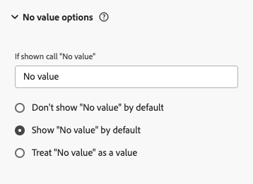

# Umgang mit „Kein Wert“

Wenn Sie mit Customer Journey Analytics arbeiten und auf **[!UICONTROL keinen Wert]** in Berichten und Dashboards stoßen, stellen sich wichtige Fragen zur Datenqualität, zu Erfassungsmethoden und zur Berichtsgenauigkeit. Diese Fälle müssen sorgfältig überwacht werden, da sie versteckte Lücken in der Datenerfassung aufdecken. Die Herausforderung besteht darin, zwei Szenarien zu unterscheiden: Wenn **[!UICONTROL kein Wert]**-Einträge von Datenquellenanbietern untersucht werden müssen und wenn **[!UICONTROL kein Wert]**-Einträge den natürlichen Datenfluss nach Customer Journey Analytics widerspiegeln. Das Verständnis dieser Unterscheidung ist für die Aufrechterhaltung effizienter Analysevorgänge von entscheidender Bedeutung. Dieses Handbuch hilft Ihnen bei fundierten Entscheidungen über das Erscheinungsbild **[!UICONTROL keinen Wert]** in Ihrer Customer Journey Analytics-Implementierung.

## Wissenswertes zu „Kein Wert“

**[!UICONTROL Kein Wert]** wird angezeigt, wenn eine Dimension keinen entsprechenden Wert für ein Ereignis hat, das ansonsten eine Metrik enthält. &quot;**[!UICONTROL Wert]** in einem Bericht zu sehen ist nicht immer ein Problem. In vielen Fällen spiegelt sie die erwartete Struktur Ihres Datensatzes wider.

Dimension-Elemente fallen in eine von drei Kategorien:

* **Erwartet [!UICONTROL kein Wert]**: Ein natürliches Ergebnis davon, wie Benutzer Ihre Daten durchlaufen, z. B. Besucher, die sich noch nicht angemeldet haben, oder Dimensionen, die nicht für jedes Ereignis gelten
* **Problematisch [!UICONTROL kein Wert]**: Das Ergebnis einer fehlgeschlagenen Datenerfassung oder eines Implementierungsfehlers, bei dem ein Wert vorhanden ist, aber fehlt
* **Gültiger Wert**: Die Dimension hat erfolgreich einen Wert erfasst

Das folgende Diagramm zeigt, wie Customer Journey Analytics bei jeder dieser Kategorien ankommt, wenn Daten von Ihrer Quelle durch Adobe Experience Platform verschoben werden.

Das Diagramm veranschaulicht, wie sich Customer Journey Analytics-Auswertungen auf eingehende Daten konzentrieren, indem zunächst das Vorhandensein von Werten überprüft und dann festgestellt wird, ob fehlende Werte erwartet werden oder problematisch sind. Diese klare Bewertung hilft Admins und Analysten bei der Unterscheidung zwischen **[!UICONTROL keinen Wert]**-Fällen, in denen eine Quelluntersuchung erforderlich ist, und solchen, in denen normale Vorgänge dargestellt werden.

## Wenn kein Wert erwartet wird

Im Folgenden finden Sie häufige, erwartete Gründe dafür **[!UICONTROL dass „Kein Wert]** in einem Bericht angezeigt wird:

* Eine Dimension gilt nur für bestimmte Szenarien, wie Traffic-Quelle oder Gerätetyp
* Einem erstmaligen Besucher wurde noch keine Kennung zugewiesen
* Ein Besucher befindet sich im Status vor der Anmeldung und hat keine Benutzerinformationen bereitgestellt
* Eine Funktion oder eine Produktinteraktion gilt nicht für eine bestimmte Benutzer-Journey
* Ein geräteübergreifendes Szenario enthält keine Dimensionswerte über Geräte hinweg

In diesen Fällen gibt **[!UICONTROL Kein Wert]** an, wo sich ein Benutzer auf seiner Authentifizierungs-Journey befindet, während der Umstellung von einem nicht identifizierten auf einen identifizierten Status, wie unten dargestellt.

## Wenn kein Wert Aufmerksamkeit erfordert

Untersuchen Sie **[!UICONTROL keinen Wert]**-Einträge, wenn sie aus einem der folgenden Gründe resultieren:

**Implementierungsprobleme bei der Datenquelle:**

* Fehlende Datenelemente oder Nullwerte
* Falsche Variablenzuordnung
* Eine falsch konfigurierte Datenschicht
* Fehlgeschlagene Datenerfassung
* Fehlende Übereinstimmung zwischen eingehenden Daten und dem definierten Schema

**Probleme mit der Datenqualität:**

* Beschädigter Trackingcode
* Unvollständige Datenerfassung
* Integrationsfehler
* Bei der Datenumwandlung aufgetretene Fehler
* Störungen in der Datenpipeline

## Verwalten von „Kein Wert“ in den Einstellungen für die Datenansicht

Mit den Einstellungen für die Datenansicht können Sie steuern, wie **[!UICONTROL Elemente]** Wert in Berichten angezeigt werden. Dazu gehören das Umbenennen der Beschriftung, das standardmäßige Anzeigen oder Ausblenden der Elemente und **[!UICONTROL Kein]**) als legitimer Zeichenfolgenwert. Unter [Komponenteneinstellungen für Optionen für keinen Wert](/help/data-views/component-settings/no-value-options.md) finden Sie eine vollständige Liste der Einstellungen und ihrer Auswirkungen auf Prozentverteilung, Filterung und Segmentierung.

Evaluieren Sie beim Konfigurieren dieser Einstellungen Ihre Reporting-Anforderungen und bewerten Sie, wie sich das Vorhandensein von **[!UICONTROL Kein Wert]** auf Ihre Analyse auswirkt. Berücksichtigen Sie sowohl die unmittelbaren Auswirkungen auf die Sichtbarkeit der Daten als auch die langfristigen Auswirkungen auf die Trendanalyse und die Konsistenz der Berichte. Gut ausgewählte Konfigurationen verbessern die Datenklarheit und halten gleichzeitig geschäftliche Einblicke verfügbar und umsetzbar, unabhängig davon, wie **[!UICONTROL kein Wert]** Einträge in Ihren Berichten angezeigt werden. Die ideale Konfiguration sorgt für ein ausgewogenes Verhältnis zwischen der Datendarstellung und praktischen analytischen Anforderungen und schafft eine Reporting-Umgebung, die genaue und aussagekräftige Einblicke bietet, auch wenn **[!UICONTROL wertlose]** Daten vorhanden sind.

In der folgenden Tabelle sind die verschiedenen verfügbaren Konfigurationen zusammengefasst.

<table>
<thead>
<tr>
<th>Kategorie</th>
<th>Einstellung</th>
<th>Funktion</th>
<th>Wirkung</th>
</tr>
</thead>
<tbody>
<tr>
<td rowspan="2">Optionen anzeigen</td>
<td></td>
<td rowspan="2">Kann über die Kontrollkästchen-Auswahl im Freiformtabellen-Suchfilter ein- oder ausgeschlossen werden.</td>
<td rowspan="2">Sichtbarkeit</td>
</tr>
<tr>
<td></td>
</tr>
<tr>
<td rowspan="2">Benutzerdefinierte Benennung</td>
<td></td>
<td rowspan="2">Wirkt sich auf die Anzeige von Reporting-Dimensionswerten und möglicherweise auf die Wertkonsolidierung und Metrikaggregation aus.</td>
<td rowspan="2">Benennung</td>
</tr>
<tr>
<td></td>
</tr>
<tr>
<td rowspan="3">Behandlungsoptionen</td>
<td></td>
<td>Gilt nur für nicht numerische Dimensionen.
Wirkt sich sowohl auf die Attribution als auch auf die Option **[!UICONTROL Kein Wert]** im Freiformtabellen-Suchfilter aus.</td>
<td>Umgang mit Werten und Sichtbarkeit</td>
</tr>
<tr>
<td rowspan="2">Unterstützung numerischer Dimensionen:  </td>
<td rowspan="2">Kann über die Kontrollkästchen-Auswahl im Freiformtabellen-Suchfilter ein- oder ausgeschlossen werden</td>
<td rowspan="2">Sichtbarkeit</td>
</tr>
<tr>
</tr>
</tbody>
</table>

### Falls angezeigt, „Kein Wert“ aufrufen

Mit dieser Einstellung können Sie anpassen, wie **[!UICONTROL Zeilen „Kein Wert]** in Berichten angezeigt werden. Sie können einen benutzerdefinierten Namen für das Dimensionselement **[!UICONTROL Kein Wert]** in das Textfeld eingeben, um einen aussagekräftigeren Kontext zu erzielen, indem Sie **[!UICONTROL Wenn angezeigt, „Kein Wert“]**. Die Verwendung klarer, unternehmensfreundlicher Begriffe anstelle von `No value` hilft Ihrem Unternehmen, Berichtswerte besser zu verstehen. Sie können **[!UICONTROL Kein Wert]** zwar nicht direkt als Zeichenfolge in Segmenten verwenden, Sie können jedoch denselben Effekt mit dem Operator **[!UICONTROL Nicht vorhanden]** erzielen.

Sie können `No value` durch beschreibende Begriffe ersetzen, z. B. `Pre-login User` für den Authentifizierungsstatus, `No Customer Tier` für Kunden ohne Ebenen oder `No Tracked Marketing Channel` für nicht identifizierte Marketing-Quellen. Dadurch werden intuitivere Berichte erstellt. `Pre-login User` zeigt klar an, wo sich ein Kunde in seinem Journey befindet, während `No Customer Tier` einen bestimmten Kontext bietet. Denken Sie daran, dass die ausgewählte Beschreibung für alle Instanzen **[!UICONTROL Kein Wert]** für diese Dimension gilt. Wählen Sie daher Begriffe aus, die alle Szenarien mit fehlenden Dimensionswerten korrekt widerspiegeln.

### Standardmäßig nicht „Kein Wert“ anzeigen

Diese Einstellung legt fest, ob **[!UICONTROL Keine Werte]** Zeilen standardmäßig in Berichten ausgeblendet werden. Wenn diese Option aktiviert ist, werden diese Zeilen zunächst herausgefiltert, können jedoch bei Bedarf weiterhin in einer Freiformtabelle angezeigt werden, indem die Kontrollkästchen im Suchfilter der Freiformtabelle aktiviert werden. Beachten Sie, dass das Ausblenden **[!UICONTROL Kein Wert]** Zeilen die prozentuale Verteilung der verbleibenden Werte beeinflusst, da Prozentsätze nur auf der Grundlage der sichtbaren Elemente neu berechnet werden.

### Standardmäßig „Kein Wert“ anzeigen

Mit dieser Einstellung wird festgelegt **[!UICONTROL ob „Kein]**&quot; standardmäßig in Berichten angezeigt wird. Wenn diese Option aktiviert **[!UICONTROL , sind]**-Einträge sichtbar, obwohl Benutzer sie mithilfe des Kontrollkästchens im Freiformtabellen-Suchfilter ausschließen können. Das Ein- oder Ausschließen **[!UICONTROL Zeilen]** Kein Wert) wirkt sich auf die Prozentverteilungen aus, da die Prozentsätze nur auf der Grundlage sichtbarer Elemente berechnet werden.

### „Kein Wert“ als Wert behandeln

Bei dieser Einstellung wird **[!UICONTROL Kein Wert]** als Zeichenfolgenwert behandelt (mit Ausnahme numerischer Dimensionen), sodass Sie seine Darstellung als Dimensionswert anpassen können. Diese Anpassung wirkt sich sowohl auf die Attribution als auch auf **[!UICONTROL Option &quot;]** einschließen“ im Freiformtabellen-Suchfilter aus. Beachten Sie, dass beim Zuweisen eines benutzerdefinierten Zeichenfolgenwerts alle übereinstimmenden Werte in Ihrem Datensatz unter demselben Dimensionszeichenfolgenwert konsolidiert werden.

Die **[!UICONTROL „Kein Wert“ als Wert behandeln]** einem anderen Zweck, als standardmäßig **[!UICONTROL „Kein]**&quot; anzuzeigen. Während die Anzeige standardmäßig nur die Sichtbarkeit steuert, ändert die Behandlung als Wert, wie Customer Journey Analytics diese Einträge logisch verarbeitet. Deshalb ist diese Unterscheidung wichtig:

* Sie ermöglicht eine granulare Steuerung der Filterung und Segmentierung, sodass **[!UICONTROL Kein Wert]** ein eindeutiger, umsetzbarer Dimensionswert ist.
* Sie erhält die konsistente Attribution und Darstellung in Ihrer Analyse, indem **[!UICONTROL Kein Wert]** sowohl in Attributionsmodellen als auch in Visualisierungen als legitimer Dimensionswert gehandhabt wird.

Sie behandeln **[!UICONTROL Kein Wert]** als Wert, wenn:

* Das Fehlen der Daten selbst ist für Ihre Analyse von Bedeutung (z. B. Status vor der Anmeldung oder nicht zugewiesener Traffic).
* Sie müssen Segmente oder berechnete Metriken erstellen, die speziell auf diese Fälle abzielen oder sie ausschließen.

Im Gegensatz dazu ist die standardmäßige Anzeige **[!UICONTROL Kein]**&quot; besser geeignet, wenn Sie eine grundlegende Sichtbarkeit fehlender Daten benötigen, ohne die Komplexität zusätzlicher Logik und Attribution, die mit der Behandlung als Wert einhergeht.

### Keine Wertunterstützung für numerische Dimensionen

Für numerische Dimensionen sind mehrere Konfigurationsoptionen verfügbar. In den Einstellungen für die Datenansichtsdimensionen können Sie alle Optionen &quot;**[!UICONTROL Wert“ konfigurieren]** mit Ausnahme von **[!UICONTROL Kein Wert“ als Wert behandeln]**. Sie können auch &quot;**[!UICONTROL Wert einschließen“]** für numerische Dimensionen verwalten, indem Sie im Freiformtabellen-Suchfilter ein Kontrollkästchen aktivieren. Beim Erstellen von Segmenten können Sie die Operatoren **[!UICONTROL vorhanden]** oder **[!UICONTROL nicht vorhanden]** mit numerischen Dimensionen verwenden.

### Keine Werte und Dimensionen auf Elementebene

Einige Dimensionen werden auf Elementebene innerhalb eines Arrays und nicht auf der obersten Ebene eines Ereignisses angewendet. Beispielsweise hat `productListItems.SKU` nur dann einen Wert, wenn für dieses Ereignis ein Produktlistenelement vorhanden ist. Dieser Unterschied in der Datennutzung ändert das Verhalten von **[!UICONTROL Kein Wert]**.

Für eine standardmäßige Dimension der obersten Ebene kann Customer Journey Analytics eine Metrik in einen Bucket **[!UICONTROL Kein Wert]** einfügen, wenn diese Dimension fehlt oder einen Nullwert für ein Ereignis hat, das ansonsten eine Metrik aufweist. Eine Dimension auf Elementebene hängt davon ab, dass das Element überhaupt vorhanden ist. Wenn ein Ereignis eine Metrik aufweist, aber keine Produktlistenelemente enthält, verfügt Customer Journey Analytics über keine Zeile, um diese Metrik anzuhängen oder die Daten als &quot;**[!UICONTROL &quot;]** markieren.

Customer Journey Analytics erstellt keinen Platzhalter und keine leere Zeile für fehlende oder leere Arrays. Daher können Sie Ihre Datenansichtseinstellungen **[!UICONTROL Kein Wert]** korrekt konfigurieren und dennoch keine **[!UICONTROL Kein Wert]** in einem Bericht auf Elementebene sehen, z. B. eine Aufschlüsselung der SKU. Das Fehlen von Einträgen ist ein Unterschied in der Granularität von Daten und kein Konfigurationsproblem. **[!UICONTROL Kein Wert]** Einstellungen legen fest, wie vorhandene Zeilen angezeigt werden. Ein leeres Array bedeutet, dass auf dieser Datengranularitätsebene keine Zeilen vorhanden sind.

Wenn die Anzahl **[!UICONTROL Elemente (kein Wert]** niedriger als erwartet aussieht, überprüfen Sie, ob fehlende Array-Daten die Lücke erklären, bevor Sie davon ausgehen, dass Ihre Datenansichtseinstellung angepasst werden muss.

## Best Practices

Sobald Sie problematische Instanzen (**[!UICONTROL Wert)]** haben, müssen Sie eine Strategie zur Problembehebung entwickeln und implementieren. Diese Behebung kann auf zwei Arten durchgeführt werden:

* Anpassen der Einstellungen für die Option **[!UICONTROL Kein Wert]** oder
* Beheben von Problemen bei der Datenerfassungsquelle.

Wählen Sie Ihren Ansatz sorgfältig aus, da jeder Pfad unterschiedliche Auswirkungen sowohl auf Schnellkorrekturen als auch auf die langfristige Datenqualität hat. Ihre Implementierung folgt einem methodischen Prozess, der aktuelle Probleme behebt und gleichzeitig zukünftige Probleme verhindert. Der Erfolg hängt von der Planung, der systematischen Ausführung und der kontinuierlichen Überwachung ab.

Im Folgenden finden Sie wichtige strategische Überlegungen für Ihren Sanierungsplan:

### Keine Werteprobleme verhindern

* Daten vor ihrer Verarbeitung validieren
* Legen Sie ggf. standardmäßige Dimensionswerte fest (nie für eine Personen-ID)
* Dokumentieren Sie die Szenarien, in **[!UICONTROL „kein Wert]** erwartet wird
* Hinzufügen von Qualitätsprüfungen zum Zeitpunkt der Datenerfassung
* Überwachen der Einhaltung Ihres Datenmodells
* Fehler bei der Datenerfassung protokollieren
* Hinzufügen automatisierter Tests für Ihre Implementierung
* Schemafelder verlangen, bei denen immer ein Wert vorhanden ist

### Kein Wert in Ihren Berichten validieren

* Erstellen Sie Segmente, die (**[!UICONTROL ) Muster]**
* Erstellen eines QA-Dashboards, das **[!UICONTROL keinen Wert]** Trends im Zeitverlauf überwacht
* Warnhinweise einrichten, die Änderungen des Volumens **[!UICONTROL kein Wert]** verfolgen
* Generieren automatisierter Berichte, die wesentliche Musteränderungen hervorheben
* Querverweise (**[!UICONTROL Wert)]** Muster über verwandte Dimensionen hinweg
* Durchführen regelmäßiger Audits Ihrer Datenansichtskonfiguration
* Pflegen Sie ein Änderungsprotokoll für Ihre Strategie **[!UICONTROL kein Wert]**.
* Erstellen von Standardarbeitsanweisungen und Dokumentationsvorlagen für Stakeholder

## Zusammenfassung

Nicht jeder **[!UICONTROL Kein Wert]**-Eintrag signalisiert ein Problem. Um **[!UICONTROL keinen Wert]** korrekt zu interpretieren, müssen Sie Ihre Adobe Experience Platform- und Customer Journey Analytics-Datenarchitektur verstehen und wissen, wie Benutzende Ihr Produkt oder Ihre Site durchlaufen. Anstatt zu versuchen, jede Instanz von **[!UICONTROL Kein Wert]** zu eliminieren, erstellen Sie dokumentierte, organisationsweite Regeln, die erwartete **[!UICONTROL Kein Wert]** von problematischen **[!UICONTROL Kein Wert]** unterscheiden, basierend auf Ihren eigenen Journey und Geschäftsfällen.

>[!MORELIKETHIS]
>
>[Das vollständige Playbook für die Handhabung von **[!UICONTROL Kein Wert]** in Adobe Customer Journey Analytics](https://experienceleaguecommunities.adobe.com/adobe-analytics-3/the-complete-playbook-for-handling-no-value-in-adobe-cja-12769?profile.language=de)
