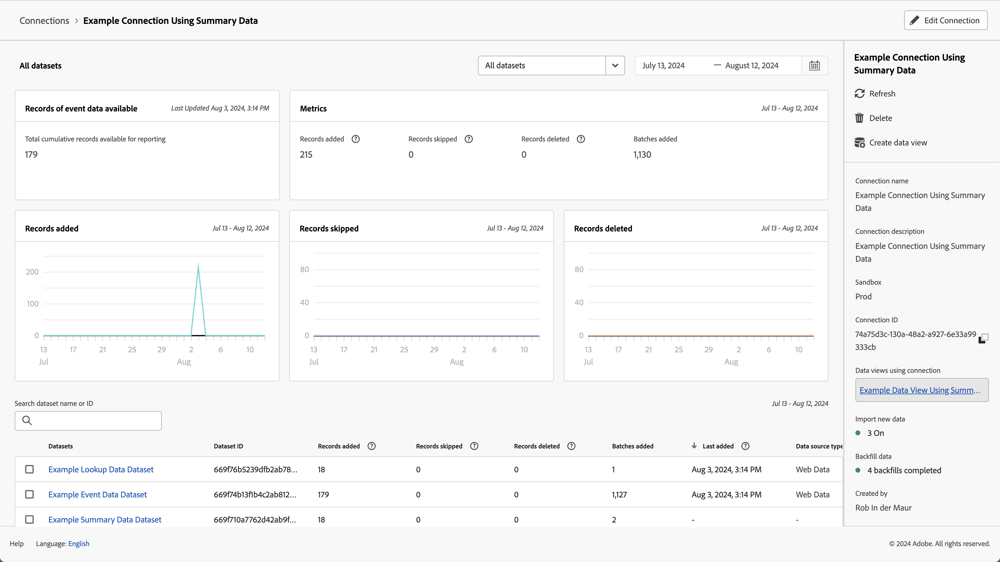
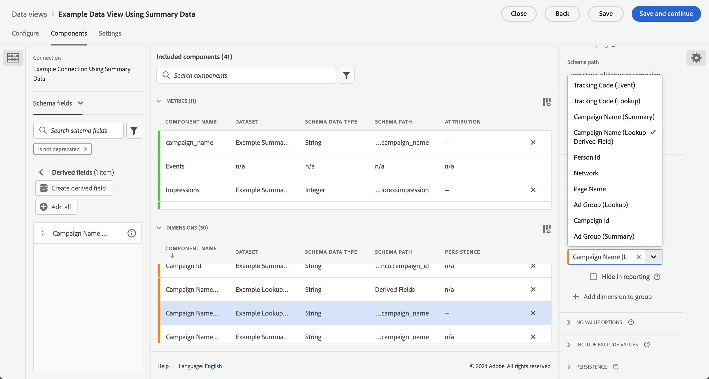

# Verwenden von Zusammenfassungsdaten

In diesem Anwendungsbeispiel erfahren Sie, wie Sie Zusammenfassungsdaten in Ihrem Reporting und in Ihrer Analyse verwenden. Der Anwendungsfall beschreibt alle Schritte, die zur Verwendung von Zusammenfassungsdaten in Customer Journey Analytics erforderlich sind:

- [Aufnehmen](#ingest) von Zusammenfassungsdaten und anderen Datenquellen in Experience Platform.
- Richten Sie Ihre [Verbindung](#connection) für die Zusammenfassungsdaten und andere Datenquellen ein.
- Konfigurieren Sie Ihre [Datenansicht](#data-view), um Ihre Datenquellen zu kombinieren.
- Berichte und Analysen in [Workspace](#workspace) zu Ihren kombinierten Daten durchführen.

Der Anwendungsfall enthält Beispieldaten für Zusammenfassungsdaten, Ereignisdaten und Suchdaten. Alle Daten enthalten zufällige Werte.

## Erfassen

Für diesen Anwendungsfall verwenden Sie die folgenden Beispielzusammenfassungsdaten, die Zusammenfassungsdaten für die Durchführung von Kampagnen auf Facebook zeigen.

+++Zusammenfassungsdaten

| _id | campaign_name | Kosten | Impression | campaign_id | network | ad_group | timestamp |
|---|---|---:|---:|---|---|---|---|
| 1 | 123 Kampagne | 100 | 5.000 | abc123 | Facebook | abc-adgroup | 18.07.2024:20:18.39.000Z |
| 2 | 123 Kampagne | 50 | 4.000 | def123 | Facebook | def-adgroup | 18.07.2024:20:18.39.000Z |
| 3 | 123 Kampagne | 125 | 6000 | ghi123 | Facebook | ghi-adgroup | 18.07.2024:20:18.39.000Z |
| 4 | 456-Kampagne | 25 | 2500 | ABC456 | Facebook | abc-adgroup | 18.07.2024:20:18.39.000Z |
| 5 | 456-Kampagne | 10 | 1.000 | def456 | Facebook | def-adgroup | 18.07.2024:20:18.39.000Z |
| 6 | 456-Kampagne | 115 | 5500 | GHI456 | Facebook | ghi-adgroup | 18.07.2024:20:18.39.000Z |
| 7 | 789-Kampagne | 200 | 9000 | ABC789 | Facebook | abc-adgroup | 18.07.2024:20:18.39.000Z |
| 8 | 789-Kampagne | 20 | 2.000 | DEF789 | Facebook | def-adgroup | 18.07.2024:20:18.39.000Z |
| 9 | 789-Kampagne | 225 | 12000 | ghi789 | Facebook | ghi-adgroup | 18.07.2024:20:18.39.000Z |
| 10 | 987-Kampagne | 125 | 10000 | ABC987 | Facebook | abc-adgroup | 18.07.2024:20:18.39.000Z |
| 11 | 987-Kampagne | 120 | 15000 | DEF987 | Facebook | def-adgroup | 18.07.2024:20:18.39.000Z |
| 12 | 987-Kampagne | 315 | 22500 | ghi987 | Facebook | ghi-adgroup | 18.07.2024:20:18.39.000Z |
| 13 | 654-Kampagne | 325 | 20000 | ABC654 | Facebook | abc-adgroup | 18.07.2024:20:18.39.000Z |
| 14 | 654-Kampagne | 320 | 25000 | DEF654 | Facebook | def-adgroup | 18.07.2024:20:18.39.000Z |
| 15 | 654-Kampagne | 315 | 22500 | ghi654 | Facebook | ghi-adgroup | 18.07.2024:20:18.39.000Z |
| 16 | 321-Kampagne | 25 | 2.000 | ABC321 | Facebook | abc-adgroup | 18.07.2024:20:18.39.000Z |
| 17 | 321-Kampagne | 20 | 2500 | DEF321 | Facebook | def-adgroup | 18.07.2024:20:18.39.000Z |
| 18 | 321-Kampagne | 15 | 2250 | ghi321 | Facebook | ghi-adgroup | 18.07.2024:20:18.39.000Z |

+++

Um die Zusammenfassungsdaten in Customer Journey Analytics, in einem Bericht oder im Rahmen der Datenanalyse in Workspace zu verwenden, benötigen Sie Folgendes

- ein Zusammenfassungsschema in Experience Platform,
- einen zusammenfassenden Datensatz in Experience Platform,
- Eine Verbindung in Customer Journey Analytics, die für die Verwendung des Zusammenfassungsdatensatzes konfiguriert ist,
- Eine Datenansicht in Customer Journey Analytics, korrekt konfiguriert mit Metriken und Dimensionen für die Zusammenfassungsdaten.

Sie verwenden diese Zusammenfassungsdaten zusammen mit einem Datensatz für Ereignisdaten und einem Datensatz für Suchdaten.

+++Ereignisdaten

Ereignisdaten sind im Beispielereignisdatensatz verfügbar. Die Beispieldaten sehen wie folgt aus:

| timestamp | _id | page_name | person_id | tracking_code | Bestellungen | REVENUE_AMOUNT |
|---|---:|---|---|---|---:|---:|
| 18.07.2024:15:19.39+00:00 | 1 | Startseite | person-1abc123 | abc123 |  |  |
| 18.07.2024:15:19.39+00:00 | 2 | Bestätigungsseite | person-1abc123 |  | 1 | 174,25 |
| 18.07.2024:15:19.39+00:00 | 3 | Startseite | person-2def123 | def123 |  |  |
| 18.07.2024:15:19.39+00:00 | 4 | Startseite | person-3ghi123 | ghi123 |  |  |
| 18.07.2024:15:19.39+00:00 | 5 | Bestätigungsseite | person-3ghi123 |  | 1 | 149,25 |
| 18.07.2024:15:19.39+00:00 | 6 | Startseite | person-4abc456 | ABC456 |  |  |
| 18.07.2024:15:19.39+00:00 | 7 | Startseite | person-5def456 | def456 |  |  |
| 18.07.2024:15:19.39+00:00 | 8 | Startseite | person-6ghi456 | GHI456 |  |  |
| 18.07.2024:15:19.39+00:00 | 9 | Bestätigungsseite | person-6ghi456 |  | 1 | 159,25 |
| 18.07.2024:15:19.39+00:00 | 10 | Startseite | person-7abc789 | ABC789 |  |  |
| 18.07.2024:15:19.39+00:00 | 11 | Startseite | person-8def789 | DEF789 |  |  |
| 18.07.2024:15:19.39+00:00 | 12 | Startseite | person-9ghi789 | ghi789 |  |  |
| 18.07.2024:15:19.39+00:00 | 13 | Bestätigungsseite | person-9ghi789 |  | 1 | 124,25 |
| 18.07.2024:15:19.39+00:00 | 14 | Startseite | person-10abc987 | ABC987 |  |  |
| 18.07.2024:15:19.39+00:00 | 15 | Startseite | person-11def987 | DEF987 |  |  |
| 18.07.2024:15:19.39+00:00 | 16 | Startseite | person-12ghi987 | ghi987 |  |  |
| 18.07.2024:15:19.39+00:00 | 17 | Startseite | person-13abc654 | ABC654 |  |  |
| 18.07.2024:15:19.39+00:00 | 18 | Startseite | person-14def654 | DEF654 |  |  |
| 18.07.2024:15:19.39+00:00 | 19 | Startseite | person-15ghi654 | ghi654 |  |  |
| 18.07.2024:15:19.39+00:00 | 20 | Bestätigungsseite | person-15ghi654 |  | 1 | 174,25 |
| 18.07.2024:15:19.39+00:00 | 21 | Startseite | person-16abc321 | ABC321 |  |  |
| 18.07.2024:15:19.39+00:00 | 22 | Startseite | person-17def321 | DEF321 |  |  |
| 18.07.2024:15:19.39+00:00 | 23 | Startseite | person-18ghi321 | ghi321 |  |  |
| 18.07.2024:15:19.39+00:00 | 24 | Startseite | person-19abc123 | abc123 |  |  |
| 18.07.2024:15:19.39+00:00 | 25 | Startseite | person-20def123 | def123 |  |  |
| 18.07.2024:15:19.39+00:00 | 26 | Startseite | person-21ghi123 | ghi123 |  |  |
| 18.07.2024:15:19.39+00:00 | 27 | Bestätigungsseite | person-21ghi123 |  | 1 | 149,25 |
| 18.07.2024:15:19.39+00:00 | 28 | Startseite | person-22abc456 | ABC456 |  |  |
| 18.07.2024:15:19.39+00:00 | 29 | Startseite | person-23def456 | def456 |  |  |
| 18.07.2024:15:19.39+00:00 | 30 | Startseite | person-24ghi456 | GHI456 |  |  |
| 18.07.2024:15:19.39+00:00 | 31 | Startseite | person-25abc789 | ABC789 |  |  |
| 18.07.2024:15:19.39+00:00 | 32 | Bestätigungsseite | person-25abc789 |  | 1 | 139,25 |
| 18.07.2024:15:19.39+00:00 | 33 | Startseite | person-26abc987 | ABC987 |  |  |
| 18.07.2024:15:19.39+00:00 | 34 | Startseite | person-27def987 | DEF987 |  |  |
| 18.07.2024:15:19.39+00:00 | 35 | Startseite | person-28ghi987 | ghi987 |  |  |
| 18.07.2024:15:19.39+00:00 | 36 | Startseite | person-29abc654 | ABC654 |  |  |
| 18.07.2024:15:19.39+00:00 | 37 | Bestätigungsseite | person-29abc654 |  | 1 | 124,25 |
| 18.07.2024:15:19.39+00:00 | 38 | Startseite | person-30def654 | DEF654 |  |  |
| 18.07.2024:15:19.39+00:00 | 39 | Startseite | person-31ghi654 | ghi654 |  |  |
| 18.07.2024:15:19.39+00:00 | 40 | Startseite | person-32abc321 | ABC321 |  |  |
| 18.07.2024:15:19.39+00:00 | 41 | Startseite | person-33ghi456 | GHI456 |  |  |
| 18.07.2024:15:19.39+00:00 | 42 | Bestätigungsseite | person-33ghi456 |  | 1 | 174,25 |
| 18.07.2024:15:19.39+00:00 | 43 | Startseite | person-34abc789 | ABC789 |  |  |
| 18.07.2024:15:19.39+00:00 | 44 | Startseite | person-35def789 | DEF789 |  |  |
| 18.07.2024:15:19.39+00:00 | 45 | Startseite | person-36ghi789 | ghi789 |  |  |
| 18.07.2024:15:19.39+00:00 | 46 | Bestätigungsseite | person-36ghi789 |  | 1 | 149,25 |
| 18.07.2024:15:19.39+00:00 | 47 | Startseite | person-37abc987 | ABC987 |  |  |
| 18.07.2024:15:19.39+00:00 | 48 | Startseite | person-38def987 | DEF987 |  |  |
| 18.07.2024:15:19.39+00:00 | 49 | Startseite | person-39ghi987 | ghi987 |  |  |
| 18.07.2024:15:19.39+00:00 | 50 | Startseite | person-40abc654 | ABC654 |  |  |
| 18.07.2024:15:19.39+00:00 | 51 | Bestätigungsseite | person-40abc654 |  | 1 | 124,25 |
| 18.07.2024:15:19.39+00:00 | 52 | Startseite | person-41def654 | DEF654 |  |  |
| 18.07.2024:15:19.39+00:00 | 53 | Startseite | person-42ghi654 | ghi654 |  |  |
| 18.07.2024:15:19.39+00:00 | 54 | Startseite | person-43abc321 | ABC321 |  |  |
| 18.07.2024:15:19.39+00:00 | 55 | Startseite | person-44def321 | DEF321 |  |  |
| 18.07.2024:15:19.39+00:00 | 56 | Startseite | person-45ghi321 | ghi321 |  |  |
| 18.07.2024:15:19.39+00:00 | 57 | Startseite | person-46abc123 | abc123 |  |  |
| 18.07.2024:15:19.39+00:00 | 58 | Bestätigungsseite | person-46abc123 |  | 1 | 174,25 |
| 18.07.2024:15:19.39+00:00 | 59 | Startseite | person-47def123 | def123 |  |  |
| 18.07.2024:15:19.39+00:00 | 60 | Startseite | person-48ghi123 | ghi123 |  |  |
| 18.07.2024:15:19.39+00:00 | 61 | Startseite | person-49abc456 | ABC456 |  |  |
| 18.07.2024:15:19.39+00:00 | 62 | Startseite | person-50def456 | def456 |  |  |
| 18.07.2024:15:19.39+00:00 | 63 | Startseite | person-51ghi456 | GHI456 |  |  |
| 18.07.2024:15:19.39+00:00 | 64 | Startseite | person-52abc789 | ABC789 |  |  |
| 18.07.2024:15:19.39+00:00 | 65 | Bestätigungsseite | person-52abc789 |  | 1 | 149,25 |
| 18.07.2024:15:19.39+00:00 | 66 | Startseite | person-53abc987 | ABC987 |  |  |
| 18.07.2024:15:19.39+00:00 | 67 | Startseite | person-54def987 | DEF987 |  |  |
| 18.07.2024:15:19.39+00:00 | 68 | Startseite | person-55ghi987 | ghi987 |  |  |
| 18.07.2024:15:19.39+00:00 | 69 | Bestätigungsseite | person-55ghi987 |  | 1 | 124,25 |
| 18.07.2024:15:19.39+00:00 | 70 | Startseite | person-56abc123 | abc123 |  |  |
| 18.07.2024:15:19.39+00:00 | 71 | Startseite | person-57def123 | def123 |  |  |
| 18.07.2024:15:19.39+00:00 | 72 | Bestätigungsseite | person-57def123 |  | 1 | 174,25 |
| 18.07.2024:15:19.39+00:00 | 73 | Startseite | person-58ghi123 | ghi123 |  |  |
| 18.07.2024:15:19.39+00:00 | 74 | Startseite | person-59abc456 | ABC456 |  |  |
| 18.07.2024:15:19.39+00:00 | 75 | Bestätigungsseite | person-59abc456 |  | 1 | 149,25 |
| 18.07.2024:15:19.39+00:00 | 76 | Startseite | person-60def456 | def456 |  |  |
| 18.07.2024:15:19.39+00:00 | 77 | Startseite | person-61ghi456 | GHI456 |  |  |
| 18.07.2024:15:19.39+00:00 | 78 | Startseite | person-62abc789 | ABC789 |  |  |
| 18.07.2024:15:19.39+00:00 | 79 | Bestätigungsseite | person-62abc789 |  | 1 | 159,25 |
| 18.07.2024:15:19.39+00:00 | 80 | Startseite | person-63def789 | DEF789 |  |  |
| 18.07.2024:15:19.39+00:00 | 81 | Startseite | person-64ghi789 | ghi789 |  |  |
| 18.07.2024:15:19.39+00:00 | 82 | Startseite | person-65abc987 | ABC987 |  |  |
| 18.07.2024:15:19.39+00:00 | 83 | Bestätigungsseite | person-65abc987 |  | 1 | 124,25 |
| 18.07.2024:15:19.39+00:00 | 84 | Startseite | person-66def987 | DEF987 |  |  |
| 18.07.2024:15:19.39+00:00 | 85 | Startseite | person-67ghi987 | ghi987 |  |  |
| 18.07.2024:15:19.39+00:00 | 86 | Startseite | person-68abc654 | ABC654 |  |  |
| 18.07.2024:15:19.39+00:00 | 87 | Startseite | person-69def654 | DEF654 |  |  |
| 18.07.2024:15:19.39+00:00 | 88 | Startseite | person-70ghi654 | ghi654 |  |  |
| 18.07.2024:15:19.39+00:00 | 89 | Startseite | person-71abc321 | ABC321 |  |  |
| 18.07.2024:15:19.39+00:00 | 90 | Bestätigungsseite | person-71abc321 |  | 1 | 174,25 |
| 18.07.2024:15:19.39+00:00 | 91 | Startseite | person-72def321 | DEF321 |  |  |
| 18.07.2024:15:19.39+00:00 | 92 | Startseite | person-73ghi321 | ghi321 |  |  |
| 18.07.2024:15:19.39+00:00 | 93 | Startseite | person-74abc123 | abc123 |  |  |
| 18.07.2024:15:19.39+00:00 | 94 | Startseite | person-75def123 | def123 |  |  |
| 18.07.2024:15:19.39+00:00 | 95 | Startseite | person-76ghi123 | ghi123 |  |  |
| 18.07.2024:15:19.39+00:00 | 96 | Startseite | person-77abc456 | ABC456 |  |  |
| 18.07.2024:15:19.39+00:00 | 97 | Bestätigungsseite | person-77abc456 |  | 1 | 149,25 |
| 18.07.2024:15:19.39+00:00 | 98 | Startseite | person-78def456 | def456 |  |  |
| 18.07.2024:15:19.39+00:00 | 99 | Startseite | person-79ghi456 | GHI456 |  |  |
| 18.07.2024:15:19.39+00:00 | 100 | Startseite | person-80abc789 | ABC789 |  |  |
| 18.07.2024:15:19.39+00:00 | 101 | Startseite | person-81abc987 | ABC987 |  |  |
| 18.07.2024:15:19.39+00:00 | 102 | Bestätigungsseite | person-81abc987 |  | 1 | 139,25 |
| 18.07.2024:15:19.39+00:00 | 103 | Startseite | person-82def987 | DEF987 |  |  |
| 18.07.2024:15:19.39+00:00 | 104 | Startseite | person-83ghi987 | ghi987 |  |  |
| 18.07.2024:15:19.39+00:00 | 105 | Startseite | person-84abc654 | ABC654 |  |  |
| 18.07.2024:15:19.39+00:00 | 106 | Startseite | person-85def654 | DEF654 |  |  |
| 18.07.2024:15:19.39+00:00 | 107 | Bestätigungsseite | person-85def654 |  | 1 | 124,25 |
| 18.07.2024:15:19.39+00:00 | 108 | Startseite | person-86ghi654 | ghi654 |  |  |
| 18.07.2024:15:19.39+00:00 | 109 | Startseite | person-87abc321 | ABC321 |  |  |
| 18.07.2024:15:19.39+00:00 | 110 | Startseite | person-88ghi456 | GHI456 |  |  |
| 18.07.2024:15:19.39+00:00 | 111 | Startseite | person-89abc789 | ABC789 |  |  |
| 18.07.2024:15:19.39+00:00 | 112 | Bestätigungsseite | person-89abc789 |  | 1 | 174,25 |
| 18.07.2024:15:19.39+00:00 | 113 | Startseite | person-90def789 | DEF789 |  |  |
| 18.07.2024:15:19.39+00:00 | 114 | Startseite | person-91ghi789 | ghi789 |  |  |
| 18.07.2024:15:19.39+00:00 | 115 | Startseite | person-92abc987 | ABC987 |  |  |
| 18.07.2024:15:19.39+00:00 | 116 | Bestätigungsseite | person-92abc987 |  | 1 | 149,25 |
| 18.07.2024:15:19.39+00:00 | 117 | Startseite | person-93def987 | DEF987 |  |  |
| 18.07.2024:15:19.39+00:00 | 118 | Startseite | person-94ghi987 | ghi987 |  |  |
| 18.07.2024:15:19.39+00:00 | 119 | Startseite | person-95abc654 | ABC654 |  |  |
| 18.07.2024:15:19.39+00:00 | 120 | Startseite | person-96def654 | DEF654 |  |  |
| 18.07.2024:15:19.39+00:00 | 121 | Bestätigungsseite | person-96def654 |  | 1 | 124,25 |
| 18.07.2024:15:19.39+00:00 | 122 | Startseite | person-97ghi654 | ghi654 |  |  |
| 18.07.2024:15:19.39+00:00 | 123 | Startseite | person-98abc321 | ABC321 |  |  |
| 18.07.2024:15:19.39+00:00 | 124 | Startseite | person-99def321 | DEF321 |  |  |
| 18.07.2024:15:19.39+00:00 | 125 | Startseite | person-100ghi321 | ghi321 |  |  |
| 18.07.2024:15:19.39+00:00 | 126 | Startseite | person-101abc123 | abc123 |  |  |
| 18.07.2024:15:19.39+00:00 | 127 | Startseite | person-102def123 | def123 |  |  |
| 18.07.2024:15:19.39+00:00 | 128 | Bestätigungsseite | person-102def123 |  | 1 | 174,25 |
| 18.07.2024:15:19.39+00:00 | 129 | Startseite | person-103ghi123 | ghi123 |  |  |
| 18.07.2024:15:19.39+00:00 | 130 | Startseite | person-104abc456 | ABC456 |  |  |
| 18.07.2024:15:19.39+00:00 | 131 | Startseite | person-105def456 | def456 |  |  |
| 18.07.2024:15:19.39+00:00 | 132 | Startseite | person-106ghi456 | GHI456 |  |  |
| 18.07.2024:15:19.39+00:00 | 133 | Startseite | person-107abc789 | ABC789 |  |  |
| 18.07.2024:15:19.39+00:00 | 134 | Startseite | person-108abc987 | ABC987 |  |  |
| 18.07.2024:15:19.39+00:00 | 135 | Bestätigungsseite | person-108abc987 |  | 1 | 149,25 |
| 18.07.2024:15:19.39+00:00 | 136 | Startseite | person-109def987 | DEF987 |  |  |
| 18.07.2024:15:19.39+00:00 | 137 | Startseite | person-110ghi987 | ghi987 |  |  |
| 18.07.2024:15:19.39+00:00 | 138 | Bestätigungsseite | person-110ghi987 |  |  |  |
| 18.07.2024:15:19.39+00:00 | 139 | Startseite | person-111def987 | DEF987 |  |  |
| 18.07.2024:15:19.39+00:00 | 140 | Startseite | person-112def987 |  | 1 | 124,25 |
| 18.07.2024:15:19.39+00:00 | 141 | Bestätigungsseite | person-112def987 |  | 1 | 149,25 |
| 18.07.2024:15:19.39+00:00 | 142 | Startseite | person-113ghi987 | ghi987 |  |  |
| 18.07.2024:15:19.39+00:00 | 143 | Startseite | person-114abc654 | ABC654 |  |  |
| 18.07.2024:15:19.39+00:00 | 144 | Startseite | person-115def654 | DEF654 |  |  |
| 18.07.2024:15:19.39+00:00 | 145 | Bestätigungsseite | person-115def654 |  | 1 | 159,25 |
| 18.07.2024:15:19.39+00:00 | 146 | Startseite | person-116ghi654 | ghi654 |  |  |
| 18.07.2024:15:19.39+00:00 | 147 | Startseite | person-117abc321 | ABC321 |  |  |
| 18.07.2024:15:19.39+00:00 | 148 | Startseite | person-118def321 | DEF321 |  |  |
| 18.07.2024:15:19.39+00:00 | 149 | Bestätigungsseite | person-118def321 |  | 1 | 124,25 |
| 18.07.2024:15:19.39+00:00 | 150 | Startseite | person-119ghi321 | ghi321 |  |  |
| 18.07.2024:15:19.39+00:00 | 151 | Startseite | person-120abc123 | abc123 |  |  |
| 18.07.2024:15:19.39+00:00 | 152 | Startseite | person-121def123 | def123 |  |  |
| 18.07.2024:15:19.39+00:00 | 153 | Startseite | person-122ghi123 | ghi123 |  |  |
| 18.07.2024:15:19.39+00:00 | 154 | Startseite | person-123abc456 | ABC456 |  |  |
| 18.07.2024:15:19.39+00:00 | 155 | Startseite | person-124def456 | def456 |  |  |
| 18.07.2024:15:19.39+00:00 | 156 | Bestätigungsseite | person-124def456 |  | 1 | 174,25 |
| 18.07.2024:15:19.39+00:00 | 157 | Startseite | person-125ghi456 | GHI456 |  |  |
| 18.07.2024:15:19.39+00:00 | 158 | Startseite | person-126abc789 | ABC789 |  |  |
| 18.07.2024:15:19.39+00:00 | 159 | Startseite | person-127abc987 | ABC987 |  |  |
| 18.07.2024:15:19.39+00:00 | 160 | Startseite | person-128def987 | DEF987 |  |  |
| 18.07.2024:15:19.39+00:00 | 161 | Startseite | person-129ghi987 | ghi987 |  |  |
| 18.07.2024:15:19.39+00:00 | 162 | Startseite | person-130abc654 | ABC654 |  |  |
| 18.07.2024:15:19.39+00:00 | 163 | Bestätigungsseite | person-130abc654 |  | 1 | 149,25 |
| 18.07.2024:15:19.39+00:00 | 164 | Startseite | person-131def654 | DEF654 |  |  |
| 18.07.2024:15:19.39+00:00 | 165 | Startseite | person-132ghi654 | ghi654 |  |  |
| 18.07.2024:15:19.39+00:00 | 166 | Startseite | person-133abc321 | ABC321 |  |  |
| 18.07.2024:15:19.39+00:00 | 167 | Startseite | person-134ghi456 | GHI456 |  |  |
| 18.07.2024:15:19.39+00:00 | 168 | Bestätigungsseite | person-134ghi456 |  | 1 | 139,25 |
| 18.07.2024:15:19.39+00:00 | 169 | Startseite | person-135abc789 | ABC789 |  |  |
| 18.07.2024:15:19.39+00:00 | 170 | Startseite | person-136def789 | DEF789 |  |  |
| 18.07.2024:15:19.39+00:00 | 171 | Startseite | person-137ghi789 | ghi789 |  |  |
| 18.07.2024:15:19.39+00:00 | 172 | Startseite | person-138abc987 | ABC987 |  |  |
| 18.07.2024:15:19.39+00:00 | 173 | Bestätigungsseite | person-138abc987 |  | 1 | 124,25 |
| 18.07.2024:15:19.39+00:00 | 174 | Startseite | person-139def987 | DEF987 |  |  |
| 18.07.2024:15:19.39+00:00 | 175 | Startseite | person-140ghi987 | ghi987 |  |  |
| 18.07.2024:15:19.39+00:00 | 176 | Startseite | person-141abc654 | ABC654 |  |  |
| 18.07.2024:15:19.39+00:00 | 177 | Startseite | person-142def654 | DEF654 |  |  |
| 18.07.2024:15:19.39+00:00 | 178 | Bestätigungsseite | person-142def654 |  | 1 | 174,25 |
| 18.07.2024:15:19.39+00:00 | 179 | Startseite | person-143ghi654 | ghi654 |  |  |

+++

+++ Lookup-Daten

Lookup-Daten sind im Beispiel-Lookup-Datensatz verfügbar. Die Beispieldaten sehen wie folgt aus:

| _id | tracking_code | ad_group | campaign_name |
|---|---|---|---|
| 1 | abc123 | abc-adgroup | 123 Kampagne |
| 2 | def123 | def-adgroup | 123 Kampagne |
| 3 | ghi123 | ghi-adgroup | 123 Kampagne |
| 4 | ABC456 | abc-adgroup | 456-Kampagne |
| 5 | def456 | def-adgroup | 456-Kampagne |
| 6 | GHI456 | ghi-adgroup | 456-Kampagne |
| 7 | ABC789 | abc-adgroup | 789-Kampagne |
| 8 | DEF789 | def-adgroup | 789-Kampagne |
| 9 | ghi789 | ghi-adgroup | 789-Kampagne |
| 10 | ABC987 | abc-adgroup | 987-Kampagne |
| 11 | DEF987 | def-adgroup | 987-Kampagne |
| 12 | ghi987 | ghi-adgroup | 987-Kampagne |
| 13 | ABC654 | abc-adgroup | 654-Kampagne |
| 14 | DEF654 | def-adgroup | 654-Kampagne |
| 15 | ghi654 | ghi-adgroup | 654-Kampagne |
| 16 | ABC321 | abc-adgroup | 321-Kampagne |
| 17 | DEF321 | def-adgroup | 321-Kampagne |
| 18 | ghi321 | ghi-adgroup | 321-Kampagne |

+++

>[!INFO]
>
>Weitere Details zum Einrichten von Schemata und Datensätzen für die Ereignis- und Lookup-Daten werden nicht bereitgestellt. Diese Einrichtung wird als allgemein bekannt angenommen und folgt denselben Schritten wie für die Suchdaten.
>

### Zusammenfassungsschema

Zusammenfassungsdaten benötigen ein Zusammenfassungsschema in Experience Platform. Ein Zusammenfassungsschema ist ein Schema, das die XDM-Zusammenfassungsmetriken als Basisklasse verwendet.

So erstellen Sie ein Zusammenfassungsschema in Experience Platform:

1. Wählen Sie **[!UICONTROL Experience Platform]** aus der      Programmumschalter.
1. Wählen Sie **[!UICONTROL Schemata]** in der linken Leiste aus.
1. Wählen Sie  **[!UICONTROL Schema erstellen]**.
1. Wählen **[!UICONTROL Manuell]** im Dialogfeld **[!UICONTROL Schema erstellen]** aus. Verwenden Sie dann **[!UICONTROL Auswählen]**, um fortzufahren.
1. Wählen Sie im **[!UICONTROL Klasse auswählen]** des Assistenten **[!UICONTROL Schemata]** > **[!UICONTROL Schema erstellen]** die Option **[!UICONTROL Sonstige]** aus dem **[!UICONTROL Basisklasse für dieses Schema auswählen]**.
1. Wählen Sie aus der Liste **[!UICONTROL XDM-Zusammenfassungsmetriken]** aus (oder verwenden Sie das -Feld, nach dem gesucht werden soll) und klicken Sie auf **[!UICONTROL Weiter]**.
1. Geben **[!UICONTROL im Schritt]** Name und Überprüfung“ des Assistenten **[!UICONTROL Schemata]** > **[!UICONTROL Schema erstellen]** einen **[!UICONTROL Schema-Anzeigenamen]** ein, z. B. `Example Summary Data Schema` und eine optionale Beschreibung. Wählen Sie **[!UICONTROL Beenden]** aus, um diesen Schritt abzuschließen.

Die Struktur Ihres Basis-Zusammenfassungsschemas wird angezeigt, das mit den Feldern für Ihre Zusammenfassungsdaten erweitert werden kann. Mithilfe von Feldergruppen können Sie einem Schema Felder hinzufügen.

So fügen Sie eine Feldergruppe mit den Feldern für Ihre Beispieldaten hinzu:

1. Wählen Sie  **[!UICONTROL Add]** in **[!UICONTROL Feldergruppen]**.
1. Wählen **[!UICONTROL Dialogfeld „Feldergruppen hinzufügen]** die Option **[!UICONTROL Neue Feldergruppe erstellen]**.
1. Geben Sie einen **[!UICONTROL Anzeigenamen]** für die Feldergruppe ein, z. B. `Example Summary Data`. Geben Sie optional eine Beschreibung ein.
1. Wählen Sie **[!UICONTROL Feldergruppen hinzufügen]** aus.
1. Sie befinden sich wieder in der Benutzeroberfläche der Schemastruktur . Wählen Sie die neue **[!UICONTROL Beispielzusammenfassungsdaten]** in **[!UICONTROL Feldergruppen]** aus.
1. Wählen Sie  neben dem Schemanamen **[!UICONTROL Beispiel-Zusammenfassungsdatenschema]**. Ein **[!UICONTROL Feldeigenschaften]** Bedienfeld wird geöffnet, in dem Sie Details zu einem Feld hinzufügen können.
   1. Geben Sie einen **[!UICONTROL Feldnamen]** ein: `campaign_id`
   1. Geben Sie einen **[!UICONTROL Anzeigenamen]** ein: `campaign_id`
   1. Wählen Sie einen **[!UICONTROL Typ]** aus dem **[!UICONTROL Datentyp auswählen]** Dropdown-Menü: **[!UICONTROL Zeichenfolge]**
   1. Stellen Sie sicher **[!UICONTROL dass]** Zuweisen zu **[!UICONTROL Feldergruppe]** ausgewählt ist, und wählen Sie **[!UICONTROL Beispielzusammenfassungsdaten]** aus dem Dropdown-Menü aus.
   1. Scrollen Sie nach unten zum unteren Rand und wählen Sie **[!UICONTROL Anwenden]** aus.
1. Wiederholen Sie den vorherigen Schritt für die anderen Felder der Zusammenfassungsdaten. Die richtigen Werte finden Sie in der Tabelle unten.

   | Feldname | Anzeigename | Typ | Feldergruppe |
   |---|---|---|---|
   | `ad_group` | `ad_group` | Zeichenfolge | Beispielzusammenfassungsdaten |
   | `campaign_name` | `campaign_name` | Zeichenfolge | Beispielzusammenfassungsdaten |
   | `cost` | `cost` | Double | Beispielzusammenfassungsdaten |
   | `impression` | `impression` | Ganzzahl | Beispielzusammenfassungsdaten |
   | `network` | `network` | Zeichenfolge | Beispielzusammenfassungsdaten |

1. Um Ihre Feldergruppe **[!UICONTROL Beispielzusammenfassungsdaten]** als Teil Ihres Schemas zu speichern, wählen Sie **[!UICONTROL Speichern]** aus. Wenn Ihr Schema erfolgreich gespeichert wurde, wird eine Bestätigung angezeigt.

Sie haben jetzt ein Schema definiert, in dem das Modell für Ihre Zusammenfassungsdaten beschrieben wird. Ähnlich wie der unten stehende.

### Zusammenfassungsdatensatz

Um Ihre Zusammenfassungsdaten in Experience Platform zu speichern, müssen Sie zunächst einen Datensatz erstellen und dann Ihre Zusammenfassungsdaten in den Datensatz hochladen.

So erstellen Sie einen Datensatz:

1. Wählen Sie **[!UICONTROL Experience Platform]** aus der      Programmumschalter.
1. Wählen **[!UICONTROL Datensätze]** in der linken Leiste aus.
1. Wählen Sie  **[!UICONTROL Datensatz erstellen]**.
1. Wählen Sie **[!UICONTROL Bildschirm]** > **[!UICONTROL Datensätze erstellen]** die Option **[!UICONTROL Datensatz aus Schema erstellen]**.
1. Suchen Sie im Schritt **[!UICONTROL Schema auswählen]** des Assistenten **[!UICONTROL Workflows]** > **[!UICONTROL Datensatz aus Schema erstellen]** nach  und wählen Sie Ihr **[!UICONTROL Beispielzusammenfassungsdatenschema]**.
1. Klicken Sie auf **[!UICONTROL Weiter]**.
1. Im Schritt **[!UICONTROL Datensatz konfigurieren]** des Assistenten **[!UICONTROL Workflows]** > **[!UICONTROL Datensatz aus Schema erstellen]**:
   1. Geben Sie einen **[!UICONTROL Namen]** für den Datensatz ein, z. B.: `Example Summary Data Dataset`. Geben Sie optional eine Beschreibung ein.
   1. Wählen Sie **[!UICONTROL Beenden]** aus.

Es wird ein Bildschirm mit den Details Ihres neuen Datensatzes angezeigt.

So laden Sie Ihre Beispieldaten in diesen Datensatz hoch:

1. Wählen Sie **[!UICONTROL Experience Platform]** aus der      Programmumschalter.
1. Wählen **[!UICONTROL Workflows]** in der linken Leiste aus.
   1. Wählen **[!UICONTROL CSV zu XDM-Schema zuordnen]** aus den Optionen **[!UICONTROL Datenaufnahme]** im Bildschirm **[!UICONTROL Workflows]** aus.
   1. Wählen **[!UICONTROL Launch]** im Bedienfeld **[!UICONTROL CSV zu XDM-Schema]**.
1. Im Schritt **[!UICONTROL Datenflussdetails]** des Assistenten **[!UICONTROL Workflows]** > **[!UICONTROL CSV zu XDM-Schema]**:
   1. Wählen Sie **[!UICONTROL Vorhandener Datensatz]** für **[!UICONTROL Zieldatensatz]** aus.
   1. Wählen Sie **[!UICONTROL Beispiel-Zusammenfassungsdatensatz]** aus dem Dropdown-Menü aus.
   1. Klicken Sie auf **[!UICONTROL Weiter]**.
1. Im Schritt **[!UICONTROL Daten auswählen]** des Assistenten **[!UICONTROL Workflows]** > **[!UICONTROL CSV zu XDM-Schema]**:
   1. Ziehen Sie Ihre Datei mit Zusammenfassungsdaten im CSV-Format per Drag-and-Drop auf **[!UICONTROL Dateien per Drag-and-Drop]**. Alternativ können Sie **[!UICONTROL Dateien auswählen]** verwenden, um Ihre Datei auszuwählen.
   1. Stellen Sie sicher **[!UICONTROL dass]** Datenformat) und **[!UICONTROL Trennzeichen]** die richtigen Werte für Ihre Beispieldaten haben. Beispiel: **[!UICONTROL Getrennt]** als **[!UICONTROL Datenformat]** und **[!UICONTROL ,]** als **[!UICONTROL Trennzeichen]**.
   1. Ein Beispiel (10 Datensätze) Ihrer Zusammenfassungsdaten wird unter &quot;**[!UICONTROL &quot;]**.
   1. Klicken Sie auf **[!UICONTROL Weiter]**.
1. Im Schritt **[!UICONTROL Zuordnung]** des Assistenten **[!UICONTROL Workflows]** > **[!UICONTROL CSV zu XDM-Schema]**:
   
   1. Überprüfen Sie, ob alle Datenfelder Ihrer **[!UICONTROL Source-Daten]** den entsprechenden **[!UICONTROL Zielfeldern“]** Ihrem Schema korrekt zugeordnet sind. Für die Beispieldaten werden keine Fehler gemeldet, da Sie die Felder in Ihrem Schema explizit ähnlich den Feldnamen in Ihren Beispieldaten benannt haben. Andernfalls können Sie diesen Bildschirm verwenden, um die Zuordnung zu korrigieren.
   1. Sie können optional  **[!UICONTROL Validieren]** auswählen, um die Daten (erneut) zu validieren.
   1. Sie können optional  **[!UICONTROL Vorschau von Daten]** auswählen, um ein Dialogfeld mit einer Vorschau der Daten nach dem Laden in den Datensatz zu öffnen.
   1. Wählen Sie **[!UICONTROL Beenden]** aus.

In **[!UICONTROL Quellen]** > **[!UICONTROL Datenfluss - XX/XX/XXXX, XX:XX XX]** wird der Status Ihres Uploads angezeigt. Aktualisieren Sie , um Aktualisierungen des Uploads anzuzeigen. Nach erfolgreicher Ausführung werden Ihre Beispieldaten in Experience Platform geladen.

## Verbindung

Um Ihre Beispieldaten in Customer Journey Analytics zu verwenden, erstellen Sie eine Verbindung, die den Beispielzusammenfassungsdatensatz aus Experience Platform enthält.

1. Wählen Sie **[!UICONTROL Customer Journey Analytics]** aus der      Programmumschalter.
1. Wählen **[!UICONTROL Verbindungen]**, optional unter **[!UICONTROL Datenverwaltung]** im oberen Menü aus.
1. Wählen Sie **[!UICONTROL Neue Verbindung erstellen]** aus.
1. In **[!UICONTROL Verbindungen]** > **[!UICONTROL Nicht benannte Verbindung]**:
   1. Geben Sie einen **[!UICONTROL Verbindungsnamen]** ein, z. B. `Example Connection Using Summary Data`.
   1. Wählen Sie aus dem Dropdown-Menü Sandbox die Sandbox aus, die den von Ihnen erstellten Datensatz und die anderen Datensätze enthält, die Sie einbeziehen möchten.
   1. Wählen Sie **[!UICONTROL weniger als 1 Million]** aus **[!UICONTROL Dropdown-Menü Durchschnittliche Anzahl]** täglichen Ereignisse“ aus.
   1. Wählen Sie **[!UICONTROL Datensätze hinzufügen]** aus.
   1. Im Schritt **[!UICONTROL Auswählen von]**&quot; des Assistenten **[!UICONTROL Hinzufügen von]**&quot;:
      1. Suchen  und wählen Sie **[!UICONTROL Beispielzusammenfassungsdatensatz]**, **[!UICONTROL Beispielereignisdatensatz]** und **[!UICONTROL Beispiel-Lookup-Datensatz]**.
      1. Klicken Sie auf **[!UICONTROL Weiter]**.
   1. Im Schritt **[!UICONTROL Datensatzeinstellungen]** des Assistenten **[!UICONTROL Datensätze hinzufügen]**:

      1. Für den **[!UICONTROL Beispiel-Ereignisdatensatz]**:

         1. Bestätigen Sie, dass die **[!UICONTROL Personen-ID]** (`person_id`) und **[!UICONTROL Zeitstempel]** korrekt sind.
         1. Wählen Sie **[!UICONTROL Webdaten]** unter **[!UICONTROL Datenquellentyp]** aus.
         1. Aktivieren Sie **[!UICONTROL Alle neuen Daten importieren]**.
         1. Aktivieren Sie **[!UICONTROL Aufstockung aller vorhandenen Daten]**.

      1. Für den **[!UICONTROL Beispiel-Lookup-]**:

         1. Wählen Sie **[!UICONTROL tracking_code]** als **[!UICONTROL Key]** und **[!UICONTROL tracking_code (Ereignisdatensätze)]** als **[!UICONTROL Matching]**-Schlüssel aus.
         1. Wählen Sie **[!UICONTROL Webdaten]** unter **[!UICONTROL Datenquellentyp]** aus.
         1. Aktivieren Sie **[!UICONTROL Alle neuen Daten importieren]**.
         1. Aktivieren Sie **[!UICONTROL Aufstockung aller vorhandenen Daten]**.

      1. Für den **[!UICONTROL Zusammenfassungsdatensatz zum Beispiel]**:

         1. Bestätigen Sie, dass die **[!UICONTROL Zeitstempel]** und **[!UICONTROL Zeitzone]** korrekt sind.
         1. Aktivieren Sie **[!UICONTROL Alle neuen Daten importieren]**.
         1. Aktivieren Sie **[!UICONTROL Aufstockung aller vorhandenen Daten]**.

      1. Wählen Sie **[!UICONTROL Datensätze hinzufügen]** aus.

1. Klicken Sie im Bildschirm **[!UICONTROL Verbindungen]** > **[!UICONTROL Beispielverbindung mithilfe von Zusammenfassungsdaten]** auf **[!UICONTROL Speichern]**, um die Verbindung zu speichern.

Die Daten aus den Datensätzen werden zu Customer Journey Analytics hinzugefügt, was einige Stunden dauern kann. Also bitte, seien Sie geduldig, bevor Sie fortfahren.

Überprüfen Sie nach einiger Zeit, ob die Daten aus Ihren Datensätzen ordnungsgemäß in Customer Journey Analytics geladen wurden.

1. Wählen Sie **[!UICONTROL Customer Journey Analytics]** aus der      Programmumschalter.
1. Wählen **[!UICONTROL Verbindungen]**, optional unter **[!UICONTROL Datenverwaltung]** im oberen Menü aus.
1. Wählen Sie Ihre Verbindung aus, z **[!UICONTROL B. Verbindung mit Zusammenfassungsdaten]**.
1. Wählen Sie einen entsprechenden Datumsbereich unter **[!UICONTROL Verbindung]** > **[!UICONTROL Beispielverbindung mit Zusammenfassungsdaten]** aus.
   1. Wählen Sie  und dann **[!UICONTROL Letzte 7 Tage]** aus.
   1. Wählen Sie **[!UICONTROL Anwenden]** aus.

In der Liste der **[!UICONTROL Datensätze]** sollten die Werte in der Spalte **[!UICONTROL Hinzugefügte Datensätze]** bestätigen, dass Daten aus Ihren Datensätzen jetzt Teil von Customer Journey Analytics sind.

## Datenansicht

Um sicherzustellen, dass Sie Berichte zu den richtigen Daten in Workspace erstellen können, sollten Sie eine Datenansicht mit den entsprechenden Metriken und Dimensionen erstellen.

1. Wählen Sie **[!UICONTROL Customer Journey Analytics]** aus der      Programmumschalter.
1. Wählen **[!UICONTROL Datenansichten]** optional unter **[!UICONTROL Daten-Management]** im oberen Menü aus.
1. Wählen Sie **[!UICONTROL Neue Datenansicht erstellen]**.
1. Gehen Sie **[!UICONTROL Datenansichten]** durch die Assistenten-Bildschirme, um Ihre Datenansicht zu konfigurieren.
   1. Im Schritt **[!UICONTROL Konfigurieren]** von **[!UICONTROL Datenansichten]**:
      1. Wählen Sie Ihre Verbindung unter **[!UICONTROL Einstellungen]** | **[!UICONTROL Verbindung]**. Beispiel: **[!UICONTROL Verbindung mit Zusammenfassungsdaten]**.
      1. Geben Sie **[!UICONTROL Name]** für Ihre Datenansicht ein, z. B. `Example Data View Using Summary Data`.
      1. Alle anderen Einstellungen beibehalten.
      1. Wählen Sie **[!UICONTROL Speichern und fortfahren]** aus.
   1. Im Schritt **[!UICONTROL Komponenten]** von **[!UICONTROL Datenansichten]** > **[!UICONTROL Beispieldatenansicht mit Zusammenfassungsdaten]**:
      1. Fügen Sie die folgenden Komponenten zur Liste Dimensionen und Metriken hinzu. Beachten Sie, dass die Komponentennamen aus Gründen der Klarheit über den Standardnamen unter **[!UICONTROL Komponentenname]** im Bereich **[!UICONTROL Komponenteneinstellungen]** (rechts) geändert werden.

         **Metriken**

         | Name der Komponente | Datensatz | Datentyp des Schemas | Pfad des Schemas |
         |---|---|---|---|
         | Kosten | Beispiel für einen zusammenfassenden Datensatz | Double | *_tenant*.cost |
         | Impressionen | Beispiel für einen zusammenfassenden Datensatz | Ganzzahl | *_tenant*.impression |
         | Bestellungen | Beispiel für einen Ereignisdatensatz | Ganzzahl | *_tenant*.orders |
         | Umsatz | Beispiel für einen Ereignisdatensatz | Double | *_tenant*.venue_amount |

         **Dimensionen**

         | Name der Komponente | Datensatz | Datentyp des Schemas | Pfad des Schemas |
         |---|---|---|---|
         | Anzeigengruppe (Lookup) | Beispiel für Lookup-Datensatz | Zeichenfolge | *_tenant*.ad_group |
         | Anzeigengruppe (Zusammenfassung) | Beispiel für einen zusammenfassenden Datensatz | Zeichenfolge | *_tenant*.ad_group |
         | Kampagnen-ID | Beispiel für einen zusammenfassenden Datensatz | Zeichenfolge | *_tenant*.campaign_id |
         | Kampagnenname (Lookup) | Beispiel für Lookup-Datensatz | Zeichenfolge | *_tenant*.campaign_name |
         | Kampagnenname (Zusammenfassung) | Beispiel für einen zusammenfassenden Datensatz | Zeichenfolge | *_tenant*.campaign_name |
         | Netzwerk | Beispiel für einen zusammenfassenden Datensatz | Zeichenfolge | *_tenant*.network |
         | Seitenname | Beispiel für einen Ereignisdatensatz | Zeichenfolge | *_tenant*.page_name |
         | Personen-ID | Beispiel für einen Ereignisdatensatz | Zeichenfolge | *_tenant*.person_id |
         | Trackingcode (Ereignis) | Beispiel für einen Ereignisdatensatz | Zeichenfolge | *_tenant*.tracking_code |
         | Trackingcode (Lookup) | Beispiel für Lookup-Datensatz | Zeichenfolge | *_tenant*.tracking_code |

      1. Wählen Sie die Dimension **[!UICONTROL Trackingcode (Ereignis]** in der Liste **[!UICONTROL Dimensionen]** aus. Im Bedienfeld Komponente :

         
         1. Erweitern Sie  **[!UICONTROL Summary Data Group]**.
         1. Aktivieren Sie **[!UICONTROL Gruppierung erstellen]**.
         1. Wählen Sie **[!UICONTROL Kampagnenkennung]** aus dem Dropdown-Menü {2 **[!UICONTROL Dimension} aus.]** Dieser Schritt stellt sicher, dass Ereignisdaten und Zusammenfassungsdaten für das Reporting ordnungsgemäß kombiniert werden.
         1. Sie können optional &quot;**[!UICONTROL in Berichten ausblenden“]**. [!UICONTROL In Berichten ausblenden] stellt sicher, dass die ausgewählte Dimension ([!UICONTROL Kampagnen-ID]) in Analysis Workspace und anderen Reporting-Tools von Customer Journey Analytics ausgeblendet ist. Wenn Sie diese Option aktiviert haben, können Sie die Option überprüfen:
            1. Wählen Sie die Dimension **[!UICONTROL Kampagnen]** ID) in der Liste **[!UICONTROL Dimensionen]** aus.
            1. Sie werden feststellen **[!UICONTROL dass „Komponente in Berichten ausblenden]** in **[!UICONTROL Komponenteneinstellungen]** jetzt automatisch aktiviert ist.

      1. Erstellen Sie ein neues abgeleitetes Feld, z. B. `Campaign Name (Lookup Derived Field)`, um sicherzustellen, dass Sie Berichte in Workspace mithilfe der Dimension Kampagnenname (Lookup) aus dem Beispiel-Lookup-Datensatz erstellen können.

         

         1. Wählen Sie **[!UICONTROL campaign_id]** für **[!UICONTROL value]** aus.
         1. Wählen Sie **[!UICONTROL Beispiel-Lookup-]**) aus dem **[!UICONTROL Dropdown-Menü]** Lookup-Datensatz“.
         1. Wählen Sie **[!UICONTROL tracking_code]** aus dem Dropdown **[!UICONTROL Menü]**&#x200B;Übereinstimmungsschlüssel“ aus.
         1. Wählen Sie **[!UICONTROL campaign_name]** aus dem Dropdown **[!UICONTROL Menü „Zurückzugebende Werte]** aus.
         1. Wählen Sie **[!UICONTROL Speichern]** aus.

      1. Fügen Sie das neu erstellte abgeleitete Feld **[!UICONTROL Kampagnenname (abgeleitetes Nachschlagefeld)]** zur Komponentenliste **[!UICONTROL Dimensionen]** hinzu.

      1. Wählen Sie die Dimension **[!UICONTROL Kampagnenname (Lookup]** in der Liste **[!UICONTROL Dimensionen]** aus. Im Bedienfeld Komponente :

         

         1. Erweitern Sie  **[!UICONTROL Summary Data Group]**.
         1. Aktivieren Sie **[!UICONTROL Gruppierung erstellen]**.
         1. Wählen Sie **[!UICONTROL Kampagnenname (abgeleitetes Suchfeld)]** Dropdown-Menü {2 **[!UICONTROL Dimension} aus.]** Dadurch wird sichergestellt, dass der Kampagnenname (Lookup) aus dem Beispiel-Lookup-Datensatz sicher in Berichten verwendet werden kann (siehe [Workspace](#workspace)).

      1. Wählen Sie die **[!UICONTROL Umsatz]** aus der Liste **[!UICONTROL Metriken]** aus. Im Bedienfeld Komponente :

         
         1. Entfalten Sie  **[!UICONTROL Attribution]**.
            1. Wählen  **[!UICONTROL Last Touch]** aus dem **[!UICONTROL Attributionsmodell]** Dropdown-Menü aus.
            1. Wählen Sie **[!UICONTROL 30 Tag]** aus dem **[!UICONTROL Lookback-Fenster]** Dropdown-Menü aus.
         1. Entfalten  **Format**.
            1. Wählen Sie **[!UICONTROL Währung]** aus dem Dropdown-Menü **[!UICONTROL Format]** aus.
            1. Wählen Sie **[!UICONTROL 2]** aus dem Dropdown-Menü **[!UICONTROL Dezimalstellen]** aus.

      1. Wählen Sie die **[!UICONTROL Bestellungen]** aus der Liste **[!UICONTROL Metriken]** aus. Im Bedienfeld Komponente :

         
         1. Entfalten Sie  **[!UICONTROL Attribution]**.
            1. Wählen  **[!UICONTROL Last Touch]** aus dem **[!UICONTROL Attributionsmodell]** Dropdown-Menü aus.
            1. Wählen Sie **[!UICONTROL 30 Tag]** aus dem **[!UICONTROL Lookback-Fenster]** Dropdown-Menü aus.
         1. Entfalten  **[!UICONTROL Format]**.
            1. Wählen Sie **[!UICONTROL Dezimal]** aus dem **[!UICONTROL Format]** Dropdown-Menü aus.
            1. Wählen Sie **[!UICONTROL ▲Gut (grün]** aus dem **[!UICONTROL Aufwärts-Trend anzeigen als]** Dropdown-Menü aus.

      1. Wählen Sie **[!UICONTROL Speichern und fortfahren]** aus.

   1. Im Schritt **[!UICONTROL Einstellungen]** von **[!UICONTROL Datenansichten]**:
      1. Belassen Sie alle Einstellungen auf den Standardwerten.
      1. Wählen Sie **[!UICONTROL Speichern und beenden.]**

Sie haben jetzt Ihre Datenansicht eingerichtet, um ein ordnungsgemäßes Reporting über Zusammenfassungsdaten zu ermöglichen.

## Workspace

Um Berichte zu Ihren Zusammenfassungsdaten zu erstellen, erstellen Sie ein neues Projekt in Analysis Workspace.

1. Wählen Sie **[!UICONTROL Customer Journey Analytics]** aus der      Programmumschalter.
1. Wählen Sie **[!UICONTROL Workspace]** aus dem oberen Menü aus.
1. Wählen Sie **[!UICONTROL Projekt erstellen]** aus
1. Wählen Sie **[!UICONTROL Leeres Workspace-Projekt]** aus dem Dialogfeld mit Optionen zum Erstellen eines leeren Workspace-Projekts aus.
1. Wählen Sie **[!UICONTROL Erstellen]** aus.

Es wird eine leere Arbeitsfläche mit einem [!UICONTROL Freiform]-Bedienfeld angezeigt, das aus einer leeren [!UICONTROL Freiformtabelle] besteht.

1. Stellen Sie sicher, dass die für das Bedienfeld ausgewählte Datenansicht auf die Datenansicht verweist, die die Konfiguration für die Zusammenfassungsdaten enthält. Beispiel: **[!UICONTROL Datenansicht mit Zusammenfassungsdaten.]**
1. Stellen Sie sicher, dass der Datumsbereich für die Daten gültig ist, zu denen Sie einen Bericht erstellen möchten. Beispiel: **[!UICONTROL Letzte 2 volle Monate]**.
1. Ziehen Sie **[!UICONTROL Trackingcode (Ereignis]** aus **[!UICONTROL Dimensionen]** und legen Sie die Dimension auf der leeren Freiformtabelle ab.
1. Ziehen Sie **[!UICONTROL Bestellungen]** aus **[!UICONTROL Metriken]** und legen Sie die Metrik in der Spalte **[!UICONTROL Ereignisse]** ab, um diese Spalte in der Freiformtabelle zu ersetzen.
1. Ziehen Sie **[!UICONTROL Umsatz]** aus **[!UICONTROL Metriken]** und legen Sie die Metrik ab, die als zusätzliche Spalte zur Freiformtabelle hinzugefügt werden soll.
1. Ziehen Sie **[!UICONTROL Impressions (Zusammenfassung)]** aus **[!UICONTROL Metriken]** und legen Sie die Metrik ab, um sie als zusätzliche Spalte zur Freiformtabelle hinzuzufügen.
1. Ziehen Sie **[!UICONTROL Kosten (Zusammenfassung)]** aus **[!UICONTROL Metriken]** und legen Sie die Metrik ab, um sie als zusätzliche Spalte zur Freiformtabelle hinzuzufügen.
1. Wählen Sie zum Speichern des Projekts **[!UICONTROL Projekt]** > **[!UICONTROL Speichern]** und geben Sie einen Namen für das Projekt ein. Zum Beispiel `Example Project Using Summary Data`.

Sie möchten die Berichtsfunktion für Zusammenfassungsdaten nutzen und Berichte zu Kosten pro Impression und Rendite auf Werbeausgaben (ROAS) erstellen. Um Berichte zu diesen Metriken zu erstellen, müssen Sie zwei berechnete Metriken erstellen.

1. Wählen Sie **[!UICONTROL Komponenten]** > **[!UICONTROL Berechnete Metriken]** aus.
1. Wählen Sie  **[!UICONTROL Hinzufügen]**, um eine neue berechnete Metrik hinzuzufügen.
   1. Geben Sie `Cost per Impression` für den **[!UICONTROL Name]** an.
   1. Wählen Sie **[!UICONTROL Währung]** für **[!UICONTROL Format]** aus.
   1. Geben Sie `4` für **[!UICONTROL Dezimalstellen“]**.
   1. Verwenden Sie  **[!UICONTROL Kosten (Zusammenfassung)]** **[!UICONTROL ÷]** **[!UICONTROL Impressions (Zusammenfassung)]** als **[!UICONTROL Definition]**.
   1. Wählen Sie **[!UICONTROL Speichern]** aus.
1. Wählen Sie  **[!UICONTROL Add]** aus, um eine weitere neue berechnete Metrik hinzuzufügen.
   1. Geben Sie `Return on Ad Spend` für den **[!UICONTROL Name]** an.
   1. Wählen Sie **[!UICONTROL Währung]** für **[!UICONTROL Format]** aus.
   1. Wählen Sie `2` für **[!UICONTROL Dezimalstellen]**.
   1. Verwenden  **[!UICONTROL Umsatz (Letztkontakt) | 30 Tage)]** **[!UICONTROL −]**  **[!UICONTROL Kosten (Zusammenfassung)]** als **[!UICONTROL Definition]**.
   1. Wählen Sie **[!UICONTROL Speichern]** aus.

Fügen Sie Ihre berechneten Metriken zu Ihrem Bericht hinzu.

1. Ziehen Sie **[!UICONTROL Kosten pro]** aus **[!UICONTROL Metriken]** und legen Sie die Metrik ab, um sie als zusätzliche Spalte zur Freiformtabelle hinzuzufügen.
   1. Wählen Sie  Spalteneinstellungen aus.
      1. Deaktivieren Sie **[!UICONTROL Prozent]**.
1. Ziehen Sie **[!UICONTROL Rückgabe für Werbeausgaben]**  aus **[!UICONTROL Metriken]** und legen Sie die Metrik ab, um sie als zusätzliche Spalte zur Freiformtabelle hinzuzufügen.
   1. Wählen Sie  Spalteneinstellungen aus.
      1. Deaktivieren Sie **[!UICONTROL Prozent]**.
      1. Aktivieren Sie **[!UICONTROL Bedingte Formatierung]**.
         1. Wählen **[!UICONTROL Automatisch generiert]** aus.
         1. Wählen Sie eine bevorzugte **[!UICONTROL Bedingte Formatierungspalette]**.
   1. Wählen Sie **[!UICONTROL Speichern]** aus, um Ihr Projekt zu speichern.

Wenn Sie einen Bericht über den Kampagnennamen und nicht über den Trackingcode (Ereignis) erstellen möchten, führen Sie die folgenden Schritte aus:

1. Duplizieren Sie die **[!UICONTROL Zusammenfassungsdatenbericht]** Freiformtabellen-Visualisierung.
1. Benennen Sie die duplizierte Visualisierung in `Summary Data Report (using Campaign Name)` um.
1. Ersetzen  die Dimension **[!UICONTROL Trackingcode (Ereignis)]** durch die Dimension **[!UICONTROL Kampagnenname (Lookup)]** .

Aufgrund des von Ihnen erstellten abgeleiteten Felds und der Konfiguration der Datengruppen-Zusammenfassungskonfiguration für den Kampagnennamen (Lookup) können Sie Berichte zum Kampagnennamen (Lookup) erstellen. Siehe [Datenansicht](#data-view).

Ihr endgültiges Projekt sollte wie das unten dargestellte aussehen.

>[!MORELIKETHIS]
>
>[Zusammenfassungsdaten](/help/data-views/summary-data.md)
>&#x200B;>[Einstellungen für die Datengruppen-Zusammenfassungskomponente](/help/data-views/component-settings/summary-data-group.md)
