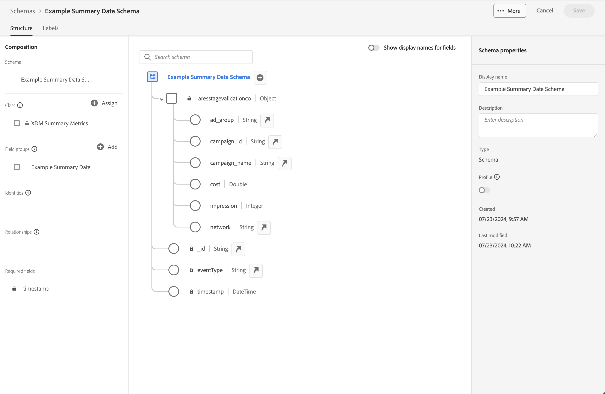

# Verwenden von Zusammenfassungsdaten

Dieser Anwendungsfall soll Ihnen dabei helfen, die Verwendung von Zusammenfassungsdaten in Ihren Berichten und Analysen zu verstehen. Im Anwendungsfall werden alle Schritte beschrieben, die zur Verwendung von Zusammenfassungsdaten im Customer Journey Analytics erforderlich sind:

- [Aufnehmen](#ingest) von Zusammenfassungsdaten und anderen Datenquellen in Experience Platform.
- Richten Sie Ihre [Verbindung](#connection) für die Zusammenfassungsdaten und andere Datenquellen ein.
- Konfigurieren Sie Ihre [Datenansicht](#data-view), um Ihre Datenquellen zu kombinieren.
- Berichten und analysieren Sie in [Workspace](#workspace) Ihre kombinierten Daten.

Der Anwendungsfall enthält Beispieldaten für Zusammenfassungsdaten, Ereignisdaten und Lookup-Daten. Alle Daten enthalten zufällige Werte.

## Erfassen

Sie verwenden die folgenden Zusammenfassungsdaten für dieses Anwendungsbeispiel und zeigen Zusammenfassungsdaten für laufende Kampagnen in Facebook an.

+++Zusammenfassungsdaten

| _id | campaign_name | Kosten | Impression | campaign_id | network | ad_group | timestamp |
|---|---|---:|---:|---|---|---|---|
| 1 | 123 Kampagne | 100 | 5.000 | abc123 | facebook | abc-adgroup | 2024-07-18T18:20:39.000Z |
| 2 | 123 Kampagne | 50 | 4.000 | def123 | facebook | def-adgroup | 2024-07-18T18:20:39.000Z |
| 3 | 123 Kampagne | 125 | 6000 | ghi123 | facebook | ghi-adgroup | 2024-07-18T18:20:39.000Z |
| 4 | 456 Kampagne | 25 | 2500 | abc456 | facebook | abc-adgroup | 2024-07-18T18:20:39.000Z |
| 5 | 456 Kampagne | 10 | 1000 | def456 | facebook | def-adgroup | 2024-07-18T18:20:39.000Z |
| 6 | 456 Kampagne | 115 | 5500 | ghi456 | facebook | ghi-adgroup | 2024-07-18T18:20:39.000Z |
| 7 | 789 Kampagne | 200 | 9000 | abc789 | facebook | abc-adgroup | 2024-07-18T18:20:39.000Z |
| 8 | 789 Kampagne | 20 | 2.000 | def789 | facebook | def-adgroup | 2024-07-18T18:20:39.000Z |
| 9 | 789 Kampagne | 225 | 12000 | ghi789 | facebook | ghi-adgroup | 2024-07-18T18:20:39.000Z |
| 10 | 987 Kampagne | 125 | 10000 | abc987 | facebook | abc-adgroup | 2024-07-18T18:20:39.000Z |
| 11 | 987 Kampagne | 120 | 15000 | def987 | facebook | def-adgroup | 2024-07-18T18:20:39.000Z |
| 12 | 987 Kampagne | 315 | 22500 | ghi987 | facebook | ghi-adgroup | 2024-07-18T18:20:39.000Z |
| 13 | 654 Kampagne | 325 | 20000 | abc654 | facebook | abc-adgroup | 2024-07-18T18:20:39.000Z |
| 14 | 654 Kampagne | 320 | 25000 | def654 | facebook | def-adgroup | 2024-07-18T18:20:39.000Z |
| 15 | 654 Kampagne | 315 | 22500 | ghi654 | facebook | ghi-adgroup | 2024-07-18T18:20:39.000Z |
| 16 | 321 Kampagne | 25 | 2.000 | abc321 | facebook | abc-adgroup | 2024-07-18T18:20:39.000Z |
| 17 | 321 Kampagne | 20 | 2500 | def321 | facebook | def-adgroup | 2024-07-18T18:20:39.000Z |
| 18 | 321 Kampagne | 15 | 2250 | ghi321 | facebook | ghi-adgroup | 2024-07-18T18:20:39.000Z |

+++

Um die Zusammenfassungsdaten im Customer Journey Analytics, in einem Bericht oder im Rahmen der Datenanalyse in Workspace zu verwenden, benötigen Sie

- ein Zusammenfassungsschema in Experience Platform,
- einen Zusammenfassungsdatensatz in Experience Platform,
- eine Verbindung in Customer Journey Analytics, die für die Verwendung des Zusammenfassungsdatensatzes konfiguriert ist,
- eine Datenansicht in Customer Journey Analytics, die korrekt mit Metriken und Dimensionen für die Zusammenfassungsdaten konfiguriert ist.

Sie verwenden diese Zusammenfassungsdaten zusammen mit einem Datensatz für Ereignisdaten und einem Datensatz für Suchdaten.

+++Ereignisdaten

Ereignisdaten sind im Beispiel-Ereignisdatensatz verfügbar. Die Beispieldaten sehen wie folgt aus:

| timestamp | _id | page_name | person_id | tracking_code | Bestellungen | revenue_amount |
|---|---:|---|---|---|---:|---:|
| 2024-07-18T19:15:39+00:00 | 1 | Startseite | person-1abc123 | abc123 |  |  |
| 2024-07-18T19:15:39+00:00 | 2 | Bestätigungsseite | person-1abc123 |  | 1 | 174,25 |
| 2024-07-18T19:15:39+00:00 | 3 | Startseite | person-2def123 | def123 |  |  |
| 2024-07-18T19:15:39+00:00 | 4 | Startseite | person-3ghi123 | ghi123 |  |  |
| 2024-07-18T19:15:39+00:00 | 5 | Bestätigungsseite | person-3ghi123 |  | 1 | 149,25 |
| 2024-07-18T19:15:39+00:00 | 6 | Startseite | person-4abc456 | abc456 |  |  |
| 2024-07-18T19:15:39+00:00 | 7 | Startseite | person-5def456 | def456 |  |  |
| 2024-07-18T19:15:39+00:00 | 8 | Startseite | person-6ghi456 | ghi456 |  |  |
| 2024-07-18T19:15:39+00:00 | 9 | Bestätigungsseite | person-6ghi456 |  | 1 | 159,25 |
| 2024-07-18T19:15:39+00:00 | 10 | Startseite | person-7abc789 | abc789 |  |  |
| 2024-07-18T19:15:39+00:00 | 11 | Startseite | person-8def789 | def789 |  |  |
| 2024-07-18T19:15:39+00:00 | 12 | Startseite | person-9ghi789 | ghi789 |  |  |
| 2024-07-18T19:15:39+00:00 | 13 | Bestätigungsseite | person-9ghi789 |  | 1 | 124,25 |
| 2024-07-18T19:15:39+00:00 | 14 | Startseite | person-10abc987 | abc987 |  |  |
| 2024-07-18T19:15:39+00:00 | 15 | Startseite | person-11def987 | def987 |  |  |
| 2024-07-18T19:15:39+00:00 | 16 | Startseite | person-12ghi987 | ghi987 |  |  |
| 2024-07-18T19:15:39+00:00 | 17 | Startseite | person-13abc654 | abc654 |  |  |
| 2024-07-18T19:15:39+00:00 | 18 | Startseite | person-14def654 | def654 |  |  |
| 2024-07-18T19:15:39+00:00 | 19 | Startseite | person-15ghi654 | ghi654 |  |  |
| 2024-07-18T19:15:39+00:00 | 20 | Bestätigungsseite | person-15ghi654 |  | 1 | 174,25 |
| 2024-07-18T19:15:39+00:00 | 21 | Startseite | person-16abc321 | abc321 |  |  |
| 2024-07-18T19:15:39+00:00 | 22 | Startseite | person-17def321 | def321 |  |  |
| 2024-07-18T19:15:39+00:00 | 23 | Startseite | person-18ghi321 | ghi321 |  |  |
| 2024-07-18T19:15:39+00:00 | 24 | Startseite | person-19abc123 | abc123 |  |  |
| 2024-07-18T19:15:39+00:00 | 25 | Startseite | person-20def123 | def123 |  |  |
| 2024-07-18T19:15:39+00:00 | 26 | Startseite | person-21ghi123 | ghi123 |  |  |
| 2024-07-18T19:15:39+00:00 | 27 | Bestätigungsseite | person-21ghi123 |  | 1 | 149,25 |
| 2024-07-18T19:15:39+00:00 | 28 | Startseite | person-22abc456 | abc456 |  |  |
| 2024-07-18T19:15:39+00:00 | 29 | Startseite | person-23def456 | def456 |  |  |
| 2024-07-18T19:15:39+00:00 | 30 | Startseite | person-24ghi456 | ghi456 |  |  |
| 2024-07-18T19:15:39+00:00 | 31 | Startseite | person-25abc789 | abc789 |  |  |
| 2024-07-18T19:15:39+00:00 | 32 | Bestätigungsseite | person-25abc789 |  | 1 | 139,25 |
| 2024-07-18T19:15:39+00:00 | 33 | Startseite | person-26abc987 | abc987 |  |  |
| 2024-07-18T19:15:39+00:00 | 34 | Startseite | person-27def987 | def987 |  |  |
| 2024-07-18T19:15:39+00:00 | 35 | Startseite | person-28ghi987 | ghi987 |  |  |
| 2024-07-18T19:15:39+00:00 | 36 | Startseite | person-29abc654 | abc654 |  |  |
| 2024-07-18T19:15:39+00:00 | 37 | Bestätigungsseite | person-29abc654 |  | 1 | 124,25 |
| 2024-07-18T19:15:39+00:00 | 38 | Startseite | person-30def654 | def654 |  |  |
| 2024-07-18T19:15:39+00:00 | 39 | Startseite | person-31ghi654 | ghi654 |  |  |
| 2024-07-18T19:15:39+00:00 | 40 | Startseite | person-32abc321 | abc321 |  |  |
| 2024-07-18T19:15:39+00:00 | 41 | Startseite | person-33ghi456 | ghi456 |  |  |
| 2024-07-18T19:15:39+00:00 | 42 | Bestätigungsseite | person-33ghi456 |  | 1 | 174,25 |
| 2024-07-18T19:15:39+00:00 | 43 | Startseite | person-34abc789 | abc789 |  |  |
| 2024-07-18T19:15:39+00:00 | 44 | Startseite | person-35def789 | def789 |  |  |
| 2024-07-18T19:15:39+00:00 | 45 | Startseite | person-36ghi789 | ghi789 |  |  |
| 2024-07-18T19:15:39+00:00 | 46 | Bestätigungsseite | person-36ghi789 |  | 1 | 149,25 |
| 2024-07-18T19:15:39+00:00 | 47 | Startseite | person-37abc987 | abc987 |  |  |
| 2024-07-18T19:15:39+00:00 | 48 | Startseite | person-38def987 | def987 |  |  |
| 2024-07-18T19:15:39+00:00 | 49 | Startseite | person-39ghi987 | ghi987 |  |  |
| 2024-07-18T19:15:39+00:00 | 50 | Startseite | person-40abc654 | abc654 |  |  |
| 2024-07-18T19:15:39+00:00 | 51 | Bestätigungsseite | person-40abc654 |  | 1 | 124,25 |
| 2024-07-18T19:15:39+00:00 | 52 | Startseite | person-41def654 | def654 |  |  |
| 2024-07-18T19:15:39+00:00 | 53 | Startseite | person-42ghi654 | ghi654 |  |  |
| 2024-07-18T19:15:39+00:00 | 54 | Startseite | person-43abc321 | abc321 |  |  |
| 2024-07-18T19:15:39+00:00 | 55 | Startseite | person-44def321 | def321 |  |  |
| 2024-07-18T19:15:39+00:00 | 56 | Startseite | person-45ghi321 | ghi321 |  |  |
| 2024-07-18T19:15:39+00:00 | 57 | Startseite | person-46abc123 | abc123 |  |  |
| 2024-07-18T19:15:39+00:00 | 58 | Bestätigungsseite | person-46abc123 |  | 1 | 174,25 |
| 2024-07-18T19:15:39+00:00 | 59 | Startseite | person-47def123 | def123 |  |  |
| 2024-07-18T19:15:39+00:00 | 60 | Startseite | person-48ghi123 | ghi123 |  |  |
| 2024-07-18T19:15:39+00:00 | 61 | Startseite | person-49abc456 | abc456 |  |  |
| 2024-07-18T19:15:39+00:00 | 62 | Startseite | person-50def456 | def456 |  |  |
| 2024-07-18T19:15:39+00:00 | 63 | Startseite | person-51ghi456 | ghi456 |  |  |
| 2024-07-18T19:15:39+00:00 | 64 | Startseite | person-52abc789 | abc789 |  |  |
| 2024-07-18T19:15:39+00:00 | 65 | Bestätigungsseite | person-52abc789 |  | 1 | 149,25 |
| 2024-07-18T19:15:39+00:00 | 66 | Startseite | person-53abc987 | abc987 |  |  |
| 2024-07-18T19:15:39+00:00 | 67 | Startseite | person-54def987 | def987 |  |  |
| 2024-07-18T19:15:39+00:00 | 68 | Startseite | person-55ghi987 | ghi987 |  |  |
| 2024-07-18T19:15:39+00:00 | 69 | Bestätigungsseite | person-55ghi987 |  | 1 | 124,25 |
| 2024-07-18T19:15:39+00:00 | 70 | Startseite | person-56abc123 | abc123 |  |  |
| 2024-07-18T19:15:39+00:00 | 71 | Startseite | person-57def123 | def123 |  |  |
| 2024-07-18T19:15:39+00:00 | 72 | Bestätigungsseite | person-57def123 |  | 1 | 174,25 |
| 2024-07-18T19:15:39+00:00 | 73 | Startseite | person-58ghi123 | ghi123 |  |  |
| 2024-07-18T19:15:39+00:00 | 74 | Startseite | person-59abc456 | abc456 |  |  |
| 2024-07-18T19:15:39+00:00 | 75 | Bestätigungsseite | person-59abc456 |  | 1 | 149,25 |
| 2024-07-18T19:15:39+00:00 | 76 | Startseite | person-60def456 | def456 |  |  |
| 2024-07-18T19:15:39+00:00 | 77 | Startseite | person-61ghi456 | ghi456 |  |  |
| 2024-07-18T19:15:39+00:00 | 78 | Startseite | person-62abc789 | abc789 |  |  |
| 2024-07-18T19:15:39+00:00 | 79 | Bestätigungsseite | person-62abc789 |  | 1 | 159,25 |
| 2024-07-18T19:15:39+00:00 | 80 | Startseite | person-63def789 | def789 |  |  |
| 2024-07-18T19:15:39+00:00 | 81 | Startseite | person-64ghi789 | ghi789 |  |  |
| 2024-07-18T19:15:39+00:00 | 82 | Startseite | person-65abc987 | abc987 |  |  |
| 2024-07-18T19:15:39+00:00 | 83 | Bestätigungsseite | person-65abc987 |  | 1 | 124,25 |
| 2024-07-18T19:15:39+00:00 | 84 | Startseite | person-66def987 | def987 |  |  |
| 2024-07-18T19:15:39+00:00 | 85 | Startseite | person-67ghi987 | ghi987 |  |  |
| 2024-07-18T19:15:39+00:00 | 86 | Startseite | person-68abc654 | abc654 |  |  |
| 2024-07-18T19:15:39+00:00 | 87 | Startseite | person-69def654 | def654 |  |  |
| 2024-07-18T19:15:39+00:00 | 88 | Startseite | person-70ghi654 | ghi654 |  |  |
| 2024-07-18T19:15:39+00:00 | 89 | Startseite | person-71abc321 | abc321 |  |  |
| 2024-07-18T19:15:39+00:00 | 90 | Bestätigungsseite | person-71abc321 |  | 1 | 174,25 |
| 2024-07-18T19:15:39+00:00 | 91 | Startseite | person-72def321 | def321 |  |  |
| 2024-07-18T19:15:39+00:00 | 92 | Startseite | person-73ghi321 | ghi321 |  |  |
| 2024-07-18T19:15:39+00:00 | 93 | Startseite | person-74abc123 | abc123 |  |  |
| 2024-07-18T19:15:39+00:00 | 94 | Startseite | person-75def123 | def123 |  |  |
| 2024-07-18T19:15:39+00:00 | 95 | Startseite | person-76ghi123 | ghi123 |  |  |
| 2024-07-18T19:15:39+00:00 | 96 | Startseite | person-77abc456 | abc456 |  |  |
| 2024-07-18T19:15:39+00:00 | 97 | Bestätigungsseite | person-77abc456 |  | 1 | 149,25 |
| 2024-07-18T19:15:39+00:00 | 98 | Startseite | person-78def456 | def456 |  |  |
| 2024-07-18T19:15:39+00:00 | 99 | Startseite | person-79ghi456 | ghi456 |  |  |
| 2024-07-18T19:15:39+00:00 | 100 | Startseite | person-80abc789 | abc789 |  |  |
| 2024-07-18T19:15:39+00:00 | 101 | Startseite | person-81abc987 | abc987 |  |  |
| 2024-07-18T19:15:39+00:00 | 102 | Bestätigungsseite | person-81abc987 |  | 1 | 139,25 |
| 2024-07-18T19:15:39+00:00 | 103 | Startseite | person-82def987 | def987 |  |  |
| 2024-07-18T19:15:39+00:00 | 104 | Startseite | person-83ghi987 | ghi987 |  |  |
| 2024-07-18T19:15:39+00:00 | 105 | Startseite | person-84abc654 | abc654 |  |  |
| 2024-07-18T19:15:39+00:00 | 106 | Startseite | person-85def654 | def654 |  |  |
| 2024-07-18T19:15:39+00:00 | 107 | Bestätigungsseite | person-85def654 |  | 1 | 124,25 |
| 2024-07-18T19:15:39+00:00 | 108 | Startseite | person-86ghi654 | ghi654 |  |  |
| 2024-07-18T19:15:39+00:00 | 109 | Startseite | person-87abc321 | abc321 |  |  |
| 2024-07-18T19:15:39+00:00 | 110 | Startseite | person-88ghi456 | ghi456 |  |  |
| 2024-07-18T19:15:39+00:00 | 111 | Startseite | person-89abc789 | abc789 |  |  |
| 2024-07-18T19:15:39+00:00 | 112 | Bestätigungsseite | person-89abc789 |  | 1 | 174,25 |
| 2024-07-18T19:15:39+00:00 | 113 | Startseite | person-90def789 | def789 |  |  |
| 2024-07-18T19:15:39+00:00 | 114 | Startseite | person-91ghi789 | ghi789 |  |  |
| 2024-07-18T19:15:39+00:00 | 115 | Startseite | person-92abc987 | abc987 |  |  |
| 2024-07-18T19:15:39+00:00 | 116 | Bestätigungsseite | person-92abc987 |  | 1 | 149,25 |
| 2024-07-18T19:15:39+00:00 | 117 | Startseite | person-93def987 | def987 |  |  |
| 2024-07-18T19:15:39+00:00 | 118 | Startseite | person-94ghi987 | ghi987 |  |  |
| 2024-07-18T19:15:39+00:00 | 119 | Startseite | person-95abc654 | abc654 |  |  |
| 2024-07-18T19:15:39+00:00 | 120 | Startseite | person-96def654 | def654 |  |  |
| 2024-07-18T19:15:39+00:00 | 121 | Bestätigungsseite | person-96def654 |  | 1 | 124,25 |
| 2024-07-18T19:15:39+00:00 | 122 | Startseite | person-97ghi654 | ghi654 |  |  |
| 2024-07-18T19:15:39+00:00 | 123 | Startseite | person-98abc321 | abc321 |  |  |
| 2024-07-18T19:15:39+00:00 | 124 | Startseite | person-99def321 | def321 |  |  |
| 2024-07-18T19:15:39+00:00 | 125 | Startseite | person-100ghi321 | ghi321 |  |  |
| 2024-07-18T19:15:39+00:00 | 126 | Startseite | person-101abc123 | abc123 |  |  |
| 2024-07-18T19:15:39+00:00 | 127 | Startseite | person-102def123 | def123 |  |  |
| 2024-07-18T19:15:39+00:00 | 128 | Bestätigungsseite | person-102def123 |  | 1 | 174,25 |
| 2024-07-18T19:15:39+00:00 | 129 | Startseite | person-103ghi123 | ghi123 |  |  |
| 2024-07-18T19:15:39+00:00 | 130 | Startseite | person-104abc456 | abc456 |  |  |
| 2024-07-18T19:15:39+00:00 | 131 | Startseite | person-105def456 | def456 |  |  |
| 2024-07-18T19:15:39+00:00 | 132 | Startseite | person-106ghi456 | ghi456 |  |  |
| 2024-07-18T19:15:39+00:00 | 133 | Startseite | person-107abc789 | abc789 |  |  |
| 2024-07-18T19:15:39+00:00 | 134 | Startseite | person-108abc987 | abc987 |  |  |
| 2024-07-18T19:15:39+00:00 | 135 | Bestätigungsseite | person-108abc987 |  | 1 | 149,25 |
| 2024-07-18T19:15:39+00:00 | 136 | Startseite | person-109def987 | def987 |  |  |
| 2024-07-18T19:15:39+00:00 | 137 | Startseite | person-110ghi987 | ghi987 |  |  |
| 2024-07-18T19:15:39+00:00 | 138 | Bestätigungsseite | person-110ghi987 |  |  |  |
| 2024-07-18T19:15:39+00:00 | 139 | Startseite | person-111def987 | def987 |  |  |
| 2024-07-18T19:15:39+00:00 | 140 | Startseite | person-112def987 |  | 1 | 124,25 |
| 2024-07-18T19:15:39+00:00 | 141 | Bestätigungsseite | person-112def987 |  | 1 | 149,25 |
| 2024-07-18T19:15:39+00:00 | 142 | Startseite | person-113ghi987 | ghi987 |  |  |
| 2024-07-18T19:15:39+00:00 | 143 | Startseite | person-114abc654 | abc654 |  |  |
| 2024-07-18T19:15:39+00:00 | 144 | Startseite | person-115def654 | def654 |  |  |
| 2024-07-18T19:15:39+00:00 | 145 | Bestätigungsseite | person-115def654 |  | 1 | 159,25 |
| 2024-07-18T19:15:39+00:00 | 146 | Startseite | person-116ghi654 | ghi654 |  |  |
| 2024-07-18T19:15:39+00:00 | 147 | Startseite | person-117abc321 | abc321 |  |  |
| 2024-07-18T19:15:39+00:00 | 148 | Startseite | person-118def321 | def321 |  |  |
| 2024-07-18T19:15:39+00:00 | 149 | Bestätigungsseite | person-118def321 |  | 1 | 124,25 |
| 2024-07-18T19:15:39+00:00 | 150 | Startseite | person-119ghi321 | ghi321 |  |  |
| 2024-07-18T19:15:39+00:00 | 151 | Startseite | person-120abc123 | abc123 |  |  |
| 2024-07-18T19:15:39+00:00 | 152 | Startseite | person-121def123 | def123 |  |  |
| 2024-07-18T19:15:39+00:00 | 153 | Startseite | person-122ghi123 | ghi123 |  |  |
| 2024-07-18T19:15:39+00:00 | 154 | Startseite | person-123abc456 | abc456 |  |  |
| 2024-07-18T19:15:39+00:00 | 155 | Startseite | person-124def456 | def456 |  |  |
| 2024-07-18T19:15:39+00:00 | 156 | Bestätigungsseite | person-124def456 |  | 1 | 174,25 |
| 2024-07-18T19:15:39+00:00 | 157 | Startseite | person-125ghi456 | ghi456 |  |  |
| 2024-07-18T19:15:39+00:00 | 158 | Startseite | person-126abc789 | abc789 |  |  |
| 2024-07-18T19:15:39+00:00 | 159 | Startseite | person-127abc987 | abc987 |  |  |
| 2024-07-18T19:15:39+00:00 | 160 | Startseite | person-128def987 | def987 |  |  |
| 2024-07-18T19:15:39+00:00 | 161 | Startseite | person-129ghi987 | ghi987 |  |  |
| 2024-07-18T19:15:39+00:00 | 162 | Startseite | person-130abc654 | abc654 |  |  |
| 2024-07-18T19:15:39+00:00 | 163 | Bestätigungsseite | person-130abc654 |  | 1 | 149,25 |
| 2024-07-18T19:15:39+00:00 | 164 | Startseite | person-131def654 | def654 |  |  |
| 2024-07-18T19:15:39+00:00 | 165 | Startseite | person-132ghi654 | ghi654 |  |  |
| 2024-07-18T19:15:39+00:00 | 166 | Startseite | person-133abc321 | abc321 |  |  |
| 2024-07-18T19:15:39+00:00 | 167 | Startseite | person-134ghi456 | ghi456 |  |  |
| 2024-07-18T19:15:39+00:00 | 168 | Bestätigungsseite | person-134ghi456 |  | 1 | 139,25 |
| 2024-07-18T19:15:39+00:00 | 169 | Startseite | person-135abc789 | abc789 |  |  |
| 2024-07-18T19:15:39+00:00 | 170 | Startseite | person-136def789 | def789 |  |  |
| 2024-07-18T19:15:39+00:00 | 171 | Startseite | person-137ghi789 | ghi789 |  |  |
| 2024-07-18T19:15:39+00:00 | 172 | Startseite | person-138abc987 | abc987 |  |  |
| 2024-07-18T19:15:39+00:00 | 173 | Bestätigungsseite | person-138abc987 |  | 1 | 124,25 |
| 2024-07-18T19:15:39+00:00 | 174 | Startseite | person-139def987 | def987 |  |  |
| 2024-07-18T19:15:39+00:00 | 175 | Startseite | person-140ghi987 | ghi987 |  |  |
| 2024-07-18T19:15:39+00:00 | 176 | Startseite | person-141abc654 | abc654 |  |  |
| 2024-07-18T19:15:39+00:00 | 177 | Startseite | person-142def654 | def654 |  |  |
| 2024-07-18T19:15:39+00:00 | 178 | Bestätigungsseite | person-142def654 |  | 1 | 174,25 |
| 2024-07-18T19:15:39+00:00 | 179 | Startseite | person-143ghi654 | ghi654 |  |  |

+++

+++ Suchdaten

Suchdaten sind im Beispiel-Lookup-Datensatz verfügbar. Die Beispieldaten sehen wie folgt aus:

| _id | tracking_code | ad_group | campaign_name |
|---|---|---|---|
| 1 | abc123 | abc-adgroup | 123 Kampagne |
| 2 | def123 | def-adgroup | 123 Kampagne |
| 3 | ghi123 | ghi-adgroup | 123 Kampagne |
| 4 | abc456 | abc-adgroup | 456 Kampagne |
| 5 | def456 | def-adgroup | 456 Kampagne |
| 6 | ghi456 | ghi-adgroup | 456 Kampagne |
| 7 | abc789 | abc-adgroup | 789 Kampagne |
| 8 | def789 | def-adgroup | 789 Kampagne |
| 9 | ghi789 | ghi-adgroup | 789 Kampagne |
| 10 | abc987 | abc-adgroup | 987 Kampagne |
| 11 | def987 | def-adgroup | 987 Kampagne |
| 12 | ghi987 | ghi-adgroup | 987 Kampagne |
| 13 | abc654 | abc-adgroup | 654 Kampagne |
| 14 | def654 | def-adgroup | 654 Kampagne |
| 15 | ghi654 | ghi-adgroup | 654 Kampagne |
| 16 | abc321 | abc-adgroup | 321 Kampagne |
| 17 | def321 | def-adgroup | 321 Kampagne |
| 18 | ghi321 | ghi-adgroup | 321 Kampagne |

[ Beispielabfragedaten herunterladen](./assets/lookup-data.csv)
+++

>[!INFO]
>
>Weitere Details zum Einrichten von Schemas und Datensätzen für das Ereignis und die Lookup-Daten werden nicht bereitgestellt. Diese Einrichtung wird als allgemein bekannt betrachtet und folgt denselben Schritten wie bei den Lookup-Daten.
>

### Zusammenfassungsschema

Zusammenfassungsdaten benötigen ein Zusammenfassungsschema in Experience Platform. Ein Zusammenfassungsschema ist ein Schema, das die XDM-Zusammenfassungsmetriken als Basisklasse verwendet.

So erstellen Sie ein Zusammenfassungsschema unter Experience Platform:

1. Wählen Sie **[!UICONTROL Experience Platform]** aus dem      App-Umschalter.
1. Wählen Sie in der linken Leiste **[!UICONTROL Schemas]** aus.
1. Wählen Sie  **[!UICONTROL Schema erstellen]**.
1. Wählen Sie **[!UICONTROL Manuell]** im Dialogfeld **[!UICONTROL Schema erstellen]** aus. Verwenden Sie dann **[!UICONTROL Select]** , um fortzufahren.
1. Wählen Sie im Schritt **[!UICONTROL Select a class]** des Assistenten **[!UICONTROL Schemas]** > **[!UICONTROL Schema erstellen]** die Option **[!UICONTROL Sonstige]** aus den Optionen **[!UICONTROL Select a base class for this schema]** .
1. Wählen Sie in der Liste **[!UICONTROL XDM-Zusammenfassungsmetriken]** aus (oder verwenden Sie das Feld  , um nach ihnen zu suchen) und wählen Sie **[!UICONTROL Weiter]** aus.
1. Geben Sie im Schritt **[!UICONTROL Name und Überprüfung]** des Assistenten **[!UICONTROL Schemas]** > **[!UICONTROL Schema erstellen]** einen **[!UICONTROL Anzeigenamen des Schemas]** ein, z. B. `Example Summary Data Schema` und eine optionale Beschreibung. Wählen Sie **[!UICONTROL Beenden]** aus, um diesen Schritt abzuschließen.

Die Struktur Ihres Basiszusammenfassungsschemas wird angezeigt und kann mit den Feldern für Ihre Zusammenfassungsdaten erweitert werden. Mithilfe von Feldergruppen können Sie einem Schema Felder hinzufügen.

So fügen Sie eine Feldergruppe mit den Feldern für Ihre Beispieldaten hinzu:

1. Wählen Sie  **[!UICONTROL Add]** in **[!UICONTROL Feldergruppen]** aus.
1. Wählen Sie im Dialogfeld **[!UICONTROL Feldergruppen hinzufügen]** die Option **[!UICONTROL Neue Feldergruppe erstellen]**.
1. Geben Sie einen **[!UICONTROL Anzeigenamen]** für die Feldergruppe ein, z. B. `Example Summary Data`. Geben Sie optional eine Beschreibung an.
1. Wählen Sie **[!UICONTROL Feldergruppen hinzufügen]** aus.
1. Sie befinden sich wieder in der Benutzeroberfläche der Schemastruktur. Wählen Sie die neuen **[!UICONTROL Beispielzusammenfassungsdaten]** in **[!UICONTROL Feldgruppen]** aus.
1. Wählen Sie den  neben dem Schemanamen **[!UICONTROL Beispielzusammenfassungsdatenschema]** aus. Ein Bereich **[!UICONTROL Feldeigenschaften]** wird geöffnet, in dem Sie Details für ein Feld hinzufügen können.
   1. Geben Sie einen **[!UICONTROL Feldnamen]** ein: `campaign_id`
   1. Geben Sie einen **[!UICONTROL Anzeigenamen]** ein: `campaign_id`
   1. Wählen Sie einen **[!UICONTROL Typ]** aus dem Dropdown-Menü **[!UICONTROL Datentyp auswählen]** aus: **[!UICONTROL String]**
   1. Stellen Sie sicher, dass **[!UICONTROL Zuweisen zu]** **[!UICONTROL Feldergruppe]** ausgewählt ist, und wählen Sie **[!UICONTROL Beispielzusammenfassungsdaten]** aus der Dropdown-Liste aus.
   1. Scrollen Sie nach unten zum unteren Rand und wählen Sie **[!UICONTROL Anwenden]** aus.
1. Wiederholen Sie den vorherigen Schritt für die anderen Felder der Zusammenfassungsdaten. Die korrekten Werte finden Sie in der Tabelle unten.

   | Feldname | Anzeigename | Typ | Feldergruppe |
   |---|---|---|---|
   | `ad_group` | `ad_group` | Zeichenfolge | Beispielzusammenfassungsdaten |
   | `campaign_name` | `campaign_name` | Zeichenfolge | Beispielzusammenfassungsdaten |
   | `cost` | `cost` | Double | Beispielzusammenfassungsdaten |
   | `impression` | `impression` | Ganzzahl | Beispielzusammenfassungsdaten |
   | `network` | `network` | Zeichenfolge | Beispielzusammenfassungsdaten |

1. Um die Feldergruppe **[!UICONTROL Beispiel-Zusammenfassungsdaten]** als Teil Ihres Schemas zu speichern, wählen Sie **[!UICONTROL Speichern]** aus. Sie sehen eine Bestätigung, wenn Ihr Schema erfolgreich gespeichert wurde.

Sie haben jetzt ein Schema mit detaillierten Informationen zum Modell für Ihre Zusammenfassungsdaten definiert. Ähnlich wie die unten stehende.

### Zusammenfassungsdatensatz

Um Ihre Zusammenfassungsdaten im Experience Platform zu speichern, müssen Sie zunächst einen Datensatz erstellen und dann Ihre Zusammenfassungsdaten in den Datensatz hochladen.

So erstellen Sie einen Datensatz:

1. Wählen Sie **[!UICONTROL Experience Platform]** aus dem      App-Umschalter.
1. Wählen Sie in der linken Leiste **[!UICONTROL Datensätze]** aus.
1. Wählen Sie  **[!UICONTROL Datensatz erstellen]**.
1. Wählen Sie im Bildschirm **[!UICONTROL Datensätze]** > **[!UICONTROL Datensätze erstellen]** die Option **[!UICONTROL Datensatz aus Schema erstellen]**.
1. Suchen Sie im Schritt **[!UICONTROL Schema auswählen]** des Assistenten **[!UICONTROL Workflows]** > **[!UICONTROL Datensatz aus Schema erstellen]** nach Ihrem  und wählen Sie es aus.****
1. Klicken Sie auf **[!UICONTROL Weiter]**.
1. Im Schritt **[!UICONTROL Datensatz konfigurieren]** des Assistenten **[!UICONTROL Workflows]** > **[!UICONTROL Datensatz aus Schema erstellen]** :
   1. Geben Sie einen **[!UICONTROL Namen]** für den Datensatz ein, z. B. `Example Summary Data Dataset`. Geben Sie optional eine Beschreibung an.
   1. Wählen Sie **[!UICONTROL Beenden]** aus.

Es wird ein Bildschirm mit den Details Ihres neuen Datensatzes angezeigt.

So laden Sie Ihre Beispieldaten in diesen Datensatz hoch:

1. Wählen Sie **[!UICONTROL Experience Platform]** aus dem      App-Umschalter.
1. Wählen Sie in der linken Leiste **[!UICONTROL Workflows]** aus.
   1. Wählen Sie **[!UICONTROL CSV dem XDM-Schema zuordnen]** aus den Optionen **[!UICONTROL Datenerfassung]** im Bildschirm **[!UICONTROL Workflows]** aus.
   1. Wählen Sie **[!UICONTROL Launch]** aus dem Bedienfeld **[!UICONTROL CSV dem XDM-Schema zuordnen]** aus.
1. Im Schritt **[!UICONTROL Datenfluss-Detail]** des Assistenten **[!UICONTROL Workflows]** > **[!UICONTROL CSV dem XDM-Schema zuordnen]** :
   1. Wählen Sie **[!UICONTROL Vorhandenen Datensatz]** für **[!UICONTROL Target-Datensatz]** aus.
   1. Wählen Sie **[!UICONTROL Beispiel-Zusammenfassungsdatensatz]** aus der Dropdown-Liste aus.
   1. Klicken Sie auf **[!UICONTROL Weiter]**.
1. Im Schritt **[!UICONTROL Daten auswählen]** des Assistenten **[!UICONTROL Workflows]** > **[!UICONTROL CSV dem XDM-Schema zuordnen]** :
   1. Ziehen Sie Ihre Datei mit Zusammenfassungsdaten im CSV-Format per Drag-and-Drop auf **[!UICONTROL Dateien per Drag-and-Drop verschieben]**. Alternativ können Sie **[!UICONTROL Dateien auswählen]** verwenden, um Ihre Datei auszuwählen.
   1. Stellen Sie sicher, dass das **[!UICONTROL Datenformat]** und der **[!UICONTROL Trennzeichen]** die richtigen Werte für Ihre Beispieldaten aufweisen. Beispiel: **[!UICONTROL Getrennt]** als **[!UICONTROL Datenformat]** und **[!UICONTROL ,]** als **[!UICONTROL Trennzeichen]**.
   1. Ein Beispiel (10 Datensätze) Ihrer Zusammenfassungsdaten wird in **[!UICONTROL Beispieldaten]** angezeigt.
   1. Klicken Sie auf **[!UICONTROL Weiter]**.
1. Im Schritt **[!UICONTROL Zuordnen]** des Assistenten **[!UICONTROL Workflows]** > **[!UICONTROL CSV dem XDM-Schema zuordnen]** :
   
   1. Überprüfen Sie, ob alle Datenfelder Ihrer **[!UICONTROL Source-Daten]** den entsprechenden **[!UICONTROL Zielfeldern]** in Ihrem Schema korrekt zugeordnet sind. Für die Beispieldaten werden keine Fehler gemeldet, da Sie die Felder in Ihrem Schema explizit ähnlich den Feldnamen in Ihren Beispieldaten benannt haben. Andernfalls können Sie diesen Bildschirm verwenden, um die Zuordnung zu korrigieren.
   1. Sie können optional  **[!UICONTROL Validieren]** auswählen, um die Daten (noch einmal) zu validieren.
   1. Sie können optional  **[!UICONTROL Datenvorschau]** auswählen, um ein Dialogfeld mit einer Vorschau der Daten zu öffnen, nachdem diese in den Datensatz geladen wurden.
   1. Wählen Sie **[!UICONTROL Beenden]** aus.

In **[!UICONTROL Quellen]** > **[!UICONTROL Datenfluss - XX/XX/XXXX, XX:XX XX XX]** wird der Status Ihres Uploads angezeigt. Aktualisieren Sie, um die Aktualisierungen des Uploads anzuzeigen. Nach erfolgreichem Abschluss werden Ihre Beispieldaten in Experience Platform geladen.

## Verbindung

Um Ihre Beispieldaten im Customer Journey Analytics zu verwenden, erstellen Sie eine Verbindung, die den Beispielzusammenfassungsdatensatz aus Experience Platform enthält.

1. Wählen Sie **[!UICONTROL Customer Journey Analytics]** aus dem      App-Umschalter.
1. Wählen Sie im oberen Menü **[!UICONTROL Verbindungen]** aus.
1. Wählen Sie **[!UICONTROL Neue Verbindung erstellen]** aus.
1. In **[!UICONTROL Verbindungen]** > **[!UICONTROL Verbindung ohne Titel]**:
   1. Geben Sie einen **[!UICONTROL Verbindungsnamen]** ein, z. B. `Example Connection Using Summary Data`.
   1. Wählen Sie die Sandbox aus, die den erstellten Datensatz sowie die anderen Datensätze enthält, die Sie in die Dropdown-Liste Sandbox aufnehmen möchten.
   1. Wählen Sie **[!UICONTROL weniger als 1 Million]** aus der Dropdownliste **[!UICONTROL Durchschnittliche Anzahl der täglichen Ereignisse]** aus.
   1. Wählen Sie **[!UICONTROL Datensätze hinzufügen]** aus.
   1. Im Schritt **[!UICONTROL Datensatz auswählen]** des Assistenten **[!UICONTROL Datensätze hinzufügen]** :
      1. Suchen Sie nach  und wählen Sie **[!UICONTROL Beispiel-Zusammenfassungsdatensatz]**, **[!UICONTROL Beispiel-Ereignisdatensatz]** und **[!UICONTROL Beispiel-Suchdatensatz]** aus.
      1. Klicken Sie auf **[!UICONTROL Weiter]**.
   1. Im Schritt **[!UICONTROL Datensatzeinstellungen]** des Assistenten **[!UICONTROL Datensätze hinzufügen]** :

      1. Für den **[!UICONTROL Beispiel-Ereignisdatensatz]**:

         1. Bestätigen Sie, dass die Auswahlen für **[!UICONTROL Personen-ID]** (`person_id`) und **[!UICONTROL Zeitstempel]** korrekt sind.
         1. Wählen Sie **[!UICONTROL Webdaten]** aus dem **[!UICONTROL Datenquellentyp]** aus.
         1. Aktivieren Sie **[!UICONTROL Importieren Sie alle neuen Daten]**.
         1. Aktivieren Sie **[!UICONTROL Aufstockung aller vorhandenen Daten]**.

      1. Für den **[!UICONTROL Beispiel-Lookup-Datensatz]**:

         1. Wählen Sie **[!UICONTROL tracking_code]** als **[!UICONTROL key]** und **[!UICONTROL tracking_code (Ereignis-Datensätze)]** als den Schlüssel **[!UICONTROL match]** aus.
         1. Wählen Sie **[!UICONTROL Webdaten]** aus dem **[!UICONTROL Datenquellentyp]** aus.
         1. Aktivieren Sie **[!UICONTROL Importieren Sie alle neuen Daten]**.
         1. Aktivieren Sie **[!UICONTROL Aufstockung aller vorhandenen Daten]**.

      1. Für den **[!UICONTROL Beispiel-Zusammenfassungsdatensatz]**:

         1. Bestätigen Sie, dass die Auswahlen für **[!UICONTROL Zeitstempel]** und **[!UICONTROL Zeitzone]** korrekt sind.
         1. Aktivieren Sie **[!UICONTROL Importieren Sie alle neuen Daten]**.
         1. Aktivieren Sie **[!UICONTROL Aufstockung aller vorhandenen Daten]**.

      1. Wählen Sie **[!UICONTROL Datensätze hinzufügen]** aus.

1. Wählen Sie im Verbindungsbildschirm **[!UICONTROL Verbindungen]** > **[!UICONTROL Beispielverbindung mit Zusammenfassungsdaten]** die Option **[!UICONTROL Speichern]** aus, um die Verbindung zu speichern.

Die Daten aus den Datensätzen werden dem Customer Journey Analytics hinzugefügt, was einige Stunden dauern kann. Seien Sie also bitte geduldig, bevor Sie fortfahren.

Stellen Sie nach einer Weile sicher, dass die Daten aus Ihren Datensätzen ordnungsgemäß im Customer Journey Analytics geladen werden.

1. Wählen Sie **[!UICONTROL Customer Journey Analytics]** aus dem      App-Umschalter.
1. Wählen Sie im oberen Menü **[!UICONTROL Verbindungen]** aus.
1. Wählen Sie Ihre Verbindung aus, z. B. **[!UICONTROL Beispielverbindung mit Zusammenfassungsdaten]**.
1. Wählen Sie in den Details **[!UICONTROL Verbindung]** > **[!UICONTROL Beispielverbindung mit Zusammenfassungsdaten]** einen entsprechenden Datumsbereich aus.
   1. Wählen Sie  und dann **[!UICONTROL Letzte 7 Tage]** aus.
   1. Wählen Sie **[!UICONTROL Anwenden]** aus.

In der Liste von **[!UICONTROL Datensätzen]** sollten die Werte in der Spalte **[!UICONTROL hinzugefügte Datensätze]** bestätigen, dass Daten aus Ihren Datensätzen jetzt Teil von Customer Journey Analytics sind.

## Datenansicht

Um sicherzustellen, dass Sie Berichte zu den richtigen Daten in Workspace erstellen können, erstellen Sie eine Datenansicht mit den relevanten Metriken und Dimensionen.

1. Wählen Sie **[!UICONTROL Customer Journey Analytics]** aus dem      App-Umschalter.
1. Wählen Sie im oberen Menü **[!UICONTROL Datenansichten]** aus.
1. Wählen Sie **[!UICONTROL Neue Datenansicht erstellen]**.
1. Gehen Sie in **[!UICONTROL Datenansichten]** durch die Bildschirme des Assistenten, um Ihre Datenansicht zu konfigurieren.
   1. Im Schritt **[!UICONTROL Konfigurieren]** von **[!UICONTROL Datenansichten]**:
      1. Wählen Sie Ihre Verbindung unter **[!UICONTROL Einstellungen]** aus. | **[!UICONTROL Verbindung]**. Beispiel: **[!UICONTROL Beispielverbindung mit Zusammenfassungsdaten]**.
      1. Geben Sie einen **[!UICONTROL Namen]** für Ihre Datenansicht ein, z. B. `Example Data View Using Summary Data`.
      1. Behalten Sie alle anderen Einstellungen bei.
      1. Wählen Sie **[!UICONTROL Speichern und fortfahren]** aus.
   1. Im Schritt **[!UICONTROL Komponenten]** von **[!UICONTROL Datenansichten]** > **[!UICONTROL Beispieldatenansicht mit Zusammenfassungsdaten]**:
      1. Fügen Sie der Liste Dimensionen und Metriken die folgenden Komponenten hinzu. Beachten Sie, dass die Komponentennamen aus Gründen der Klarheit von ihrem Standardnamen geändert werden, indem **[!UICONTROL Komponentenname]** in den **[!UICONTROL Komponenteneinstellungen]** im Komponentenbereich (rechts) verwendet wird.

         **Metriken**

         | Name der Komponente | Datensatz | Datentyp des Schemas | Pfad des Schemas |
         |---|---|---|---|
         | Kosten | Beispiel für einen Datensatz mit Zusammenfassungsdaten | Double | *_tenant*.cost |
         | Impressions | Beispiel für einen Datensatz mit Zusammenfassungsdaten | Ganzzahl | *_tenant*.impression |
         | Bestellungen | Beispiel für einen Ereignisdatensatz | Ganzzahl | *_tenant*.orders |
         | Umsatz | Beispiel für einen Ereignisdatensatz | Double | *_tenant*.revenue_amount |

         **Dimensionen**

         | Name der Komponente | Datensatz | Datentyp des Schemas | Pfad des Schemas |
         |---|---|---|---|
         | Anzeigengruppe (Suche) | Beispiel für Lookup-Datensatz | Zeichenfolge | *_tenant*.ad_group |
         | Anzeigengruppe (Zusammenfassung) | Beispiel für einen Datensatz mit Zusammenfassungsdaten | Zeichenfolge | *_tenant*.ad_group |
         | Kampagnen-ID | Beispiel für einen Datensatz mit Zusammenfassungsdaten | Zeichenfolge | *_tenant*.campaign_id |
         | Kampagnenname (Suche) | Beispiel für Lookup-Datensatz | Zeichenfolge | *_tenant*.campaign_name |
         | Kampagnenname (Zusammenfassung) | Beispiel für einen Datensatz mit Zusammenfassungsdaten | Zeichenfolge | *_tenant*.campaign_name |
         | Netzwerk | Beispiel für einen Datensatz mit Zusammenfassungsdaten | Zeichenfolge | *_tenant*.network |
         | Seitenname | Beispiel für einen Ereignisdatensatz | Zeichenfolge | *_tenant*.page_name |
         | Personen-ID | Beispiel für einen Ereignisdatensatz | Zeichenfolge | *_tenant*.person_id |
         | Trackingcode (Ereignis) | Beispiel für einen Ereignisdatensatz | Zeichenfolge | *_tenant*.tracking_code |
         | Trackingcode (Suche) | Beispiel für Lookup-Datensatz | Zeichenfolge | *_tenant*.tracking_code |

      1. Wählen Sie die Dimension **[!UICONTROL Trackingcode (Ereignis)]** in der Liste **[!UICONTROL Dimensionen]** aus. Im Komponentenbereich:

         
         1. Erweitern Sie  **[!UICONTROL Zusammenfassungsdatengruppe]**.
         1. Aktivieren Sie **[!UICONTROL Gruppierung erstellen]**.
         1. Wählen Sie **[!UICONTROL Kampagnen-ID]** aus der Dropdownliste **[!UICONTROL Dimension]** aus. Dieser Schritt stellt sicher, dass Ereignisdaten und Zusammenfassungsdaten für die Berichterstellung ordnungsgemäß kombiniert werden.
         1. Sie können optional **[!UICONTROL In Berichten ausblenden]** aktivieren. [!UICONTROL In Berichten ausblenden] stellt sicher, dass die ausgewählte Dimension ([!UICONTROL Kampagnen-ID]) in Analysis Workspace und anderen Customer Journey Analytics-Reporting-Tools ausgeblendet wird. Wenn Sie diese Option aktiviert haben, können Sie die Option überprüfen:
            1. Wählen Sie die Dimension **[!UICONTROL Kampagnen-ID]** in der Liste **[!UICONTROL Dimensionen]** aus.
            1. Beachten Sie, dass die Komponente **[!UICONTROL Ausblenden in Berichten]** in den **[!UICONTROL Komponenteneinstellungen]** jetzt automatisch aktiviert ist.

      1. Erstellen Sie ein neues abgeleitetes Feld, z. B. &quot;`Campaign Name (Lookup Derived Field)`&quot;, um sicherzustellen, dass Sie in Workspace Berichte mit der Dimension Kampagnenname (Suche) aus dem Beispiel-Lookup-Datensatz erstellen können.

         

         1. Wählen Sie **[!UICONTROL campaign_id]** für **[!UICONTROL Wert]** aus.
         1. Wählen Sie **[!UICONTROL Beispiel-Suchdatensatz]** aus dem Dropdown-Menü **[!UICONTROL Suchdatensatz]** aus.
         1. Wählen Sie **[!UICONTROL tracking_code]** aus dem Dropdown-Menü **[!UICONTROL Matching Key]** aus.
         1. Wählen Sie **[!UICONTROL campaign_name]** aus dem Dropdown-Menü **[!UICONTROL Werte, die zurückgegeben werden sollen]**.
         1. Wählen Sie **[!UICONTROL Speichern]** aus.

      1. Fügen Sie das neu erstellte abgeleitete Feld **[!UICONTROL Kampagnenname (Feld für Abgeleitete Suche)]** zur Komponentenliste **[!UICONTROL Dimensionen]** hinzu.

      1. Wählen Sie die Dimension **[!UICONTROL Kampagnenname (Suche)]** in der Liste **[!UICONTROL Dimensionen]** aus. Im Komponentenbereich:

         

         1. Erweitern Sie  **[!UICONTROL Zusammenfassungsdatengruppe]**.
         1. Aktivieren Sie **[!UICONTROL Gruppierung erstellen]**.
         1. Wählen Sie **[!UICONTROL Kampagnenname (Suchabgeleitetes Feld)]** aus der Dropdownliste **[!UICONTROL Dimension]** aus. Dieser Schritt stellt sicher, dass der Kampagnenname (Suche) aus dem Beispiel-Lookup-Datensatz in Berichten sicher verwendet werden kann (siehe [Workspace](#workspace)).

      1. Wählen Sie die Metrik **[!UICONTROL Umsatz]** aus der Liste **[!UICONTROL Metriken]** aus. Im Komponentenbereich:

         
         1. Erweitern Sie  **[!UICONTROL Attribution]**.
            1. Wählen Sie  **[!UICONTROL Letztkontakt]** aus der Dropdown-Liste **[!UICONTROL Attributionsmodell]**.
            1. Wählen Sie **[!UICONTROL 30 Tag]** aus der Dropdownliste **[!UICONTROL Lookback-Fenster]** aus.
         1. Erweitern Sie  **Format**.
            1. Wählen Sie **[!UICONTROL Währung]** aus der Dropdown-Liste **[!UICONTROL Format]** aus.
            1. Wählen Sie **[!UICONTROL 2]** aus der Dropdownliste **[!UICONTROL Dezimalstellen]** aus.

      1. Wählen Sie die Metrik **[!UICONTROL Bestellungen]** aus der Liste **[!UICONTROL Metriken]** aus. Im Komponentenbereich:

         
         1. Erweitern Sie  **[!UICONTROL Attribution]**.
            1. Wählen Sie  **[!UICONTROL Letztkontakt]** aus der Dropdown-Liste **[!UICONTROL Attributionsmodell]**.
            1. Wählen Sie **[!UICONTROL 30 Tag]** aus der Dropdownliste **[!UICONTROL Lookback-Fenster]** aus.
         1. Erweitern Sie  **[!UICONTROL Format]**.
            1. Wählen Sie **[!UICONTROL Dezimal]** aus der Dropdown-Liste **[!UICONTROL Format]** aus.
            1. Wählen Sie **[!UICONTROL Gutes Aufwärtstrend (grün)]** aus der Dropdown-Liste **[!UICONTROL Trend als]** anzeigen.

      1. Wählen Sie **[!UICONTROL Speichern und fortfahren]** aus.

   1. Im Schritt **[!UICONTROL Einstellungen]** von **[!UICONTROL Datenansichten]**:
      1. Behalten Sie die Standardeinstellungen bei.
      1. Wählen Sie **[!UICONTROL Speichern und beenden.]**

Sie haben jetzt Ihre Datenansicht für eine ordnungsgemäße Berichterstellung zu Zusammenfassungsdaten eingerichtet.

## Workspace

Erstellen Sie ein neues Projekt in Analysis Workspace, um Berichte zu Ihren Zusammenfassungsdaten zu erstellen.

1. Wählen Sie **[!UICONTROL Customer Journey Analytics]** aus dem      App-Umschalter.
1. Wählen Sie im oberen Menü **[!UICONTROL Workspace]** aus.
1. Wählen Sie **[!UICONTROL Projekt erstellen]** aus
1. Wählen Sie **[!UICONTROL Leeres Workspace-Projekt]** aus dem Dialogfeld mit Optionen zum Erstellen eines leeren Workspace-Projekts.
1. Wählen Sie **[!UICONTROL Erstellen]** aus.

Es wird eine leere Arbeitsfläche mit einem Bedienfeld [!UICONTROL Freiform] angezeigt, das aus einer leeren [!UICONTROL Freiformtabelle] besteht.

1. Stellen Sie sicher, dass die für den Bereich ausgewählte Datenansicht sich auf die Datenansicht bezieht, die die Konfiguration für die Zusammenfassungsdaten enthält. Beispiel: **[!UICONTROL Beispiel einer Datenansicht mit Zusammenfassungsdaten.]**
1. Stellen Sie sicher, dass der Datumsbereich für die Daten gültig ist, für die Sie einen Bericht erstellen möchten. Beispiel: **[!UICONTROL Letzte 2 volle Monate]**.
1. Ziehen Sie **[!UICONTROL Trackingcode (Ereignis)]** aus **[!UICONTROL Dimensionen]** und legen Sie die Dimension auf die leere Freiformtabelle.
1. Ziehen Sie **[!UICONTROL Bestellungen]** aus **[!UICONTROL Metriken]** und legen Sie die Metrik in die Spalte **[!UICONTROL Ereignisse]**, um diese Spalte in der Freiformtabelle zu ersetzen.
1. Ziehen Sie **[!UICONTROL Umsatz]** aus **[!UICONTROL Metriken]** und legen Sie die Metrik ab, um sie als zusätzliche Spalte zur Freiformtabelle hinzuzufügen.
1. Ziehen Sie **[!UICONTROL Impressionen (Zusammenfassung)]** aus **[!UICONTROL Metriken]** und legen Sie die Metrik ab, die der Freiformtabelle als zusätzliche Spalte hinzugefügt werden soll.
1. Ziehen Sie **[!UICONTROL Kosten (Zusammenfassung)]** aus **[!UICONTROL Metriken]** und legen Sie die Metrik ab, die der Freiformtabelle als zusätzliche Spalte hinzugefügt werden soll.
1. Um Ihr Projekt zu speichern, wählen Sie **[!UICONTROL Projekt]** > **[!UICONTROL Speichern]** aus und geben Sie einen Namen für Ihr Projekt ein. Zum Beispiel `Example Project Using Summary Data`.

Sie möchten die Möglichkeit nutzen, Zusammenfassungsdaten zu melden und Berichte über Kosten pro Impression und Rendite aus Werbeausgaben (ROAS) zu erstellen. Für Berichte zu diesen Metriken müssen Sie zwei berechnete Metriken erstellen.

1. Wählen Sie **[!UICONTROL Komponenten]** > **[!UICONTROL Berechnete Metriken]** aus.
1. Wählen Sie  **[!UICONTROL Hinzufügen]** aus, um eine neue berechnete Metrik hinzuzufügen.
   1. Geben Sie `Cost per Impression` für den **[!UICONTROL Namen]** an.
   1. Wählen Sie **[!UICONTROL Währung]** für **[!UICONTROL Format]** aus.
   1. Geben Sie `4` für **[!UICONTROL Dezimalstellen]** an.
   1. Verwenden Sie  **[!UICONTROL Kosten (3}**[!UICONTROL  Zusammenfassung ]****[!UICONTROL  Impressionen (Zusammenfassung)]**als**[!UICONTROL  Definition ]**.]**
   1. Wählen Sie **[!UICONTROL Speichern]** aus.
1. Wählen Sie  **[!UICONTROL Hinzufügen]** aus, um eine weitere neue berechnete Metrik hinzuzufügen.
   1. Geben Sie `Return on Ad Spend` für den **[!UICONTROL Namen]** an.
   1. Wählen Sie **[!UICONTROL Währung]** für **[!UICONTROL Format]** aus.
   1. Wählen Sie `2` für **[!UICONTROL Dezimalstellen]** aus.
   1. Verwenden Sie  **[!UICONTROL Umsatz (Letztkontakt). | 30 Tage)]** **[!UICONTROL -]**  **[!UICONTROL Kosten (Zusammenfassung)]** als **[!UICONTROL Definition]**.
   1. Wählen Sie **[!UICONTROL Speichern]** aus.

Fügen Sie Ihre berechneten Metriken zu Ihrem Bericht hinzu.

1. Ziehen Sie **[!UICONTROL Kosten pro Impression]**  aus **[!UICONTROL Metriken]** und legen Sie die Metrik ab, die als zusätzliche Spalte zur Freiformtabelle hinzugefügt werden soll.
   1. Wählen Sie die Spalteneinstellungen  aus.
      1. Deaktivieren Sie **[!UICONTROL Prozent]**.
1. Ziehen Sie **[!UICONTROL Zurückkehren zu Werbeausgaben]**  aus **[!UICONTROL Metriken]** und legen Sie die Metrik ab, die der Freiformtabelle als zusätzliche Spalte hinzugefügt werden soll.
   1. Wählen Sie die Spalteneinstellungen  aus.
      1. Deaktivieren Sie **[!UICONTROL Prozent]**.
      1. Aktivieren Sie **[!UICONTROL Bedingte Formatierung]**.
         1. Wählen Sie **[!UICONTROL Automatisch generiert]** aus.
         1. Wählen Sie eine bevorzugte Palette **[!UICONTROL Bedingte Formatierung]** aus.
   1. Wählen Sie **[!UICONTROL Speichern]** aus, um Ihr Projekt zu speichern.

Gehen Sie wie folgt vor, wenn Sie einen Bericht zum Kampagnennamen anstatt zum Rückverfolgungscode (Ereignis) erstellen möchten:

1. Duplizieren Sie die Visualisierung des **[!UICONTROL Zusammenfassungsberichts]** Freiformtabellen.
1. Benennen Sie die duplizierte Visualisierung in `Summary Data Report (using Campaign Name)` um.
1. Ersetzen Sie die Dimension  durch die Dimension **[!UICONTROL Trackingcode (Ereignis)]** durch die Dimension **[!UICONTROL Kampagnenname (Suche)]** .

Aufgrund des von Ihnen erstellten abgeleiteten Felds und der Konfiguration der Zusammenfassungsdatengruppen-Komponente für den Kampagnennamen (Suche) können Sie einen korrekten Bericht zum Kampagnennamen (Suche) erstellen. Siehe [Datenansicht](#data-view).

Ihr endgültiges Projekt sollte wie folgt aussehen:

>[!MORELIKETHIS]
>
>[Zusammenfassungsdaten](/help/data-views/summary-data.md)
>[Komponenteneinstellungen für Zusammenfassungsdatengruppen](/help/data-views/component-settings/summary-data-group.md)
