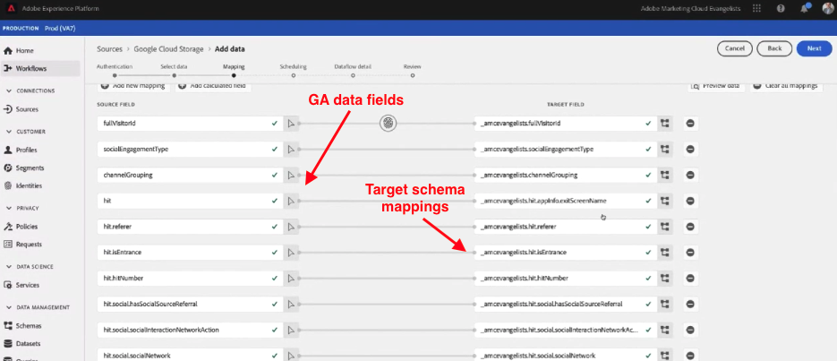
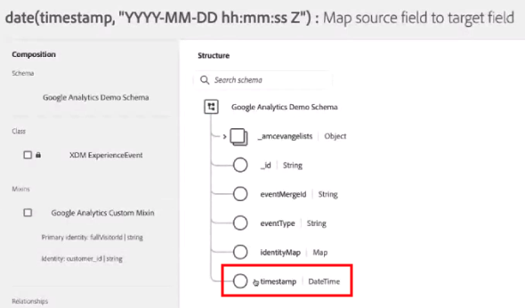
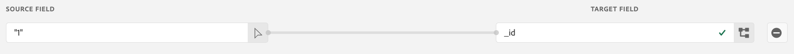

# Aufnehmen von historischen Daten aus Google Analytics

Auf dieser Seite wird beschrieben, wie Sie Ihre historischen Google Analytics-Daten in Adobe Experience Platform als Datensatz erfassen und so in einer Datenansicht in Customer Journey Analytics auf diesen Datensatz verweisen können. Sie können die Schritte auf dieser Seite mit [der Konfiguration einer Google Analytics-Implementierung](streaming.md) kombinieren, wodurch ein sich wiederholender Datensatz generiert wird. Kombinieren Sie diesen historischen Datensatz mit dem Datensatz Ihrer aktuellen Implementierung, um in Customer Journey Analytics eine lückenlose Datenansicht mit sowohl aktuellen als auch aufgestockten Daten zu erhalten.

## Voraussetzungen

Um diese Aufgaben ausführen zu können, benötigen Sie die folgenden Zugriffsrechte:

* Zugriff auf Adobe Experience Platform
* Zugriff auf Google Analytics (GA Standard oder GA 360)
* [Admin-Zugriff](/help/technotes/access-control.md) auf Customer Journey Analytics

## Einrichten eines BigQuery-Exports

Die Datenstruktur in universellen Analytics-Eigenschaften unterscheidet sich von der Datenstruktur in den Eigenschaften von Google Analytics 4. Richten Sie einen BigQuery-Export basierend auf dem Eigenschaftstyp ein, aus dem Sie Daten exportieren möchten:

* [Einrichten eines BigQuery-Exports für eine Universal Analytics-Eigenschaft](https://support.google.com/analytics/answer/3416092)
* [Einrichten eines BigQuery-Exports für eine Google Analytics 4-Eigenschaft](https://support.google.com/analytics/answer/9823238)

### Zusätzliche Anforderungen für Universal Analytics-Eigenschaften

>[!NOTE]
>
>Dieser Abschnitt gilt nur für Universal Analytics-Eigenschaften. Wenn Sie Daten aus einer GA4-Eigenschaft exportieren, lesen Sie [Daten in Google Cloud Platform exportieren](#export-gcp).

In den Universal Analytics-Eigenschaften werden die einzelnen Einträge der Daten als Benutzersitzung und nicht als einzelne Ereignisse gespeichert. Eine SQL-Abfrage ist erforderlich, um die Universal Analytics-Daten in ein mit Adobe Experience Platform kompatibles Format umzuwandeln. Wenden Sie die Funktion `UNNEST` auf das Feld `hits` im GA-Schema an und speichern Sie sie als BigQuery-Tabelle.


>[!BEGINSHADEBOX]

Unter  [Von Google Analytics zu Customer Journey Analytics - BigQuery](https://video.tv.adobe.com/v/332634?quality=12&learn=on){target="_blank"} finden Sie ein Demovideo.

>[!ENDSHADEBOX]


```sql
SELECT
   *,
   timestamp_seconds(`visitStartTime` + hit.time) AS `timestamp` 
FROM
   (
      SELECT
         fullVisitorId,
         visitNumber,
         visitId,
         visitStartTime,
         trafficSource,
         socialEngagementType,
         channelGrouping,
         device,
         geoNetwork,
         hit 
      FROM
         `example_bq_table_*`,
         UNNEST(hits) AS hit 
   )
```

## Exportieren von Daten zur Google Cloud Platform {#export-gcp}

Navigieren Sie in der Google Cloud Platform zu **Exportieren > In GCS exportieren**. Sobald sich die Daten in Google Cloud Storage befinden, können sie nach Adobe Experience Platform verschoben werden.

## Importieren von Daten von Google Cloud Storage nach Experience Platform

1. Wählen Sie in Adobe Experience Platform auf der linken Seite **[!UICONTROL Quellen]**.
1. Suchen Sie im Katalog nach der Option **[!UICONTROL Google Cloud Storage]**. Klicken Sie auf **[!UICONTROL Daten hinzufügen]**.


>[!BEGINSHADEBOX]

Siehe  [Importieren von Google Analytics-Daten in Adobe Experience Platform](https://video.tv.adobe.com/v/3437175?captions=ger&quality=12&learn=on){target="_blank"} für ein Demovideo.

>[!ENDSHADEBOX]


>[!TIP]
>
>Wenn Sie sowohl historische als auch Live-Streaming-Google Analytics-Daten importieren möchten, stellen Sie sicher, dass Sie für beide Datensätze dasselbe Schema verwenden. Sie können die Datensätze in einer Customer Journey Analytics mithilfe eines [kombinierten Datensatzes) &#x200B;](/help/connections/combined-dataset.md).

Sie können die GA-Ereignisdaten einem vorhandenen, zuvor erstellten Datensatz zuordnen oder unter Verwendung eines beliebigen XDM-Schemas einen neuen Datensatz erstellen. Nachdem Sie das Schema ausgewählt haben, wendet Experience Platform maschinelles Lernen an, um jedes der Felder in den Daten von Google Analytics automatisch Ihrem [XDM-Schema](https://experienceleague.adobe.com/docs/experience-platform/xdm/home.html?lang=de#ui) vor-zuzuordnen.



Nachdem Sie die Felder Ihrem XDM-Schema zugeordnet haben, können Sie für diesen Import einen sich wiederholenden Zeitplan festlegen und während des Aufnahmevorgangs eine Fehlerprüfung anwenden. Durch diese Prüfung wird sichergestellt, dass keine Probleme mit den importierten Daten auftreten.

## Erforderliche XDM-Felder

Bestimmte XDM-Felder in Platform benötigen das richtige Format, damit Daten korrekt verarbeitet werden können.

* **`timestamp`**: Erstellen Sie in der Benutzeroberfläche des Experience Platform-Schemas ein spezielles berechnetes Feld. Klicken Sie auf **[!UICONTROL Berechnetes Feld hinzufügen]** und schließen Sie die `timestamp`-Zeichenfolge in eine `date`-Funktion ein:

  `date(timestamp, "yyyy-MM-dd HH:mm:ssZ")`

  Speichern Sie das berechnete Feld im Schema in der Zeitstempel-Datenstruktur:

  

* **`_id`**: Dieses Feld muss einen Wert enthalten - welcher, spielt für Customer Journey Analytics keine Rolle. Sie können einfach eine „1“ zu dem Feld hinzufügen:

  

## Nächste Schritte

* Wenn Sie in Adobe Experience Platform aktuelle Daten streamen möchten, lesen Sie den Abschnitt zum [Einrichten von Streaming für Google Analytics-Daten](streaming.md).
* Wenn Sie mit dem Reporting zu aufgestockten Daten beginnen möchten, lesen Sie den Abschnitt zum [Erstellen einer Verbindung](/help/connections/create-connection.md).
