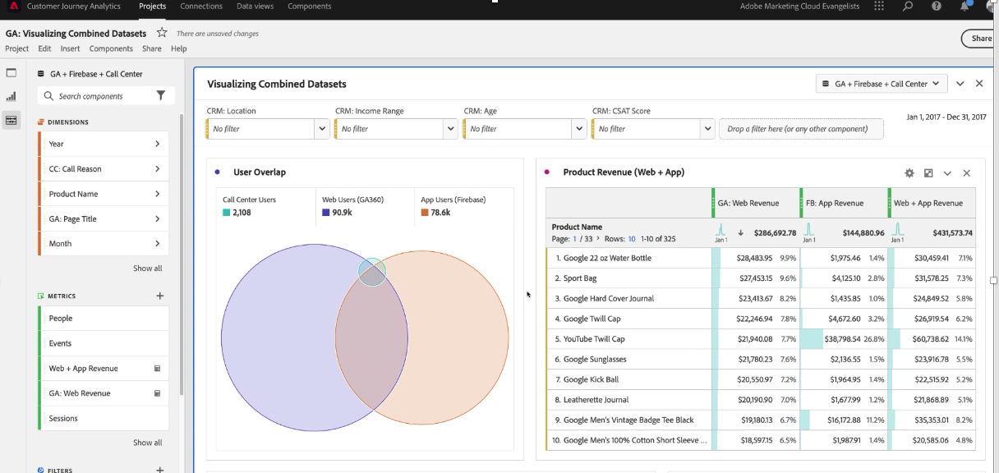
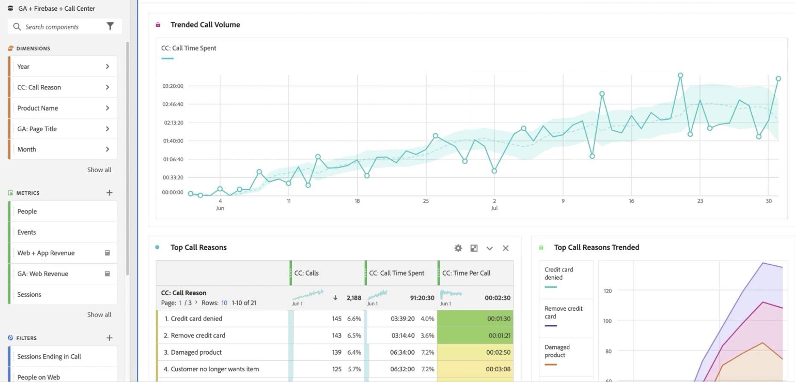
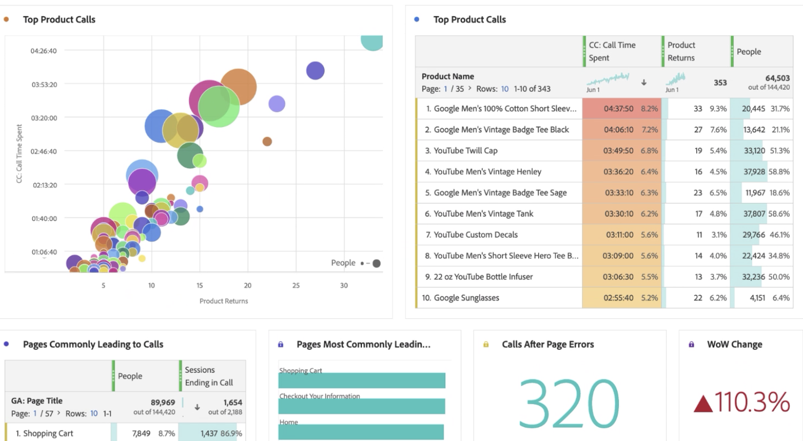
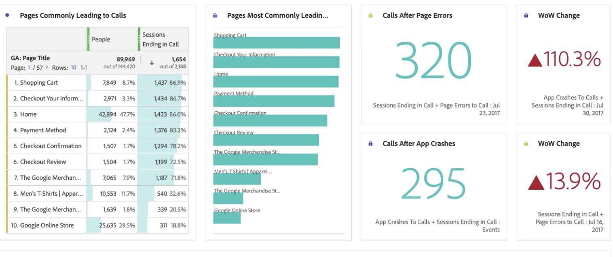
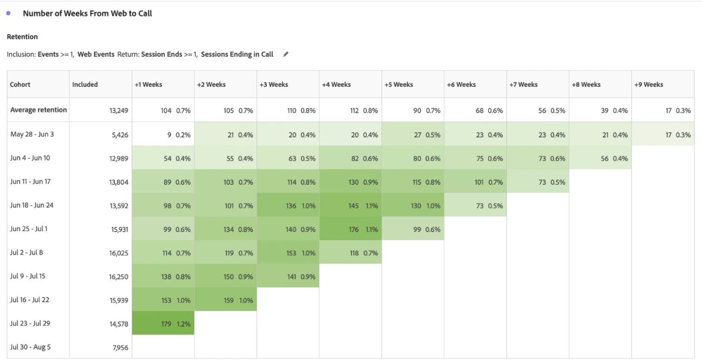
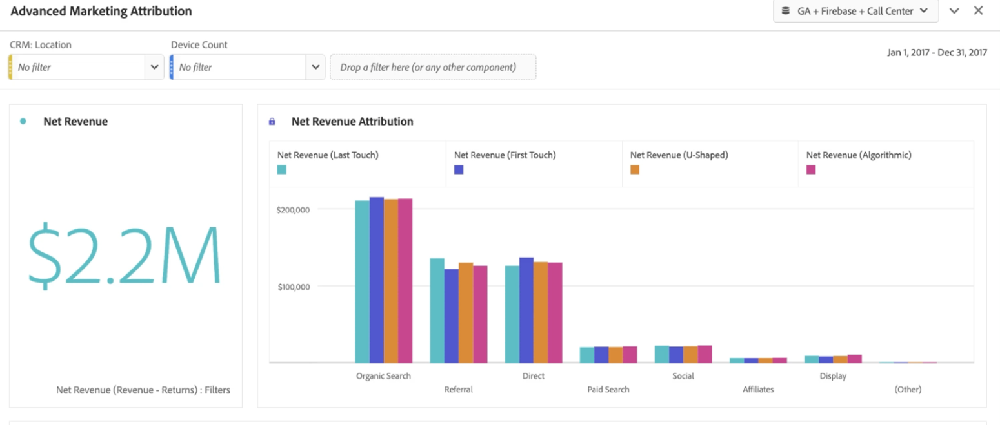
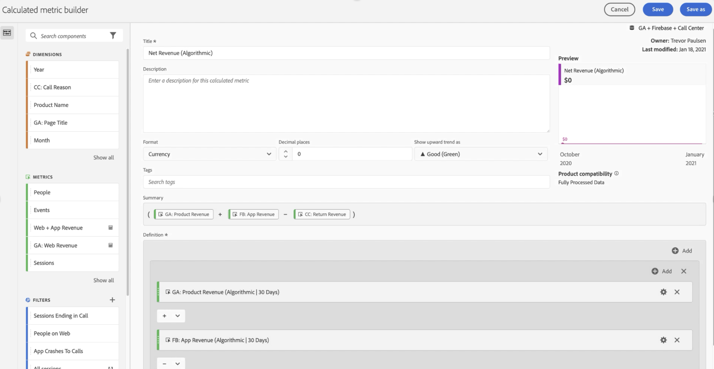
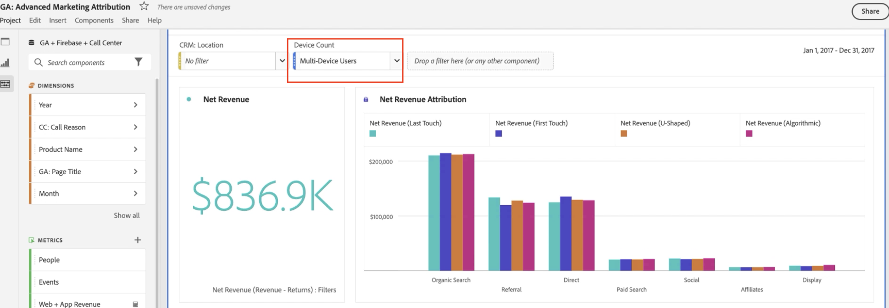
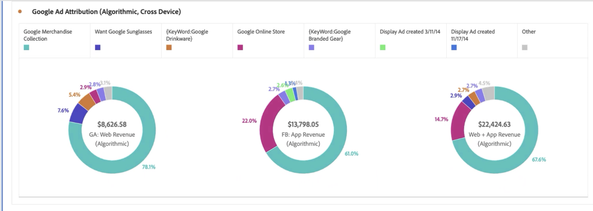
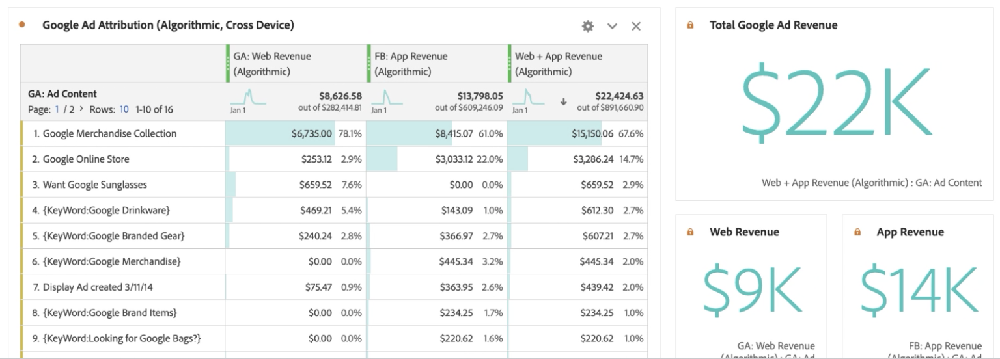

# Bericht zu Google Analytics-Daten

Sobald Daten in Customer Journey Analytics zur Verfügung stehen, bieten die folgenden Beispiele nützliche Szenarien für das Reporting über diese Daten. Eine umfassende Übersicht der Entsprechungen von GA4-Berichten in Customer Journey Analytics finden Sie unter [GA4-Berichte in Customer Journey Analytics](/help/getting-started/ga-to-cja/reports.md).

## Visualisieren von Web-Daten und App-Daten als kombinierte Datensätze

Dieses Venn-Diagramm zeigt die Überschneidung der Benutzer auf Ihrer Website (aus Ihren Google Analytics-Daten) und in Ihrer mobilen App (aus Ihren Firebase-Daten) sowie in Ihrem Callcenter. Sie können auch die leistungsstärksten Produkte sehen – nicht nur im Web, sondern auch in der mobilen App. Mithilfe einer berechneten Kennzahl können sogar die Gesamteinnahmen aus beiden ermittelt werden. Beachten Sie, dass die Top-Produkte eine andere Geschichte erzählen, wenn Sie sich den kombinierten Umsatz ansehen. Ohne die kombinierten Datensätze hätten Sie nie gewusst, dass die „Twill Cap“ eine solch starke Leistung erbringt.

## Identifizieren Sie die Gründe für die Anrufe und reduzieren Sie das Anrufvolumen.

Es kann ein Trend für die im Callcenter verbrachte Zeit über die letzten zwei Monate ermittelt werden, um das Aufrufvolumen zu bestimmen. Das folgende Beispiel zeigt den Trend dieser Daten über die letzten zwei Monate. Das folgende Beispiel zeigt einen zunehmenden Trend, der sich auf die Organisationskosten auswirken kann.

Die Verwendung der Dimension „Anrufgrund“ kann Hinweise darauf geben, wie das Web-Erlebnis verbessert werden kann, um zu verhindern, dass Personen überhaupt anrufen. Das obige Beispiel zeigt, dass das Thema „Beschädigtes Produkt“ eine durchschnittliche Anrufzeit von fast 3 Minuten pro Anruf hat. Dies gibt Ihrem Unternehmen eine präzise Möglichkeit, das Kundenerlebnis zu verbessern und die Kosten für das Callcenter zu senken.

Sie können sehen, welche Produkte die meisten Aufrufe an Ihr Callcenter verursachen und wie viele Kunden diese Aufrufe getätigt haben. Das Blasendiagramm zeigt, dass 20.000 Personen anriefen, mehr als 4 Stunden und 30 Minuten damit verbrachten, 33 Stück des Produkts „Herren T-Shirt mit kurzen Ärmeln“ zurückzugeben.

Bei Anwendung der Dimensionsaufschlüsselung „Anrufgrund“ zeigt das Beispiel eine Dimensionsposition „Beschädigtes Produkt“. Der nächste Schritt besteht darin, sich mit der Abteilung der Qualitätskontrolle in Verbindung zu setzen und herauszufinden, warum die Kunden beschädigte T-Shirts erhalten haben.

Man kann sich ansehen, welche Website-Seiten zu Anrufen im Callcenter geführt haben. Mit diesem Bericht kann man feststellen, wo auf der Website weniger optimale Erfahrungen gemacht wurden, und den Produktmanagern helfen, diese Herausforderungen zu lösen. Im folgenden Beispiel wird eine berechnete Metrik mit einem Teilnahme-Attributionsmodell verwendet, um die Daten nur in Sitzungen zu filtern, die mit einem Callcenter-Aufruf endeten.

Das folgende Beispiel zeigt, dass die Seiten „Warenkorb“ und „Checkout-Informationen“ die meisten Anrufe verursachen.

Anhand der Kohortentabelle ist ersichtlich, wie lange es in der Regel dauert, bis die Benutzenden nach dem Besuch der Website das Callcenter anrufen. Das folgende Beispiel zeigt, dass die durchschnittliche Zeit für diesen Beispieldatensatz zwischen drei und vier Wochen liegt.

## Erweiterte Marketing-Attribution verwenden

Mit Customer Journey Analytics können Sie ausgefeilte Attributionsmodelle für kanalübergreifende Daten verwenden. Im folgenden Beispiel sehen Sie einen Vergleich der Anwendung von Erstkontakt, Letztkontakt, U-förmig und algorithmischer Attribution von Umsatz mit den Channel Grouping-Dimensionen von Google Analytics.

Mithilfe einer berechneten Metrik können Sie diese Attribution auf Ihren Web-Umsatz und den Umsatz mit Mobile Apps anwenden und sogar die Produktretouren abziehen. Infolgedessen können Sie für jeden Marketing-Kanal den tatsächlichen Nettoumsatz sehen.

Mit Attribution können Sie Ihre Daten auch segmentieren. Sie können die Attribution auch für bestimmte Benutzergruppen anzeigen, z. B. nur für Benutzer, die mehr als ein Gerät verwenden.

Sie können Ihren im Web und über Mobile Apps generierten Umsatz auch Ihren Google-Anzeigeninhalten zuordnen. In unserem Beispiel erzielte dieser Datensatz mehr Umsatz durch die Mobile App mit den Online-Google-Anzeigen als durch das Internet. Wenn Sie Anzeigen nach Web- und Mobile-App-Umsatz sortieren, erhalten Sie ein anderes Bild davon, welches Ihre leistungsstärksten Google-Anzeigen waren.

Durch die Kombination von Datensätzen in Customer Journey Analytics können Sie in diesem Beispiel sehen, dass Online-Anzeigen Auswirkungen auf Produkte hatten, die in Ihrer Mobile App gekauft wurden. In der folgenden Visualisierung sehen Sie, dass der Umsatz durch Google Ads über die Mobile App im Vergleich zum Internet allein zusätzliche 14.000 $ bis 15.000 $ ausmacht.

